# Advanced RAG

## Techniques, patterns, and compound systems

A field guide from naive retrieval to self-correcting, graph-aware, production RAG. Every technique is tied to the one problem it solves, and to a framework for deciding when to reach for it.

Running scenario: **TravelMind**, an airline assistant. Passenger Rao, Gold tier, PNR JX48Q2, flight BLR to DEL cancelled. We keep returning to it so each technique has a concrete home.

---

## Slide 1 · The ceiling of naive RAG

Naive RAG is one straight line: embed the question, fetch top-k by cosine, stuff, generate. It works until it does not.

Four ways it silently fails:

| Symptom | What actually happened |
|---|---|
| Right answer, wrong doc retrieved | the passage existed but was never fetched |
| Good doc fetched, ignored in the answer | it was buried at rank 8, drowned by noise |
| Vague or multi-part question flops | the question was never search-ready |
| Context was present, answer still wrong | no step checked the answer against the context |

Naive RAG has one loop and no defenses. Everything that follows is a defense against one of these four failures.

Skeptic's question to hold the whole deck: *before adding any technique, which of these four failures am I actually seeing in a trace?*

---

## Slide 2 · Framework 1: the Four Levers

Every advanced technique pulls exactly one of four levers on the pipeline. This is the map for the entire deck.

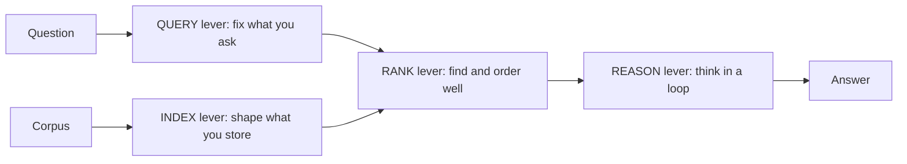

| Lever | Question it answers | Techniques that live here |
|---|---|---|
| INDEX | what do I store, and how | chunking strategy, contextual chunks, small-to-big, RAPTOR, multi-representation, metadata |
| QUERY | is the question search-ready | rewrite, multi-query, step-back, decomposition, HyDE, routing |
| RANK | did the best passage surface | hybrid plus fusion, reranking, MMR, compression |
| REASON | is the answer actually grounded | adaptive routing, Self-RAG, CRAG, agentic loops |

Two moves sit outside the line: **STRUCTURE** (GraphRAG, when relationships matter) and **MEASURE** (evaluation, the loop around everything).

Mental model in one sentence: *naive RAG pulls none of these levers. Each failure you see is a lever you have not pulled yet.*

---

## Slide 3 · The technique landscape, in one view

Breadth first. Everything in this deck, grouped by lever.

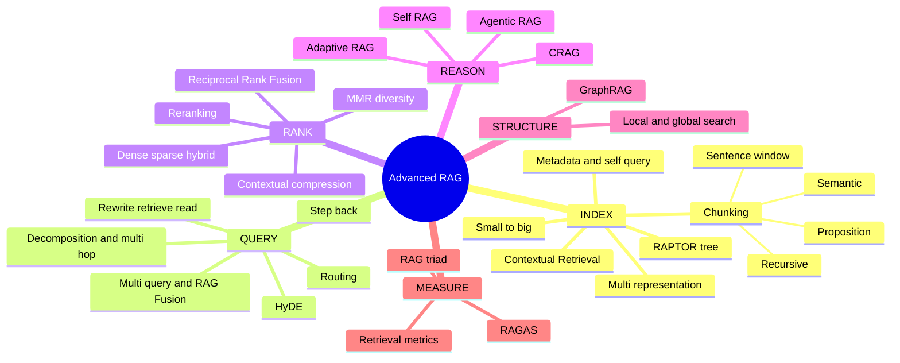

Do not try to use all of these. The rest of the deck is about choosing.

---

## Slide 4 · Framework 2: the RAG Maturity Ladder

Each rung is defined by the failure it removes, not by how fancy it is. Climb only when a metric forces you up.

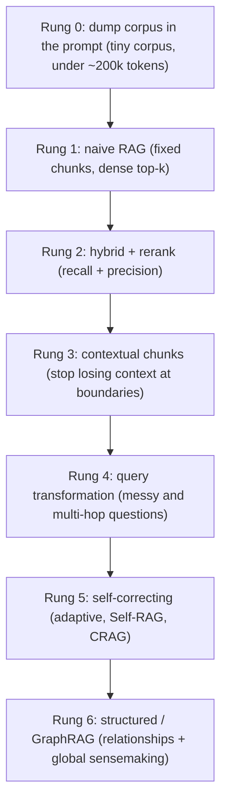

| Rung | You are here when | The failure it removes |
|---|---|---|
| 0 | corpus is small enough to fit in context | retrieval is unnecessary overhead |
| 1 | you need any grounding at all | frozen, ungrounded model |
| 2 | exact terms and buried chunks hurt | recall and ranking misses |
| 3 | chunks lose meaning at their edges | context loss at chunk boundaries |
| 4 | questions are vague, broad, or multi-part | question not search-ready |
| 5 | wrong answers must self-catch | no verification of the answer |
| 6 | questions span the whole corpus or entities | no view of relationships or the whole |

The ladder is a budget, not a checklist. Most production systems live happily at rung 2 or 3.

---

## Slide 5 · Framework 3: the Four Doors (diagnosis before cure)

When an answer is wrong, exactly one door is usually open. Read the trace, find the door, apply that door's family. Do not add levers behind doors that are already shut.

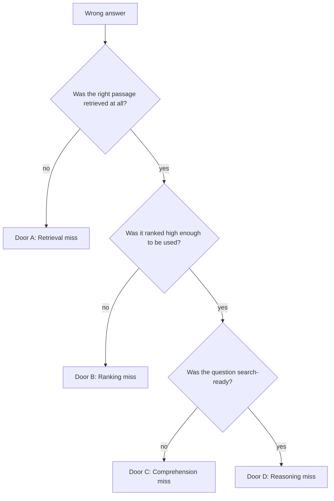

| Door | Meaning | Family of fixes |
|---|---|---|
| A Retrieval miss | right doc never fetched | contextual chunks, hybrid, HyDE, multi-query, metadata filter |
| B Ranking miss | fetched but buried | reranking, MMR, retrieve more then rerank |
| C Comprehension miss | question not search-ready | rewrite, step-back, decomposition, routing |
| D Reasoning miss | context present, answer still wrong or ungrounded | self-correction, agentic loop, compression, better prompt |

This is the single most useful habit in the deck: **diagnose the door before you spend on a cure.**

---

## Slide 6 · Transition: shape what you store

Rungs 2 and 3 and Door A start at the INDEX lever. Most retrieval failures are decided before a single query runs, at the moment you chunk and embed.

The next block is INDEX-time technique. It is the cheapest place to win, because you pay once and every future query benefits.

---

## Slide 7 · Chunking strategies

The chunk is the atom of retrieval. Pick the wrong atom and nothing downstream can recover.

| Strategy | How it splits | Best for |
|---|---|---|
| Fixed / recursive | by size, respecting separators (paragraph, sentence) | general text, the sane default |
| Semantic | at points where meaning shifts (embedding distance) | mixed-topic docs, cleaner boundaries |
| Sentence-window | one sentence indexed, neighbors attached at read | precise match, full context on read |
| Document / section | whole logical unit (a policy clause, a function) | structured docs, code, contracts |
| Proposition | atomic standalone facts (Chen et al. 2023) | dense factual QA, high precision |

Rule of thumb: start recursive at a few hundred tokens with 10 to 20 percent overlap, measure retrieval, then switch strategy only if a Door A trace tells you the boundary is the problem.

---

## Slide 8 · Semantic chunking

Fixed chunking cuts mid-thought. Semantic chunking cuts where the topic actually turns.

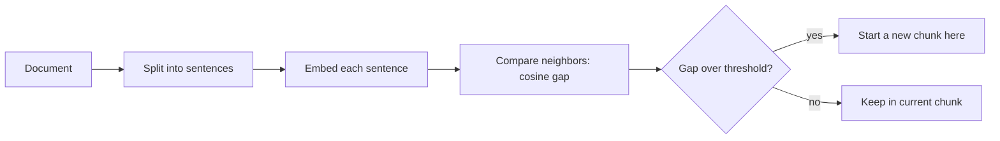

Idea: walk the sentences, embed each, and cut wherever consecutive similarity drops below a threshold. The boundary lands at a real topic change, not at an arbitrary token count.

Cost: one embedding per sentence at index time. Payoff: sharper chunks, fewer split topics.

---

## Slide 9 · Small-to-big (parent-document retrieval)

The tension: small chunks match precisely but answer thinly. Large chunks answer fully but match fuzzily. Small-to-big takes both.

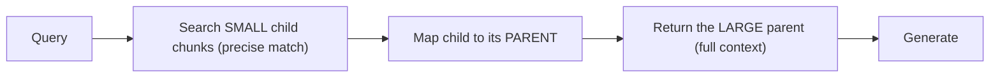

Retrieve on the sharp little chunk, feed the model the surrounding parent. Sentence-window is the same instinct at sentence scale.

Use when answers need context the matched chunk alone does not carry, for example a fee rule that only makes sense inside its section.

---

## Slide 10 · RAPTOR: a tree of summaries

Naive retrieval only ever returns short contiguous chunks, so it cannot answer questions that need the whole document at once. RAPTOR (Sarthi et al., ICLR 2024) fixes this by building a tree.

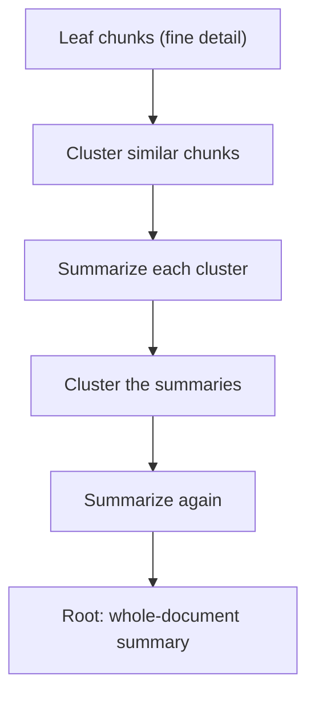

- Recursively embed, cluster, and summarize bottom-up.
- Leaves hold specifics, higher nodes hold themes, the root holds the gist.
- At query time, retrieve across levels, so a detail question hits a leaf and a thematic question hits a summary node.

Cost: extra LLM calls to build the tree, and a rebuild when the corpus changes. Payoff: multi-level questions on long documents. On QuALITY, RAPTOR with GPT-4 improved the best score by about 20 percent.

---

## Slide 11 · Multi-representation indexing

Split the thing you search from the thing you return.

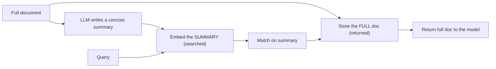

You index a clean summary (easy to match) but hand the model the full source (rich to answer from). This is the LangChain multi-vector pattern. It pairs naturally with small-to-big and RAPTOR.

---

## Slide 12 · Contextual Retrieval (the boundary fix)

The core disease of chunking: a chunk reads "Gold members pay no change fee" with no idea which airline, which fare, or which policy it belongs to. Split it out and the context is gone.

Anthropic's Contextual Retrieval (2024) prepends a short, chunk-specific context to each chunk **before** embedding and before BM25 indexing.

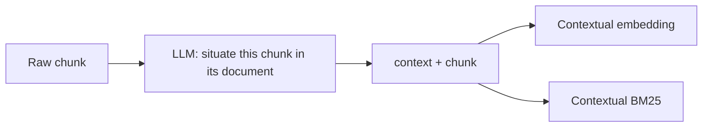

Measured failure-rate reduction (top-20 retrieval), stacked:

| Layer added | Failure rate | Reduction |
|---|---|---|
| baseline | 5.7% | |
| + contextual embeddings | 3.7% | 35% |
| + contextual BM25 (hybrid) | 2.9% | 49% |
| + reranking | 1.9% | 67% |

Two forward-looking notes: prompt caching makes contextualizing every chunk cheap, and for a corpus under roughly 200k tokens you should skip retrieval and put the whole thing in the prompt.

---

## Slide 13 · Metadata and self-querying

Half of "retrieval" problems are really filtering problems. A date, a tier, a jurisdiction, a source narrows the search before similarity ever runs.


Self-querying turns a natural question into a structured filter plus a semantic query. On a large mixed corpus this is often the highest-leverage, lowest-cost move you can make.

Attach metadata at index time (source, date, tier, section, doc type). You cannot filter on what you did not store.

---

## Slide 14 · Transition: fix what you ask

You have shaped what you store. The next lever is QUERY. The blunt truth: the user's question is rarely in the right shape to search with.

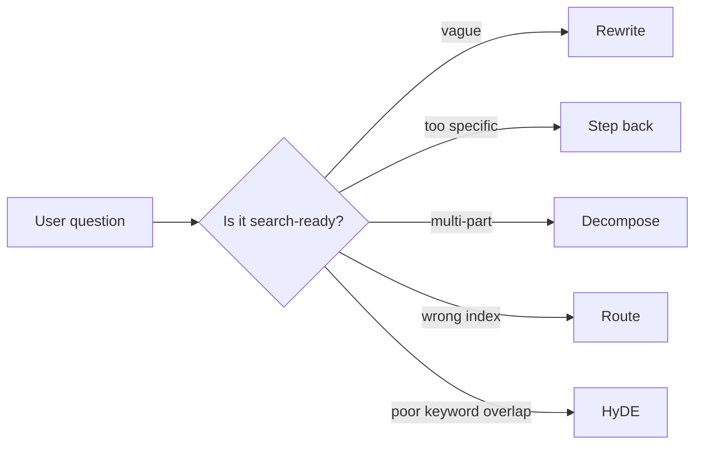

Door C lives here. Every technique below reshapes the query before retrieval.

---

## Slide 15 · Query rewriting (Rewrite-Retrieve-Read)

The simplest QUERY lever. A model rewrites the raw question into an explicit, keyword-rich one, then you retrieve and read (Ma et al. 2023).

| Before | After |
|---|---|
| "waived fees?" | "Do Gold-tier members pay a waived change fee on a cancelled flight?" |
| "my flight got cancelled what now" | "rebooking and refund options for a cancelled flight on a Gold-tier PNR" |

Cheap, always-on for conversational systems, and it also folds in chat history (contextualize a follow-up like "what about refunds?" into a standalone query).

---

## Slide 16 · Multi-query and RAG-Fusion

One phrasing retrieves one slice of the truth. Several phrasings retrieve more of it.

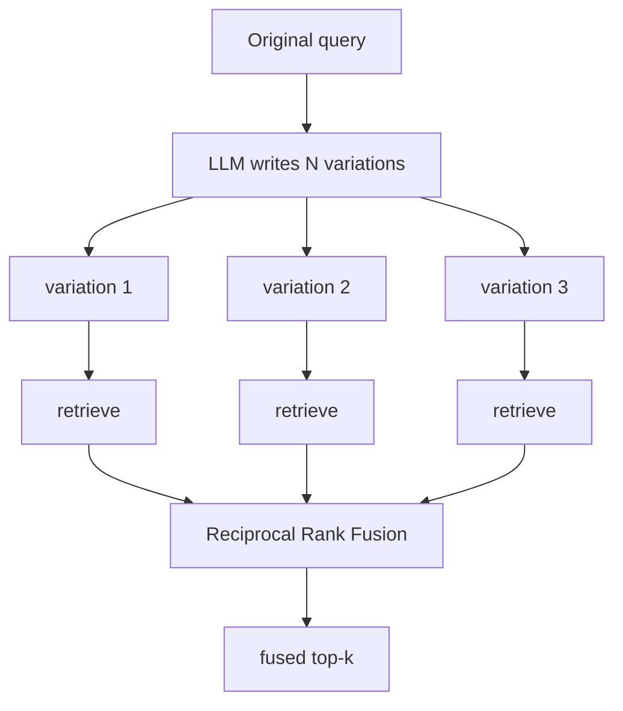

RAG-Fusion generates variations, retrieves each, and merges with Reciprocal Rank Fusion. RRF rewards documents that rank high across many lists:

$$\text{RRF}(d) = \sum_{r \in \text{lists}} \frac{1}{k + \text{rank}_r(d)}$$

with $k$ commonly 60 (Cormack et al. 2009). A doc that appears near the top of several variations wins, even if no single list put it first.

---

## Slide 17 · Step-back prompting

Some questions are too specific to retrieve well. Step back to the principle first, then answer the specific (Zheng et al. 2023).

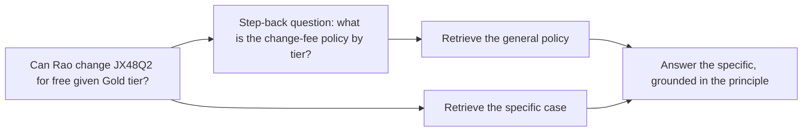

The abstract question retrieves the broad rule that the narrow question could not surface on its own. Then the model applies the rule to the specific case.

---

## Slide 18 · Decomposition and multi-hop

A compound question needs compound retrieval. "Is Rao's cancelled flight refundable, and does his tier waive the change fee?" is two lookups pretending to be one.

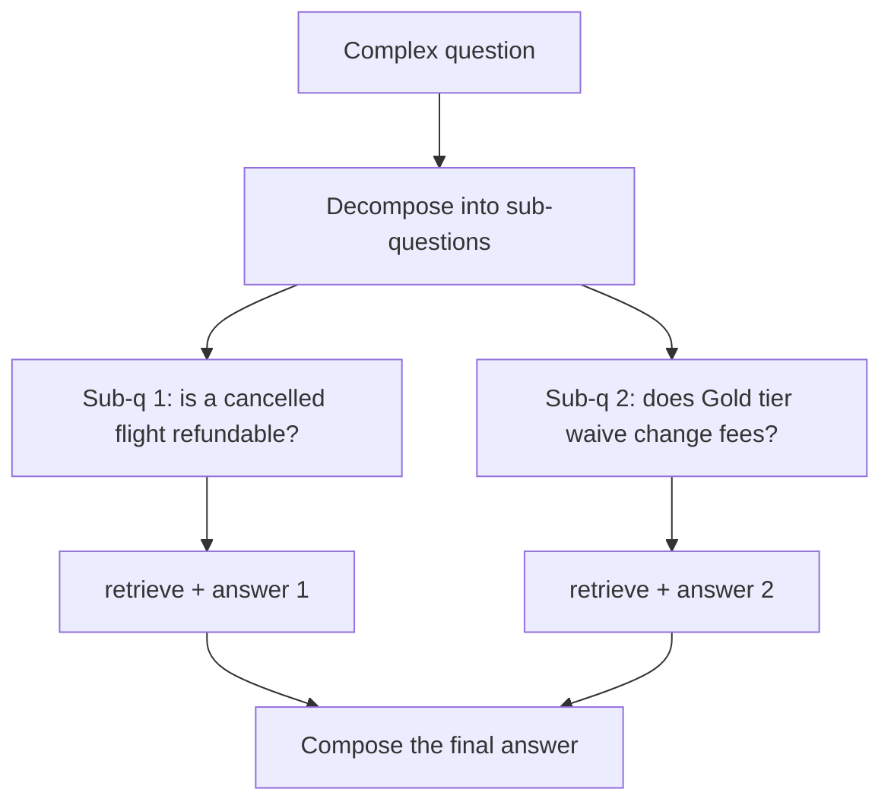

Two shapes: answer sub-questions in parallel and compose, or interleave retrieval with reasoning step by step (IRCoT, Trivedi et al. 2023), where each reasoning step triggers the next retrieval. Interleaving is what true multi-hop questions need, where hop 2 depends on the answer to hop 1.

---

## Slide 19 · Routing

Not every question belongs to the same index or the same prompt. Routing sends each query to the right place first.

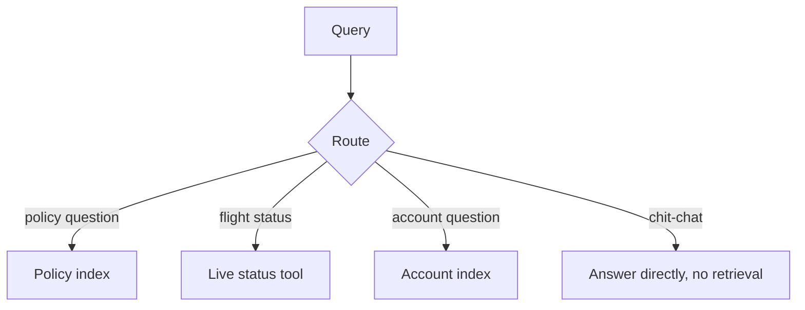

Two flavors: **logical routing** (pick a datasource by rules or a classifier) and **semantic routing** (pick the closest prompt or index by embedding the query against route descriptions). Routing is the gateway that makes multi-source assistants coherent instead of one bloated index.

---

## Slide 20 · HyDE

Sometimes a question and its answer share almost no words, so cosine on the raw question misses. HyDE closes that gap (Gao et al. 2022).

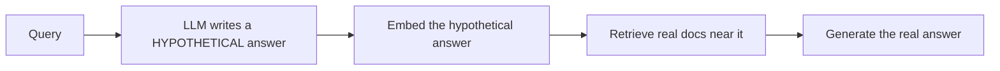

You embed a made-up answer, not the question, because an answer looks like the documents you want to find. The hypothetical can be wrong in facts and still be right in shape.

Skeptic's caveat: on narrow or highly technical corpora HyDE can hallucinate a hypothetical that pulls retrieval off-topic. Measure it against plain retrieval before trusting it.

---

## Slide 21 · Transition: find and order well

The question is now search-ready and the index is well shaped. The RANK lever decides whether the best passage actually surfaces and lands near the top. This is Door B.

---

## Slide 22 · Dense, sparse, hybrid

Three ways to match, with complementary blind spots.

| Method | Matches on | Blind spot |
|---|---|---|
| Dense (embeddings) | meaning, paraphrase | exact codes, rare tokens |
| Sparse (BM25 / TF-IDF) | exact terms | paraphrase, synonyms |
| Hybrid (both, fused) | meaning and exact | slightly more machinery |

BM25 refines TF-IDF with document-length normalization and term-frequency saturation, which is why it nails a PNR like JX48Q2 that a dense vector smears together with other codes. Fuse the two with RRF (or a weighted sum, Anthropic used 1.0 dense to 0.25 sparse) and you cover both failure modes at once.

---

## Slide 23 · Reranking

Retrieval scores are coarse. Reranking is a second, sharper pass over the shortlist.

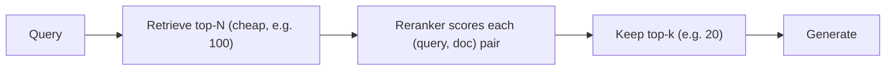

| Reranker type | How it scores | Trade |
|---|---|---|
| Bi-encoder (retrieval) | embed separately, cosine | fast, coarse |
| Cross-encoder (rerank) | read query + doc together | slow per pair, precise |
| Late interaction (ColBERT) | token-level MaxSim | middle ground, storage cost |

The pattern that wins in practice: retrieve wide and cheap, then rerank a shortlist. Anthropic's stack retrieved 150 and reranked down to 20.

---

## Slide 24 · MMR: relevance versus diversity

Top-k by pure similarity often returns five near-duplicates of the same passage. Maximal Marginal Relevance trades a little relevance for coverage (Carbonell and Goldstein 1998).

$$\text{MMR} = \arg\max_{d \notin S}\left[\lambda\, \text{sim}(d, q) - (1-\lambda)\max_{d' \in S}\text{sim}(d, d')\right]$$

- $\lambda = 1$: pure relevance, duplicates allowed.
- $\lambda = 0$: pure diversity, relevance ignored.
- Middle: relevant and non-redundant.

Use MMR when the same fact keeps crowding out the second fact a complete answer needs.

---

## Slide 25 · Contextual compression

Retrieved chunks carry filler. Compression strips each chunk down to the sentences that actually bear on the query, before they reach the model.

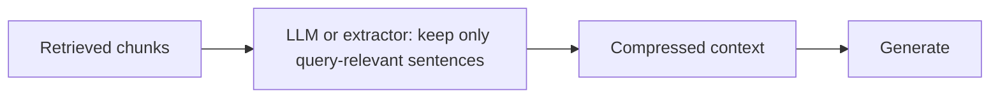

Two wins: less noise in the prompt (better answers) and fewer tokens (lower cost, more room for more chunks). It directly counters the "lost in the middle" failure where the model ignores a buried but relevant sentence.

---

## Slide 26 · The retrieval metrics that matter

You cannot tune RANK by vibes. Score retrieval directly, separate from the final answer.

| Metric | Question it answers |
|---|---|
| Hit rate / recall@k | is the right doc in the top-k at all |
| MRR | how high does the first relevant doc land |
| nDCG | are the most relevant docs ranked highest |

MRR and nDCG in brief:

$$\text{MRR} = \frac{1}{N}\sum_{i=1}^{N}\frac{1}{\text{rank}_i} \qquad \text{nDCG}_k = \frac{DCG_k}{IDCG_k},\; DCG_k = \sum_{i=1}^{k}\frac{rel_i}{\log_2(i+1)}$$

Fix retrieval with retrieval metrics. Only then judge the generated answer. Mixing the two hides which half is broken.

---

## Slide 27 · Transition: think in a loop

Index, query, and rank are still one forward pass. The REASON lever adds a loop: decide whether to retrieve, check what came back, and correct. This is Door D, and where RAG becomes agentic.

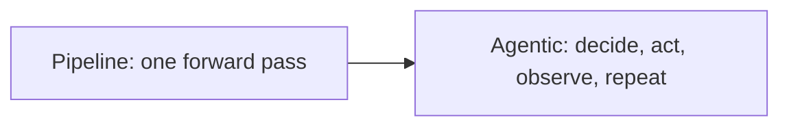

---

## Slide 28 · Adaptive RAG: route by complexity

Not every question deserves the same effort. Adaptive RAG (Jeong et al. 2024) classifies the query and routes it to the cheapest path that can answer it.

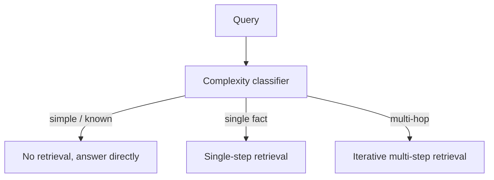

| Path | For | Cost |
|---|---|---|
| No retrieval | general knowledge, chit-chat | lowest |
| Single-step | one lookup | medium |
| Multi-step | compound, multi-hop | highest |

The insight worth stealing even without the full method: **match effort to difficulty**. Do not run a multi-hop agent to answer "2 + 2".

---

## Slide 29 · Self-RAG: reflect as you go

Self-RAG (Asai et al., ICLR 2024) trains the model to emit reflection signals: whether to retrieve, whether each passage is relevant, and whether the answer is supported.

```mermaid
stateDiagram-v2
    [*] --> Decide
    Decide --> Direct: retrieve not needed
    Decide --> Retrieve: retrieve needed
    Retrieve --> Grade: are passages relevant
    Grade --> Generate: keep relevant
    Generate --> Reflect: is answer supported
    Reflect --> [*]: supported
    Reflect --> Retrieve: not supported, retry (capped)
    Direct --> [*]
```

The four reflection checks in plain words:

| Signal | Question |
|---|---|
| Retrieve | do I need to look anything up |
| IsRel | is this passage actually relevant |
| IsSup | is my claim supported by the passage |
| IsUse | is the answer actually useful |

Retrieval becomes conditional and every answer is checked for grounding before it ships. A max-attempts cap stops the loop.

---

## Slide 30 · CRAG: grade the retrieval, then correct it

Self-RAG trusts the model to self-critique. CRAG (Yan et al. 2024) adds a dedicated evaluator on the retrieval itself, then corrects when it is weak.

```mermaid
flowchart TB
    RET["Retrieve"] --> EV["Lightweight retrieval evaluator"]
    EV -->|Correct| REF["Refine: keep the key strips, drop noise"]
    EV -->|Ambiguous| BOTH["Refine + external search"]
    EV -->|Incorrect| WEB["Discard, search the web"]
    REF --> GEN["Generate"]
    BOTH --> GEN
    WEB --> GEN
```

| Grade | Meaning | Action |
|---|---|---|
| Correct | docs clearly answer | knowledge refinement (decompose into strips, recompose) |
| Ambiguous | partial coverage | combine store docs with a fresh web search |
| Incorrect | docs miss the query | discard, fall back to web search |

The corrective source is pluggable: a web search tool, or a broadened re-retrieval when no web access is available. A bad retrieval no longer silently produces a bad answer.

---

## Slide 31 · Self-RAG vs CRAG vs Adaptive

Three self-correcting patterns, three different instincts.

| | Adaptive RAG | Self-RAG | CRAG |
|---|---|---|---|
| Core move | route by query complexity | reflect at each step | grade retrieval, then correct |
| Retrieval | none / single / multi | conditional | always, then evaluated |
| Correction | pick a heavier path | rewrite and retry | refine or web search |
| Best when | mixed difficulty | grounding must be self-checked | store is patchy, freshness matters |
| Main cost | a classifier call | reflection calls | evaluator + correction calls |

They combine. A production loop can route by complexity (Adaptive), then within the retrieval path grade and correct (CRAG), and gate the final answer on support (Self-RAG).

---

## Slide 32 · Agentic RAG: retrieval as a tool

The final step of the REASON lever: stop hard-wiring retrieval into the pipeline and hand it to the model as a tool it chooses to call, possibly many times.

```mermaid
flowchart TB
    Q["Question"] --> AG["Agent reasons"]
    AG --> T{"Need to look something up?"}
    T -->|yes| RET["Call retrieve tool"]
    RET --> OBS["Read results"]
    OBS --> AG
    T -->|no| ANS["Answer, with citations"]
```

The agent decides whether, when, and how often to retrieve, can call different indexes or a web tool, and can chain lookups for multi-hop questions. This is the natural home for Adaptive, Self-RAG, and CRAG behaviors expressed as tool-use, and it is how RAG plugs into the Strands and AgentCore agents from earlier in the week.

Skeptic's guardrail: an agent that can loop can loop forever and can burn tokens. Cap steps, log every tool call, and prefer the simplest routing that answers the question.

---

## Slide 33 · Transition: when vectors are not enough

Every technique so far assumes the answer sits in some passage. Two question types break that assumption: questions about **relationships** ("how are Rao's bookings connected?") and **global** questions ("what are the main themes across all complaints?"). No single chunk holds the answer.

That calls for STRUCTURE.

---

## Slide 34 · GraphRAG

Microsoft's GraphRAG (Edge et al. 2024, "From Local to Global") turns a corpus into a knowledge graph and pre-summarizes it.

```mermaid
flowchart TB
    D["Documents"] --> TU["Split into text units"]
    TU --> EX["LLM extracts entities, relationships, claims"]
    EX --> G["Build a weighted entity graph"]
    G --> COM["Leiden community detection (hierarchical)"]
    COM --> SUM["Summarize each community, bottom-up"]
    SUM --> IDX["Community reports at every level"]
```

Two query modes:

```mermaid
flowchart LR
    Q["Query"] --> M{"Local or global?"}
    M -->|specific entity| LOC["Local search: traverse the entity's neighbors"]
    M -->|whole-corpus theme| GLB["Global search: map-reduce over community summaries"]
```

- **Local search** answers entity-centric questions by walking neighbors.
- **Global search** answers sensemaking questions: score each community summary against the query (map), keep the useful ones, then combine (reduce).

On sensemaking questions GraphRAG beat vector RAG on comprehensiveness (roughly 72 to 83 percent win rate in LLM-judged tests). Cost is real: entity extraction and summarization over the whole corpus at index time.

---

## Slide 35 · Vector RAG vs GraphRAG

Not a replacement, a different tool for a different question.

| | Vector RAG | GraphRAG |
|---|---|---|
| Best question | specific lookup | relationships, whole-corpus themes |
| Unit retrieved | a passage | an entity neighborhood or a community summary |
| Index cost | low | high (LLM over the whole corpus) |
| Freshness | edit a doc | re-extract affected parts of the graph |
| When it shines | "what is the refund window" | "what patterns connect these 10k tickets" |

Decision line: reach for GraphRAG only when the question is about connections or the corpus as a whole. For "what is the change fee", vector RAG is faster and cheaper.

---

## Slide 36 · Framework 4: the Compounding Recipe

Techniques stack, but stacking blindly creates a slow, unexplainable system. Stack in this order, and add a layer only when a measured failure demands it.

```mermaid
flowchart TB
    B["Base: good chunks + hybrid + rerank"] --> C1{"Losing context at boundaries?"}
    C1 -->|yes| L1["+ contextual chunks"]
    C1 -->|no| C2
    L1 --> C2{"Questions vague or multi-hop?"}
    C2 -->|yes| L2["+ query transform (rewrite / step-back / decompose)"]
    C2 -->|no| C3
    L2 --> C3{"High stakes or patchy store?"}
    C3 -->|yes| L3["+ self-correction (adaptive / CRAG / Self-RAG)"]
    C3 -->|no| C4
    L3 --> C4{"Relationship or global questions?"}
    C4 -->|yes| L4["+ GraphRAG"]
    C4 -->|no| DONE["Ship"]
```

The rule that keeps systems sane: **one lever per measured failure.** Add, measure, keep or revert. Never add two levers at once, because then you cannot tell which one helped.

---

## Slide 37 · Framework 5: the Placement Grid

When two techniques could fix the same door, pick the cheaper one first. This grid maps every technique by lever and by cost, so you spend in the right order.

| Cost / Lever | INDEX | QUERY | RANK | REASON |
|---|---|---|---|---|
| Cheap (do first) | metadata filter | rewrite | hybrid + RRF | adaptive route |
| Medium | contextual chunks, small-to-big | multi-query, step-back | rerank a shortlist, MMR | Self-RAG gate |
| Expensive (justify it) | RAPTOR, GraphRAG index | decomposition, multi-hop, HyDE | large-N rerank | full agentic loop, CRAG + web |

Read it as a spending order: exhaust cheap moves on the open door before paying for expensive ones. A metadata filter or a hybrid switch often beats a multi-hop agent, at a fraction of the latency.

---

## Slide 38 · Compound case 1: conversational multi-hop support

TravelMind handling "my flight got cancelled, can I change it for free, and what about a refund?" over a chat with history.

```mermaid
flowchart TB
    H["Chat history + new turn"] --> CQ["Contextualize into a standalone query"]
    CQ --> DEC["Decompose: (1) refund on cancel? (2) Gold change-fee waiver?"]
    DEC --> R1["Hybrid retrieve + rerank: refund policy"]
    DEC --> R2["Hybrid retrieve + rerank: tier fee policy"]
    R1 --> COMP["Compose grounded answer, cite clauses"]
    R2 --> COMP
    COMP --> CHK["Support check before sending"]
```

Levers used: QUERY (contextualize, decompose), INDEX + RANK (hybrid, rerank), REASON (support gate). Doors closed: C, A, B, D. This is a rung-4-to-5 system.

---

## Slide 39 · Compound case 2: corrective research assistant

A financial or news assistant where freshness matters and the internal store goes stale.

```mermaid
flowchart TB
    Q["Question"] --> RT{"Adaptive route by complexity"}
    RT -->|simple| DIR["Answer directly"]
    RT -->|needs data| RET["Retrieve from internal store"]
    RET --> EV["CRAG evaluator: correct / ambiguous / incorrect"]
    EV -->|correct| GEN["Generate, cite"]
    EV -->|ambiguous or incorrect| WEB["Web search tool, then generate"]
    GEN --> FAITH["Faithfulness check"]
    WEB --> FAITH
```

Levers: REASON dominates (adaptive routing, CRAG correction, faithfulness gate) over a hybrid retriever. Doors: D and A. This is a rung-5 system, and the web tool is what keeps a stale store honest.

---

## Slide 40 · Compound case 3: enterprise knowledge assistant

A large mixed corpus (HR, legal, IT, finance) where filtering and trust dominate.

```mermaid
flowchart TB
    Q["Employee question"] --> SQ["Self-query: extract metadata filter (dept, date, doc type)"]
    SQ --> ROUTE["Route to the right index"]
    ROUTE --> HYB["Contextual chunks + hybrid retrieve"]
    HYB --> RR["Rerank shortlist"]
    RR --> COMP["Contextual compression"]
    COMP --> GEN["Generate with mandatory citations"]
    GEN --> GUARD["Citation + PII guardrail"]
    Q --> CACHE["Semantic cache: seen this before?"]
    CACHE -->|hit| GEN
```

Levers: INDEX (contextual chunks, metadata), QUERY (self-query, routing), RANK (hybrid, rerank, compression), plus guardrails and a semantic cache for cost. Doors: A, B, C. The cache and the citation guardrail are what make it viable at scale.

---

## Slide 41 · Compound case 4: codebase and structured assistant

A code or contract assistant where structure carries meaning that flat chunks destroy.

```mermaid
flowchart TB
    SRC["Repo or contract set"] --> CH["Structure-aware chunking (by function / clause)"]
    CH --> META["Attach symbols, file, references as metadata"]
    SRC --> GR["Extract a symbol / entity graph"]
    Q["Question"] --> RT{"Lookup or relationship?"}
    RT -->|specific symbol| VEC["Vector + metadata retrieve"]
    RT -->|how do these connect| GRAPH["Graph traversal / GraphRAG"]
    VEC --> GEN["Generate, cite files and lines"]
    GRAPH --> GEN
```

Levers: INDEX (structure-aware chunking, metadata) plus STRUCTURE (symbol graph) with a router deciding between vector lookup and graph traversal. Doors: A and D. Flat chunking would sever a function from its callers, which is exactly what the graph preserves.

---

## Slide 42 · Evaluation that actually catches regressions

Every compound system above is only as trustworthy as its eval. Score retrieval and generation separately.

```mermaid
flowchart LR
    subgraph RETRIEVAL
      HR["hit rate / recall"]
      MRR["MRR"]
      NDCG["nDCG"]
    end
    subgraph GENERATION
      F["Faithfulness: answer supported by context"]
      AR["Answer relevance: addresses the question"]
      CP["Context precision / recall: right passages fetched"]
    end
```

The RAG triad (faithfulness, answer relevance, context relevance) and RAGAS (Es et al. 2023) formalize the generation side. A demo cherry-picks easy cases. A labeled eval set catches the silent regression a new lever introduces, before users do.

Forward-looking habit: wire eval into the loop, so every technique you add is judged on the same questions, and you keep only what moves the numbers.

---

## Slide 43 · Framework 6: the master decision flow

Everything, as one decision. Start here for any new RAG system.

```mermaid
flowchart TB
    S["New RAG need"] --> SZ{"Corpus fits in context (~200k tokens)?"}
    SZ -->|yes| DUMP["Skip retrieval, put it in the prompt"]
    SZ -->|no| QT{"Question type?"}
    QT -->|specific lookup| BASE["Base: hybrid + rerank + contextual chunks"]
    QT -->|multi-hop| MH["Base + decomposition / multi-hop"]
    QT -->|relationships or global themes| GRAG["GraphRAG"]
    BASE --> FR{"Freshness or patchy store?"}
    MH --> FR
    FR -->|yes| CORR["Add CRAG + web tool"]
    FR -->|no| ST{"High stakes?"}
    CORR --> ST
    ST -->|yes| SELF["Add Self-RAG support gate"]
    ST -->|no| LAT{"Latency tight?"}
    SELF --> LAT
    LAT -->|yes| ADP["Add adaptive routing + semantic cache"]
    LAT -->|no| SHIP["Ship and measure"]
    ADP --> SHIP
```

Read top to bottom, take the first exit that fits. You will land on the simplest system that answers your questions.

---

## Slide 44 · Recap: the whole deck on one slide

Three ideas carry everything above.

| Framework | Use it to |
|---|---|
| Four Levers (Index, Query, Rank, Reason) + Structure + Measure | locate any technique and any failure |
| Four Doors | diagnose which failure you actually have before spending |
| Maturity Ladder | know which rung you are on and when to climb |
| Compounding Recipe | stack techniques in a safe order, one per measured failure |
| Placement Grid | when two fixes work, buy the cheaper one first |
| Master Decision Flow | choose a starting stack for any new system |

The single sentence to leave with: **naive RAG is one loop with no defenses; advanced RAG is the disciplined art of adding exactly the defense your trace demands, and not one technique more.**

Companion notebooks demonstrate the retrieval levers (contextual chunks, hybrid + RRF, multi-query, HyDE, step-back, reranking, MMR, compression) and the reasoning and structure patterns (adaptive, Self-RAG, CRAG, agentic, mini GraphRAG), all against Bedrock with no framework magic.
