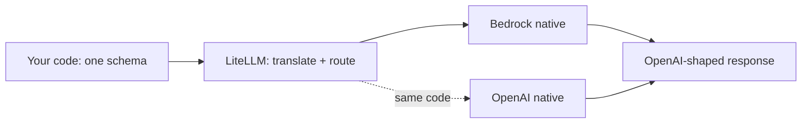
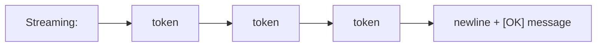
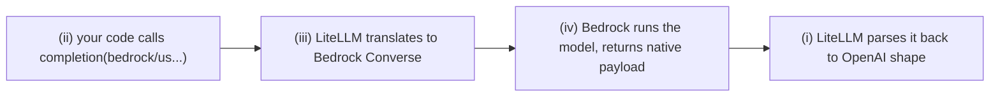
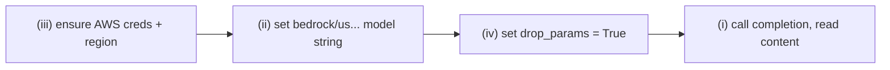
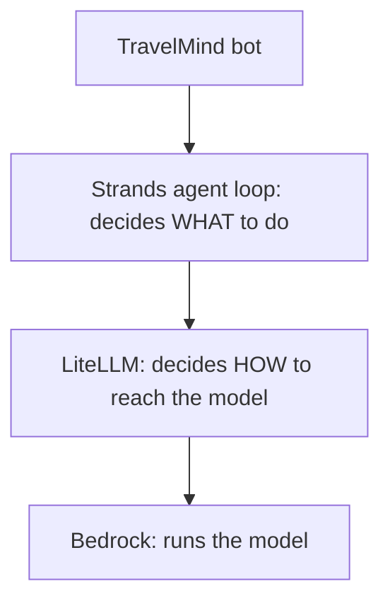

# Solutions · LiteLLM · Interim

**Language:** Python · **Topics:** LiteLLM core, Bedrock routing, unified I/O, streaming · **Level:** Foundational

How to read this sheet: each answer gives the choice, then **why it is right**, then a quick note on why the tempting wrong options fail. Code is explained construct by construct, including why Python is written this way and not another.

The one picture that anchors everything:



Your code speaks one language in and reads one language out. LiteLLM does the translation on both ends.

---

## Q1 · What `bedrock/` does → **B**

The model string is a routing address. LiteLLM reads the prefix before the slash to pick the provider driver.

```
bedrock / us.anthropic.claude-haiku-4-5-20251001-v1:0
  |            |
  |            +-- the actual model id the provider understands
  +-- provider selector: use the Bedrock driver
```

- Why not A/C/D: caching, streaming, and auth are controlled by other arguments (`caching`, `stream`, credentials), not by the prefix.

---

## Q2 · No `api_key` on Bedrock → **B**

Two auth worlds:

| Provider | Auth mechanism |
|---|---|
| OpenAI, Anthropic API | an API key string |
| Bedrock | AWS credentials (env vars, profile, or IAM role) via the AWS SDK |

When you pass `api_key` to a Bedrock call, LiteLLM tries the key path and the AWS credential chain never runs, so the request cannot sign. Leaving `api_key` out lets boto3 find your credentials normally.

- Why not A: it does not ignore it, it breaks. Why C/D: unrelated.

---

## Q3 · What `resp.choices[0].message.content` holds → **C**

LiteLLM returns the **OpenAI response object** no matter the provider. Walk the path:

```
resp
 └─ choices          # a list; a model can return several candidate answers
     └─ [0]          # the first (default) candidate
         └─ message  # the assistant turn
             └─ content   # the generated text
```

- Why a list `choices`: the schema allows `n>1` candidates, so index 0 selects the first.
- Why `.message.content` and not `resp.text`: LiteLLM standardises on OpenAI's nested shape. A flat `.text` would break the promise that the same parsing works across providers.

---

## Q4 · The `us.` prefix → **B**

`us.anthropic.claude-...` is a **cross-region system inference profile id**. On-demand Claude on Bedrock is served through these profiles, so the naked `anthropic.claude-...` id is rejected.

```
us.anthropic.claude-haiku-4-5-20251001-v1:0
|__| 
 cross-region inference profile, required for on-demand Claude
```

- Why not A: `us.` is not the region; the region is set separately (`AWS_REGION_NAME`). Why C/D: not optional, not an account id.

---

## Q5 · True or false

| | Statement | Answer | Why |
|---|---|---|---|
| a | LiteLLM is an agent framework | **F** | it only moves one model call; planning and tools are Strands / LangGraph |
| b | `completion()` returns the same shape for any provider | **T** | that is the core promise: OpenAI-shaped in and out |
| c | swapping the model string forces a parsing rewrite | **F** | the response shape is identical, so downstream code is untouched |
| d | LiteLLM can fetch embeddings too | **T** | `litellm.embedding(...)` uses the same unified interface |

---

## Q6 · Real LiteLLM capabilities → **A, B, D, E**

```
LiteLLM does:  [fallbacks] [retries] [cost tracking] [routing] [unified I/O] [embeddings]
LiteLLM is NOT: [training/fine-tuning]   [a vector database]
```

- C (training) is a platform job (SageMaker, Bedrock Custom Model Import). F (storing vectors) is a database job (FAISS, OpenSearch). LiteLLM is inference-time only.

---

## Q7 · Predict the final print → a newline, then `[OK] Streaming deltas received.` on its own line

The loop and the final print do two different jobs:

```python
print("Streaming: ", end="")                 # prints label, NO newline
for chunk in litellm.completion(..., stream=True):
    piece = chunk.choices[0].delta.content or ""
    print(piece, end="", flush=True)          # each token, NO newline, joined inline
print("\n[OK] Streaming deltas received.")     # \n ends the streamed line, then the message
```

Flow of what appears on screen:



- `\n` at the start of the last string closes the inline stream line before printing the confirmation.

---

## Q8 · Effect of `end=""`

`print` normally appends a newline. `end=""` replaces that newline with nothing, so consecutive prints sit on the **same line**. That is what makes streamed tokens read as one growing sentence instead of one token per line.

- Why not just build a string and print once: streaming's value is showing tokens as they arrive, so you print each delta immediately.

---

## Q9 · Match

| Term | Meaning | Why |
|---|---|---|
| 1. `drop_params=True` | **B** removes params the provider rejects | shields you from the temperature + top_p conflict |
| 2. `bedrock/converse/<model>` | **C** forces the Converse route | overrides LiteLLM's default route choice |
| 3. Router | **A** spreads calls across deployments | one name, many backends, with failover |
| 4. `completion()` | **D** the one call that reaches any model | the whole surface for most work |

E (prompt compression) matches nothing here.

---

## Q10 · Trace the flow → ii, iii, iv, i



The symmetry is the point: translation happens on the way in and on the way out, so your code only ever sees one shape.

---

## Q11 · Spot the issues and fix → **B**

Broken code, two independent faults:

```python
resp = litellm.completion(
    model="anthropic.claude-haiku-4-5-20251001-v1:0",   # FAULT 1: no bedrock/us. prefix
    messages=msgs,
    temperature=0.3,
    top_p=0.9,                                            # FAULT 2: temp + top_p together
)
```

Fixed:

```python
litellm.drop_params = True                               # fixes FAULT 2
resp = litellm.completion(
    model="bedrock/us.anthropic.claude-haiku-4-5-20251001-v1:0",  # fixes FAULT 1
    messages=msgs,
    temperature=0.3,
    top_p=0.9,        # now dropped safely instead of erroring
)
```

- Why `drop_params` and not "just delete top_p": frameworks often inject `top_p` for you behind the scenes, so the global switch is the durable fix, not editing one call.

---

## Q12 · Tweak `max_tokens=200` to `10`

You would see the answer **cut off mid-sentence**. `max_tokens` caps how many tokens the model may generate, not how well it reasons. A tiny cap truncates output, it does not make the model dumber.

```
max_tokens=200:  "Amazon Bedrock is a managed service that offers foundation models..."
max_tokens=10:   "Amazon Bedrock is a managed serv"   <-- truncated
```

---

## Q13 · PM question about switching providers

Accurate answer: yes, without rewriting the bot's logic. The only change is the **model string** (and providing that provider's credentials).

```python
MODEL = "bedrock/us.anthropic.claude-haiku-4-5-20251001-v1:0"   # today
MODEL = "openai/gpt-4o"                                          # after switch
# every other line stays the same
```

---

## Q14 · Order the first call → iii, ii, iv, i



Credentials first (nothing signs without them), then the address, then the safety switch, then the call. Setting `drop_params` before or after the model string is both fine; it must be before the call.

---

## Q15 · Placement → **B**



LiteLLM is the middle box, the model access layer. It never plans and never holds tools; that is the loop above it.

---

## Q16 · Skeptic check

- One honest reason it is overhead here: a single provider and one small service means you carry an extra dependency and one translation hop for zero swap benefit.
- One event that flips it: a price cut, a provider outage, a procurement mandate, or a second team sharing the account, any of which suddenly makes provider-swapping or central key and budget control worth the layer.

The lesson: abstraction earns its place when change or scale arrives, not before.
