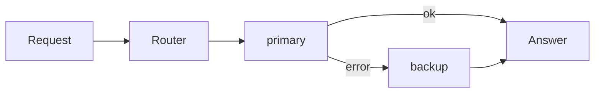
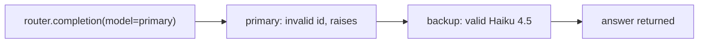
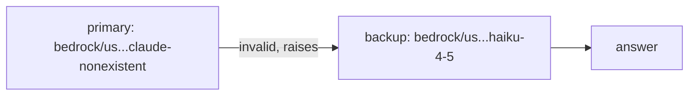
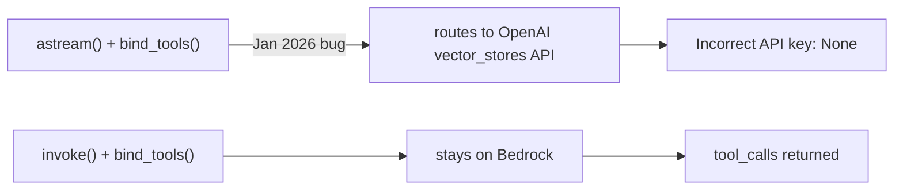
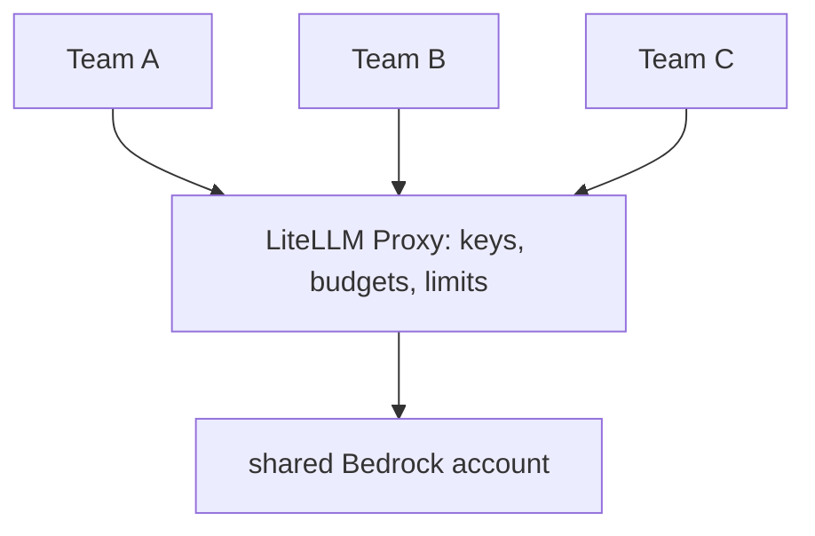

# Solutions · LiteLLM · Final

**Language:** Python · **Topics:** fallbacks, retries, routing, cost, structured output, Strands / LangChain / LangGraph · **Level:** Applied

Each answer gives the choice, the reasoning, and for code the why-this-way. Debugging answers show broken vs fixed with the mechanism that makes the fix work.

Resilience picture for this sheet:



---

## Q1 · Router fallback on primary error → **B**

The `fallbacks` mapping tells the Router: if a call to `primary` raises, retry the same request against `backup`.

```python
fallbacks=[{"primary": ["backup"]}]
#            ^ if this fails   ^ try these, in order
```

Path when primary is the invalid model:



- Why not A: the whole point of `fallbacks` is to not raise. Why C/D: it returns a real answer from backup, and it never switches to a provider you did not configure.

---

## Q2 · What `num_retries=3` handles best → **B**

| Failure type | Retry helps? | Reason |
|---|---|---|
| transient throttling / network | yes | a later attempt often succeeds |
| wrong model string | no | it will fail every time |
| bad prompt / missing messages | no | deterministic error, retrying wastes calls |

Retries target **flaky** failures, not **permanent** ones. This is the standard cushion for the throttling errors seen at concurrent load.

---

## Q3 · What `completion_cost` returns → **B**

```python
cost = litellm.completion_cost(completion_response=resp)   # a float in dollars
```

It reads the token usage on the response and multiplies by that model's per-token price. Not a count, not latency, not a name.

---

## Q4 · Temperature + top_p facts → **A, B, C**

```
Bedrock Claude rule:  send temperature OR top_p, not both
Common trap:          frameworks default top_p=1.0 silently
Durable fix:          litellm.drop_params = True   (removes the unsupported one)
```

- D is wrong: lowering `max_tokens` changes output length, not which params are sent.

---

## Q5 · Which deployment answered → `backup`



The invalid primary always raises, so the `fallbacks` mapping reroutes to backup, and backup produces the text. This is exactly how you prove a fallback path in a demo: make the primary fail on purpose.

---

## Q6 · Predict the print shape → two lines

```python
u = resp.usage
print(f"Tokens in/out: {u.prompt_tokens}/{u.completion_tokens}")   # line 1
cost = litellm.completion_cost(completion_response=resp)
print(f"Estimated cost: ${cost:.6f}")                              # line 2
```

- Line 1: a tokens in/out line, two integers separated by a slash.
- Line 2: `Estimated cost: $` then a number to six decimal places.
- Why `:.6f`: token costs are tiny fractions of a cent, so six decimals keeps them readable instead of showing `0.0`.

---

## Q7 · Match feature to call

| Need | Call | Why |
|---|---|---|
| 1. failover | **B** `Router(..., fallbacks=...)` | fallbacks reroute on failure |
| 2. dollar cost | **C** `completion_cost(...)` | prices the usage |
| 3. vectors | **A** `litellm.embedding(...)` | embeddings, not chat |
| 4. balance | **D** `Router` with same `model_name` twice | duplicate names load-balance |

E (`moderation`) matches nothing asked.

---

## Q8 · Spot the wrong line → key must be `model_name`

Broken:

```python
router = Router(model_list=[
    {"name": "claude", ...},   # WRONG key
    {"name": "claude", ...},
])
```

Fixed:

```python
router = Router(model_list=[
    {"model_name": "claude", ...},
    {"model_name": "claude", ...},
])
```

- Why it matters: the Router groups deployments by `model_name` to balance and fail over. With `name`, the Router does not see a group, so routing breaks. The field name is not decorative; it is the grouping key.

---

## Q9 · Debug the streaming tool call → use `invoke`

Broken (fails only when streaming with tools on Bedrock):

```python
async for chunk in llm_with_tools.astream("What is 6 times 7?"):   # misroutes to OpenAI
    ...
```

Fixed:

```python
ai = llm_with_tools.invoke("What is 6 times 7?")   # one-line fix
print(ai.tool_calls)
```

Mechanism of the bug:



- Why `invoke` and not "add an API key": the request should never reach OpenAI. `invoke` takes the correct Bedrock path. Alternative: `langchain-aws` `ChatBedrockConverse` for native streaming with tools.

---

## Q10 · Rectify: key in `client_args` for Bedrock

Wrong because Bedrock authenticates with **AWS credentials**, not an api_key. Passing a key breaks the AWS credential chain, same as Q2/Q10 on the interim sheet.

```python
# wrong
LiteLLMModel(client_args={"api_key": AWS_SECRET}, model_id="bedrock/us...")
# right
LiteLLMModel(model_id="bedrock/us...")   # creds come from env, profile, or IAM role
```

One line: drop the key; let boto3 find AWS credentials.

---

## Q11 · Strands `model_id` on Bedrock → **B**

```python
model_id="bedrock/us.anthropic.claude-haiku-4-5-20251001-v1:0"
```

Same LiteLLM string, now inside `LiteLLMModel`. Strands passes it straight to LiteLLM, which routes to Bedrock.

- Why not A: missing the `bedrock/us.` prefix, which LiteLLM needs to route and which Bedrock needs for on-demand Claude.

---

## Q12 · Predict `percent_of` output → `36.0`

```python
@tool
def percent_of(part: float, whole: float) -> float:
    """Return part percent of whole."""
    return whole * part / 100.0
```

For part=15, whole=240: `240 * 15 / 100 = 36.0`.

- Why a float: the params are typed `float` and the division `/` in Python always yields a float, so `36.0` not `36`.
- Why the docstring matters: Strands reads the docstring as the tool description the model sees, so the model knows when to call it.

---

## Q13 · Complete the Strands agent

```python
model = LiteLLMModel(
    model_id="bedrock/us.anthropic.claude-haiku-4-5-20251001-v1:0",   # blank 1
    params={"max_tokens": 600, "temperature": 0.3},
)
agent = Agent(model=model, tools=[calculator])
```

Why each piece:

| Piece | Purpose |
|---|---|
| `model_id="bedrock/us..."` | routes the Strands agent's calls to Bedrock via LiteLLM |
| `params={...}` | per-call generation settings passed through to the model |
| `tools=[calculator]` | the loop may call this tool when the question needs it |

---

## Q14 · Complete the fallback

```python
fallbacks=[{"primary": ["backup"]}]
```

Read it as a rule: for the group named `primary`, on failure try the list `["backup"]`, in order. A list means you can chain multiple backups.

---

## Q15 · Case study: SDK or Proxy for 5 teams → Proxy



Two reasons tied to the symptoms:

- Cross-team throttling: the Proxy enforces per-team rate limits, so one team cannot starve the others.
- Shared spend: the Proxy gives each team a virtual key with its own budget, so spend is attributable and capped.

The SDK-in-each-app option cannot coordinate across teams; every app would hold raw credentials and there is no central control point.

---

## Q16 · Skeptic check

Native SDK beats LiteLLM when:

- you need ultra-low latency on a single model (one fewer hop matters), or
- you need a provider-only feature the moment it ships, before the adapter catches up.

The trade: LiteLLM buys portability and control at the cost of a small hop and occasional feature lag. If you will never swap and never scale teams, the native SDK is the leaner choice.
