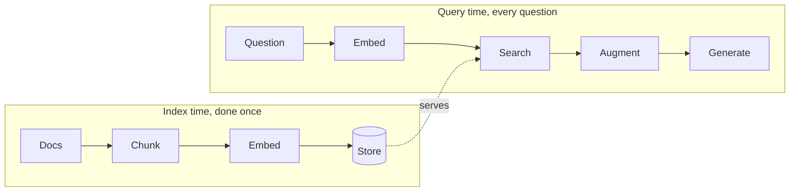
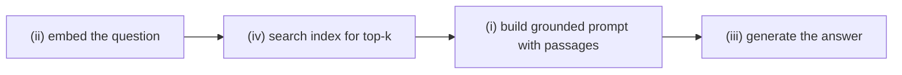
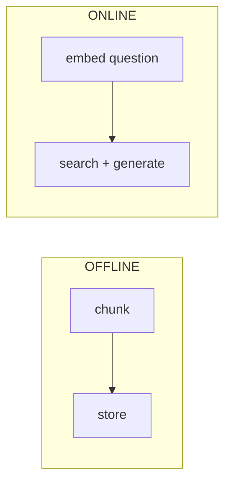

# Solutions · RAG · Interim 1

**Language:** Python · **Topics:** embeddings, chunking, cosine retrieval, naive RAG · **Level:** Foundational

Each answer gives the reasoning, and code is explained line by line, including the Python choices and why not the alternatives.

The mental model to hold throughout:



Offline is slow and rare. Online is fast and constant. Confusing the two is the root of most RAG bugs.

---

## Q1 · RAG vs fine-tuning for current rules → **B**

| | Fine-tuning | RAG |
|---|---|---|
| teaches | behaviour and style | nothing; it supplies knowledge at query time |
| update knowledge | retrain the model, slow and costly | edit a document |
| cite sources | hard | natural, you cite retrieved passages |

Refund rules change; you want to edit a doc, not retrain. That is RAG.

- Why not A: fine-tuning is not always less accurate; it is the wrong tool for fast-changing knowledge. Why C/D: both false.

---

## Q2 · What an embedding is → **B**

An embedding maps text to a point in a high-dimensional space so that **meaning becomes distance**.

```
"refund policy"     ●
"money-back rules"  ● (near, similar meaning)
"lunch menu"                         ● (far, unrelated)
```

- Why not a summary or keyword list: an embedding is a numeric vector, not text; the whole point is that math (distance) can compare meanings.

---

## Q3 · Cosine near 1 vs near 0 → **B**

$$\cos(\theta) = \frac{a \cdot b}{\lVert a \rVert \, \lVert b \rVert}$$

- Near 1: the vectors point the same way, so same topic.
- Near 0: perpendicular, so unrelated.

Why cosine and not plain distance: cosine compares **direction**, ignoring vector length. Two passages about refunds should match even if one is longer, and direction captures that where raw distance would not.

---

## Q4 · Shape returned by `embed` → **B**

```python
def embed(texts):
    e = litellm.embedding(model="bedrock/amazon.titan-embed-text-v2:0", input=texts)
    return np.array([d["embedding"] for d in e.data], dtype=float)
```

Walkthrough:

| Line piece | What it does | Why this way |
|---|---|---|
| `input=texts` | sends a list of strings | batching many texts in one call is cheaper than one call each |
| `e.data` | the list of per-text results | mirrors the response structure: one entry per input |
| `d["embedding"]` | the vector for text `d` | each entry carries its own vector |
| `np.array([... for d in e.data])` | stacks vectors into a matrix | shape becomes `(len(texts), dim)` for fast math later |
| `dtype=float` | forces numeric type | guards against object arrays that break linear algebra |

Result shape: `(len(texts), embedding_dim)`. Rows are texts, columns are dimensions.

---

## Q5 · What `np.argsort(-sims)[:k]` gives → **B**

```python
order = np.argsort(-sims)[:k]
```

Step by step:

- `sims` is an array of similarity scores, one per chunk.
- `np.argsort(sims)` returns indices that sort **ascending** (lowest first).
- Negating, `np.argsort(-sims)`, flips it so the **highest** scores come first.
- `[:k]` keeps the top k indices.

Why negate instead of `argsort(...)[::-1]`: both work; negation reads as "sort descending" in one step and is the common idiom. Why not sort the scores themselves: you need the **indices** to fetch the matching chunks, not the scores.

---

## Q6 · Predict from the bars → the refund chunk, with `k=1`

```
refund and money-back policy   ████████████████  0.83   <- highest, returned
how to reset your password     ██████            0.31
office lunch menu              ██                0.09
```

With `k=1`, `retrieve` returns only the top-scoring chunk. The bot's answer is grounded in the refund and money-back policy passage.

---

## Q7 · Predict the shape print → `Index shape: (9, 1024)`

```python
MATRIX = embed([c["text"] for c in CHUNKS])
print("Index shape:", MATRIX.shape)
```

- 9 chunks in, so 9 rows.
- Titan v2 vectors here are 1024-dim, so 1024 columns.
- `.shape` on a 2D array prints `(rows, cols)`, so `(9, 1024)`.

Why read the dimension from the array instead of hardcoding it: Titan v2 supports multiple sizes; reading `MATRIX.shape` keeps the code correct whatever size the model returns.

---

## Q8 · True or false

| | Statement | Answer | Why |
|---|---|---|---|
| a | too-large chunk blurs topics | **T** | one averaged vector loses focus, weakening the match |
| b | embed docs and query with different models | **F** | vectors from different models are not comparable |
| c | overlap stops boundary sentences being cut | **T** | overlapping windows keep straddling sentences whole |
| d | retrieval returns the k closest to the query | **T** | that is the definition of top-k retrieval |

The (b) rule is the single most common silent RAG bug: mixing embedding models is comparing metres to inches.

---

## Q9 · Symptoms of chunks too small → **A, C**

```
too SMALL:  [topic split across chunks]  [fragment answers nothing]
too BIG:    [one vector, many topics]     [answer drowns in noise]
```

- B and D are symptoms of chunks that are too **big**, so they do not belong here.

---

## Q10 · Match the pipeline

| Stage | Job | Why |
|---|---|---|
| 1. Chunk | **B** split docs into focused passages | small passages embed sharply |
| 2. Embed | **A** turn text into vectors | so math can compare meaning |
| 3. Store | **D** hold vectors for fast search | the searchable index |
| 4. Retrieve | **C** find the closest passages | top-k by similarity |

E (rewrite the question) is a query-time lever, not a base pipeline stage.

---

## Q11 · Spot the bug → **B**

Broken: documents embedded with Titan, query embedded with Cohere.

```python
doc_vecs = litellm.embedding(model="bedrock/amazon.titan-embed-text-v2:0", input=docs)
qv       = litellm.embedding(model="bedrock/cohere.embed-english-v3", input=[query])  # mismatch
```

Fixed: same model for both.

```python
EMBED = "bedrock/amazon.titan-embed-text-v2:0"
doc_vecs = litellm.embedding(model=EMBED, input=docs)
qv       = litellm.embedding(model=EMBED, input=[query])
```

Why: two models place meaning in two different, incompatible spaces. Cosine between a Titan vector and a Cohere vector is noise. Same model, same space, comparable.

---

## Q12 · Trace naive RAG → ii, iv, i, iii



You cannot search before you have a query vector, and you cannot generate before you have context, so the order is forced.

---

## Q13 · What "say you do not know" achieves → **B**

```python
"Answer ONLY from the context. ... If the answer is not in the context, say you do not know."
```

This gives the model **permission to refuse**. Without it, a model tends to fill the gap with a plausible invention. With it, a retrieval miss produces an honest "I do not know" instead of a confident hallucination.

- Why not A/C/D: it changes honesty, not speed, format, or k.

---

## Q14 · Sort into buckets

| Task | Bucket | Why |
|---|---|---|
| a. chunk the documents | OFFLINE | prepared once, before any question |
| b. embed the user's question | ONLINE | happens per question |
| c. store chunk vectors | OFFLINE | building the index |
| d. search top-k and generate | ONLINE | answering the question |



---

## Q15 · The pet-rule hallucination → **B**

The corpus has no pet-in-cabin rule, so retrieval returns nothing relevant. The fix is the grounding + refusal prompt, which makes the model say "I do not know" rather than invent a rule.

- Why not A (more seat chunks): the missing topic is pets, not seats. Why C/D: token cap and provider do not cause invention.

---

## Q16 · Skeptic check

Stop at naive RAG when the measured baseline already passes, because every lever (reranking, rewriting) adds latency and cost. Complexity is a liability until a metric shows a specific failure that the lever fixes. Ship the simple version, measure, then add only what the numbers demand.
