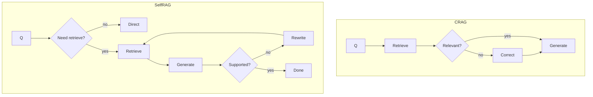
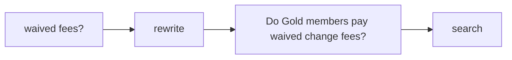
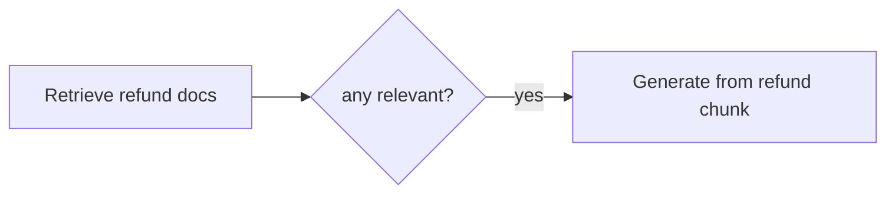
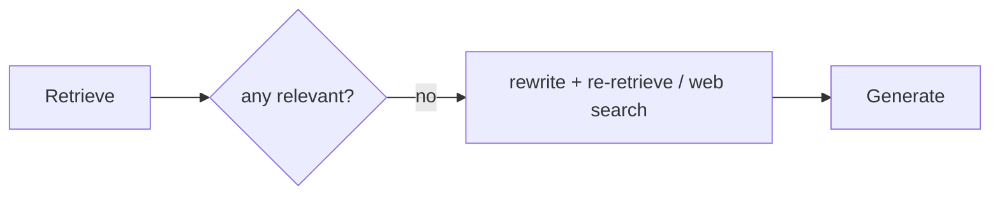
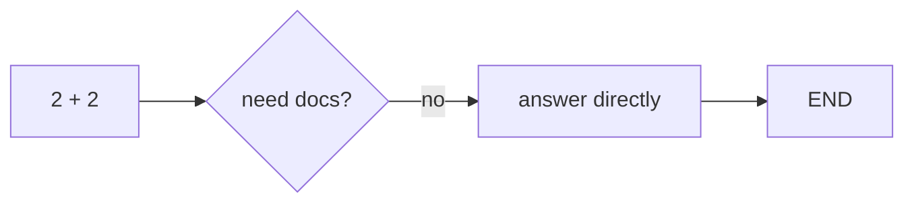
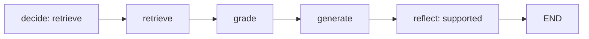
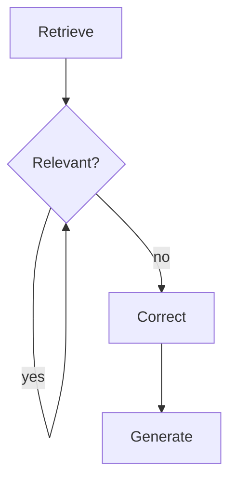
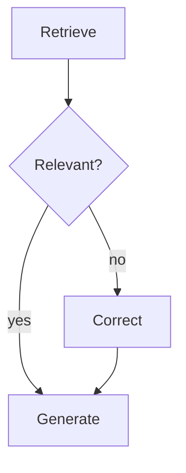
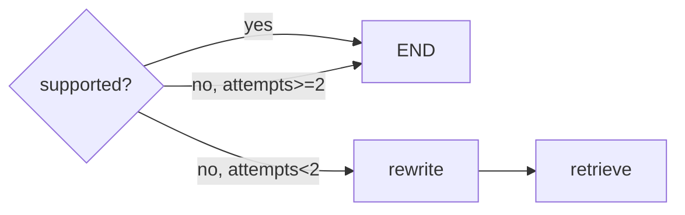
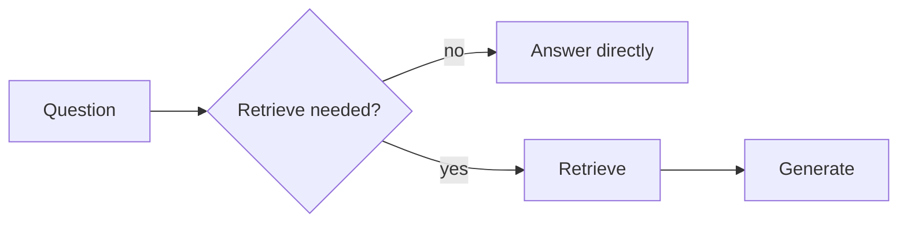

# Solutions · RAG · Interim 2

**Language:** Python · **Topics:** query rewriting, reranking, hybrid search, CRAG, Self-RAG · **Level:** Intermediate

Each answer explains the reasoning and the graph mechanics. Node code is walked through so the routing is obvious, not magic.

Two loops anchor this sheet:



CRAG grades what it got and corrects. Self-RAG decides whether to look at all, then checks itself.

---

## Q1 · What reranking fixes → **B**

Vector similarity is a **coarse** score. A truly relevant chunk can land at rank 4 while a loosely related one sits at rank 1. Reranking runs a second, sharper judge (often the model) over the top results to reorder them.

```
before rerank:  [loosely related] [target chunk] [noise] ...
after rerank:   [target chunk]    [loosely related] ...
```

- Why not A/C/D: chunk size, missing docs, and embedding speed are different problems with different fixes.

---

## Q2 · What hybrid search rescues → **B**

| Search | Strong at | Weak at |
|---|---|---|
| semantic (vector) | meaning, paraphrase | exact codes, rare tokens |
| keyword (BM25) | exact strings | paraphrase |
| hybrid | both, fused | slightly more setup |

A PNR like `JX48Q2` is a rare token a vector may smear together with other codes. Keyword search nails it exactly. Fusing both gives the best recall.

---

## Q3 · When query rewriting runs → **B**

Rewriting happens **before search**, to turn a vague question into a keyword-rich one the retriever can match.



---

## Q4 · CRAG on the refund question → generate branch

The corpus has a refund chunk, so grading keeps at least one relevant document. `crag_grade` sets `route = "generate"` and `relevant` holds the refund chunk.



---

## Q5 · CRAG on the pet question → correct branch

No pet rule exists, so grading keeps nothing. `route = "correct"`. The correction step rewrites the query broader and re-retrieves (the hook where a real web search tool would run), then generates.



- Why correction and not just answer: without it, an empty retrieval would produce a confidently wrong answer, the exact failure CRAG exists to stop.

---

## Q6 · What decides `route` in `crag_grade` → **B**

```python
def crag_grade(state):
    q = state["question"]; kept = []
    for d in state["documents"]:
        v = chat(f"Question: {q}\nPassage: {d['text']}\nRelevant and sufficient? yes or no.",
                 max_tokens=5, temperature=0.0).strip().lower()
        if v.startswith("y"):
            kept.append(d)
    return {"relevant": kept, "route": "generate" if kept else "correct"}
```

Walkthrough:

| Line | What / why |
|---|---|
| loop over `documents` | grade each retrieved chunk independently |
| `chat(... yes or no)` | ask the model a binary relevance question |
| `max_tokens=5, temperature=0.0` | tiny + deterministic: we only need a yes/no, cheaply and repeatably |
| `.strip().lower()` then `startswith("y")` | robust parse; tolerates "Yes.", " yes", "YES" |
| `"generate" if kept else "correct"` | **the single decider**: any kept doc → generate, else correct |

So the route hinges on whether the kept list is non-empty. Answer B.

- Why `temperature=0.0` for grading: a grader must be consistent; randomness would make the same doc pass sometimes and fail others.

---

## Q7 · Self-RAG on "2 + 2" → direct path

The decide node judges that general knowledge suffices, so Self-RAG skips retrieval entirely and answers directly.



Why this is the whole idea of Self-RAG: not every question needs a lookup, so it saves a retrieval and avoids stuffing irrelevant context.

---

## Q8 · Self-RAG on the seat question → node order

decide, retrieve, grade, generate, reflect, END.



Assuming supported on the first try, the reflect node routes to END with no rewrite loop.

---

## Q9 · Match CRAG grades

| Grade | Action | Why |
|---|---|---|
| 1. Correct | **B** generate from the docs | they answer the query |
| 2. Incorrect | **A** discard, fetch externally | the store missed, go elsewhere |
| 3. Ambiguous | **C** combine store docs + fresh search | partial, so blend sources |

D (delete the store) is never an action; it is the distractor.

---

## Q10 · Spot the wrong arrow → **B**

Broken diagram: the `yes` edge loops back to the grader.



Fixed: `yes` must flow to Generate.



- Why the original is a bug: `yes -> GRADE` is an infinite loop; relevant documents would never reach generation.

---

## Q11 · Self-RAG self-checks → **A, B, C**

```
Self-RAG asks:  [need to retrieve?]  [is each passage relevant?]  [is the answer supported?]
Not a self-check: [token count]
```

D (tokens used) is a cost metric, not a reasoning check.

---

## Q12 · Debug the loop → add the attempts cap

Broken (can loop forever):

```python
def sr_route_reflect(state):
    if state["supported"].startswith("y"):
        return "end"
    return "retry"
```

Fixed:

```python
def sr_route_reflect(state):
    if state["supported"].startswith("y") or state.get("attempts", 0) >= 2:
        return "end"
    return "retry"
```

Why the cap: on a genuinely hard question the answer may never be judged "supported", so the graph would rewrite and retry endlessly. `attempts >= 2` forces an exit. Every self-correcting loop needs a bound.



---

## Q13 · Rectify: add all levers at once

Wrong because stacking every lever at once adds latency and cost and hides which one actually helped. If quality moves, you cannot tell whether rewriting, reranking, or compression did it.

One line: add one lever at a time, driven by a measured failure.

---

## Q14 · Trace the state table

| Step | Node | relevant count | route | attempts |
|---|---|---|---|---|
| 1 | retrieve | 4 | (pending) | 0 |
| 2 | grade (none relevant) | 0 | correct | 0 |
| 3 | correct | 4 (broadened) | correct | 1 |
| 4 | generate | - | - | 1 |

Why attempts increments only at correct: the `crag_correct` node is the one that returns `attempts + 1`; retrieve and generate leave it unchanged.

---

## Q15 · Pick the correct diagram → **Y (B)**

Diagram X always retrieves; that is naive RAG, not Self-RAG. Diagram Y makes retrieval **conditional** on the decide node, which is the defining trait of Self-RAG.



---

## Q16 · Skeptic check

Self-RAG and CRAG add extra model or retrieval calls per question. That overhead is not justified when the corpus is well scoped, questions are uniform, and naive RAG already passes eval, or when latency and volume are tight. There, the loops buy accuracy you do not need at a cost you cannot afford.
