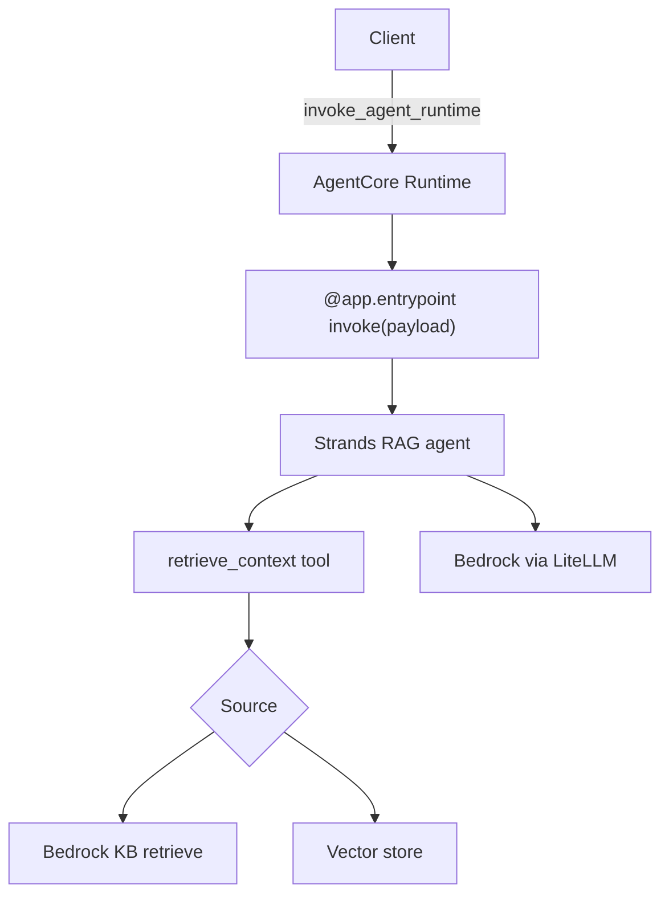
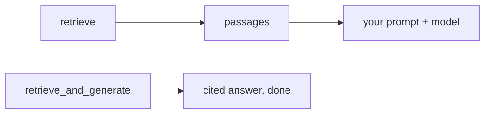
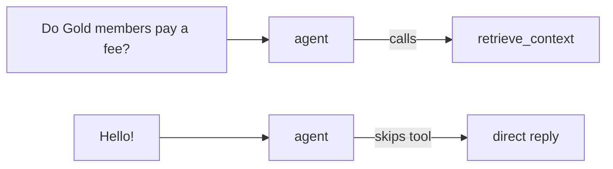
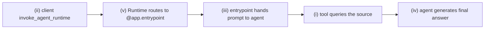
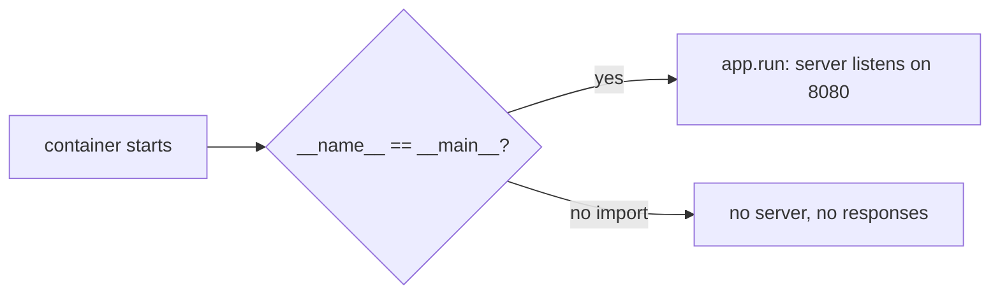

# Solutions · RAG · Final

**Language:** Python · **Topics:** Bedrock Knowledge Bases, retrieval-as-a-tool, AgentCore RAG, evaluation · **Level:** Applied

Each answer explains the reasoning; code is walked through construct by construct, with the Python and AWS choices justified.

Production shape for this sheet:



---

## Q1 · `retrieve` vs `retrieve_and_generate` → **B**

| Call | Returns | Use when |
|---|---|---|
| `retrieve` | passages only, with scores | you want to control the prompt and generation yourself (CRAG, custom formatting) |
| `retrieve_and_generate` | a generated, cited answer in one call | you want the managed shortcut, no prompt engineering |



---

## Q2 · Deprecated `citation` field → **B**

Read `retrievedReferences` instead of the deprecated `citation` field. The API still returns the old field for now, but new code should use `retrievedReferences` (and `generatedResponse`) so it does not break when `citation` is removed.

---

## Q3 · When to choose managed KB → **B**

Managed Knowledge Bases run chunking, embedding, and storage for you, so you ship fast. Choose DIY when you need custom retrieval logic (like CRAG's grade-and-correct loop), which the managed path does not expose.

- Why not A/C: those are DIY reasons. Why D: no documents means no RAG at all.

---

## Q4 · What retrieval-as-a-tool gains → **B**

When retrieval is a **tool** rather than a fixed pre-step, the agent decides per question whether to call it.



This is Self-RAG's "do I need to retrieve" instinct, expressed as tool choice. Simple chit-chat skips retrieval; policy questions trigger it.

---

## Q5 · Does the agent retrieve for "Hello"? → no

The system prompt scopes `retrieve_context` to TravelMind policy questions. A greeting is out of scope, so the model does not call the tool and just replies. The tool description and the system prompt together shape when the tool fires.

---

## Q6 · Spot the wrong config → **B**

Broken:

```python
rt.retrieve(
    knowledgeBaseId=KB_ID,
    query={"text": "refund window"},     # WRONG parameter name
    retrievalConfiguration={...},
)
```

Fixed:

```python
rt.retrieve(
    knowledgeBaseId=KB_ID,
    retrievalQuery={"text": "refund window"},   # correct name
    retrievalConfiguration={"vectorSearchConfiguration": {"numberOfResults": 4}},
)
```

Why: the boto3 `retrieve` API defines the parameter as `retrievalQuery`. AWS SDK parameter names are exact; `query` is not recognised and the call raises. There is no guessing with SDK signatures.

---

## Q7 · Complete the tool

```python
@tool
def retrieve_context(query: str) -> str:
    """Search the internal knowledge base and return the most relevant passages."""
    hits = retrieve(query, k=3)
    return "\n\n".join(f"[{h['id']}] {h['text']}" for h in hits)   # the blank
```

Walkthrough of the return line:

| Piece | What / why |
|---|---|
| `f"[{h['id']}] {h['text']}"` | format each hit as `[id] text` so the model can cite the id |
| `... for h in hits` | a generator over the retrieved hits |
| `"\n\n".join(...)` | glue passages with a blank line between them for readability |

Why a generator inside `join` and not a list built with a for-loop and append: `join` consumes an iterable directly, so the one-liner is clear and avoids a throwaway loop. Same result, less code.

Why the docstring matters: Strands shows it to the model as the tool's description, so the model knows this tool searches policies.

---

## Q8 · Match framework to RAG shape

| Framework | Shape | Why |
|---|---|---|
| 1. LangChain | **B** retriever + linear chain | good for straight-line RAG |
| 2. LangGraph | **C** graph with retrieve/grade/generate + loops | the home for CRAG and Self-RAG |
| 3. Strands | **A** retrieval as a `@tool` | agent chooses when to retrieve |
| 4. AgentCore | **D** hosts the deployed agent | production runtime |

E (spreadsheet of embeddings) is the distractor.

---

## Q9 · Trace the AgentCore request → ii, v, iii, i, iv



The request crosses the network boundary first, then the runtime dispatches to your code, then the agent works inside.

---

## Q10 · Rectify: hardcoded keys in the entrypoint

Wrong because long-lived keys committed in code leak through source control and cannot rotate cleanly, and the file may run in many environments.

One line: use the AgentCore execution IAM role, with no keys in the file. The runtime supplies scoped, rotating credentials automatically.

---

## Q11 · Debug the entrypoint → add `app.run()`

Broken (server never starts):

```python
@app.entrypoint
def invoke(payload):
    return {"result": str(agent(payload.get("prompt", "Hello")))}
# nothing here
```

Fixed:

```python
if __name__ == "__main__":
    app.run()   # starts the HTTP server on /invocations and /ping
```

Why this line is required:



`@app.entrypoint` only **registers** the handler. `app.run()` actually **starts** the server that receives requests. Without it, the container boots and exits with nothing listening.

Why guard with `if __name__ == "__main__"`: so the server starts only when the file is run directly, not when it is imported elsewhere (for tests or reuse).

---

## Q12 · Session id rejected → min 16 characters

Rule: the AgentCore session id must be at least 16 characters. `"user42"` is 6, so it fails validation.

Smallest fix: use a longer id, for example append a timestamp: `f"user42_{datetime.now():%Y%m%d%H%M%S}"`, which comfortably exceeds 16.

Why sessions matter: the id groups turns in CloudWatch and links events in Memory, so it must be long enough to be unique and valid.

---

## Q13 · Complete the entrypoint

```python
@app.entrypoint
def invoke(payload):
    """AgentCore passes the request payload; return a dict."""
    return {"result": str(agent(payload.get("prompt", "Hello")))}
```

Walkthrough:

| Piece | What / why |
|---|---|
| `payload.get("prompt", "Hello")` | read the user's prompt, default to "Hello" so a missing key does not crash |
| `agent(...)` | run the Strands agent on that prompt |
| `str(...)` | agent results are objects; convert to text for the JSON reply |
| `{"result": ...}` | AgentCore expects a JSON-serialisable dict back |

Why `.get` with a default and not `payload["prompt"]`: `["prompt"]` raises `KeyError` if the client omits it; `.get` degrades gracefully.

---

## Q14 · What `faith` measures → **B**

```python
faith = chat("... Is the answer fully supported by the context? yes or no.",
             max_tokens=5, temperature=0.0)
```

This checks **faithfulness**: is the answer backed by the retrieved context, or did the model add unsupported claims. It is not about whether the answer addresses the question (that is answer relevance), and not cost or latency.

---

## Q15 · What belongs in a RAG eval → **A, B, C**

```
measure:  [faithfulness]  [answer relevance]  [context relevance / recall]
noise:    [font size]
```

- Faithfulness: answer supported by context.
- Answer relevance: answer addresses the question.
- Context relevance / recall: retrieval fetched the right passages.

---

## Q16 · Skeptic check

A demo answering three questions is not evidence of quality; it cherry-picks easy cases. An eval set with labels catches silent regressions, retrieval misses on the long tail, and unsupported answers across the full question distribution, before users hit them. Eval is how you know the system works, not just that the demo did.
