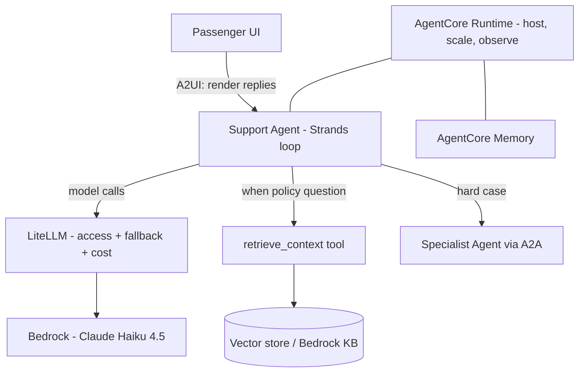
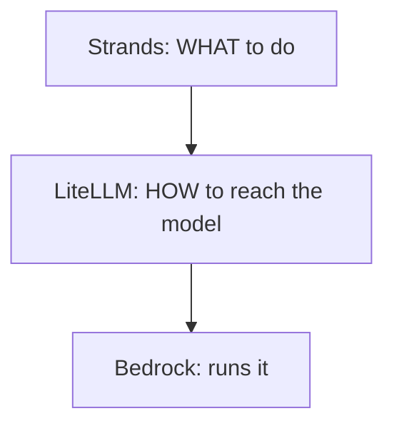
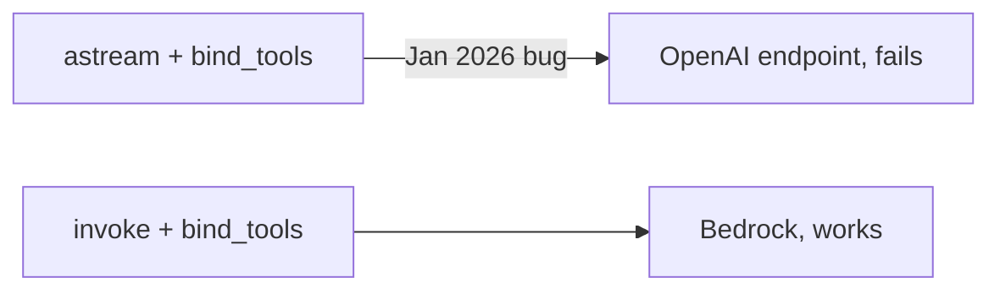
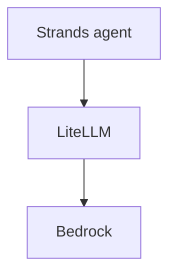
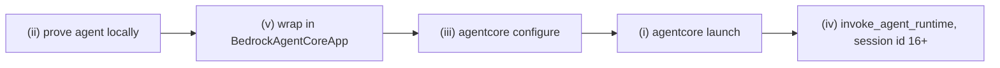
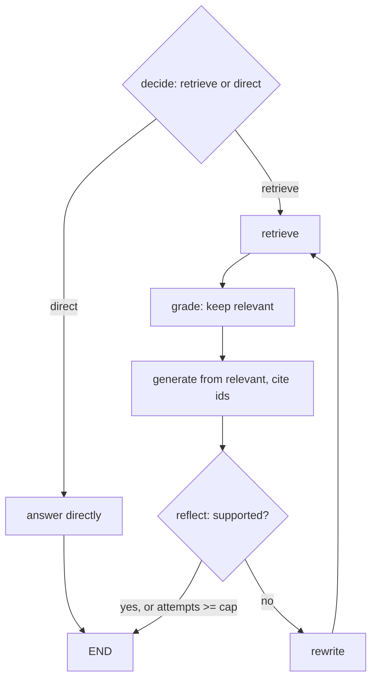

# Solutions · Consolidated Capstone

**Language:** Python · **Topics:** Strands, A2A, A2UI, AgentCore, LiteLLM, RAG · **Level:** Capstone

Each answer explains the reasoning and ties the week's pieces together. Code is walked through construct by construct.

The whole system on one picture, with each layer's job labelled:



Four distinct jobs: Strands orchestrates, LiteLLM reaches the model, RAG grounds the answer, AgentCore hosts it. A2A connects agents; A2UI connects to the screen.

---

## Q1 · Where LiteLLM sits → **B**

LiteLLM is **below** the agent, as the model access layer. The Strands loop decides what to do and, when it needs the model, calls through LiteLLM.



- Why not A: LiteLLM never decides tool calls; that is the loop. Why C/D: it is not hosting or UI.

---

## Q2 · Who decides what the agent does → **B**

The Strands agent loop plans, calls tools, and forms the reply. LiteLLM moves one call, AgentCore hosts, embeddings are just a model. Only the loop reasons about next steps.

---

## Q3 · AgentCore's role → **B**

AgentCore is production scaffolding: it hosts, scales, and observes the agent, and adds memory and identity. It does not translate model calls, chunk documents, or replace Strands.

```
AgentCore gives:  [hosting] [scaling] [memory] [identity] [observability]
AgentCore is NOT: [a model translator] [a chunker] [an agent framework]
```

---

## Q4 · Match concept to role

| Concept | Role | One-line why |
|---|---|---|
| 1. Strands | **B** the agentic loop | plans and calls tools |
| 2. LiteLLM | **A** model access | one wire to any provider |
| 3. RAG | **C** grounding in knowledge | keeps answers current and cited |
| 4. AgentCore | **E** production hosting | runtime, memory, identity, observability |
| 5. A2A | **D** agent-to-agent handoff | one agent delegates to another |
| 6. A2UI | **F** agent-to-UI rendering | replies reach the screen |

All six map; no distractor.

---

## Q5 · Which are the model-access layer → **A, B, D**

```
model access:  [litellm.completion]  [LiteLLMModel(...)]  [litellm.Router(...)]
orchestration: [Strands @tool]
hosting:       [BedrockAgentCoreApp()]
```

A, B, D all move or route model calls. C is orchestration glue; E is hosting.

---

## Q6 · Spot two bugs, fix both

Broken, two independent faults:

```python
model = LiteLLMModel(
    client_args={"api_key": AWS_SECRET},          # FAULT 1: Bedrock uses AWS creds, not a key
    model_id="bedrock/us.anthropic.claude-haiku-4-5-20251001-v1:0",
    params={"temperature": 0.3, "top_p": 0.9},    # FAULT 2: temp + top_p together
)
```

Fixed:

```python
import litellm
litellm.drop_params = True                         # fixes FAULT 2

model = LiteLLMModel(
    model_id="bedrock/us.anthropic.claude-haiku-4-5-20251001-v1:0",
    params={"temperature": 0.3},                   # send one, not both
)                                                   # FAULT 1 fixed by removing api_key
```

Why each:

- Fault 1: passing `api_key` breaks the AWS credential chain, so the request cannot sign. Credentials come from env, profile, or IAM role instead.
- Fault 2: Bedrock Claude rejects temperature and top_p together. Dropping one (or `drop_params = True`) resolves it.

---

## Q7 · Debug the streaming tool call → use `invoke`

Broken (fails only when streaming tool calls on Bedrock):

```python
async for chunk in tools_llm.astream("Look up PNR JX48Q2"):   # misroutes to OpenAI
    ...
```

Fixed:

```python
ai = tools_llm.invoke("Look up PNR JX48Q2")   # correct Bedrock path
```



Alternative: `langchain-aws` `ChatBedrockConverse` for native streaming with tools.

---

## Q8 · Assemble the RAG agent

```python
model = LiteLLMModel(
    model_id="bedrock/us.anthropic.claude-haiku-4-5-20251001-v1:0",   # blank 1
    params={"max_tokens": 600, "temperature": 0.3},
)
agent = Agent(
    model=model,
    tools=[retrieve_context],                                          # blank 2
    system_prompt=("Use retrieve_context for TravelMind policy questions. "  # blank 3
                   "Answer from retrieved passages and cite the [id]s. Say you do not know if absent."),
)
```

Why each part:

| Part | Purpose |
|---|---|
| `model_id="bedrock/us..."` | routes the agent's model calls to Bedrock via LiteLLM |
| `tools=[retrieve_context]` | lets the loop fetch policy passages when needed |
| system prompt naming the tool | tells the model when to retrieve and to cite and refuse honestly |

Why name the tool in the prompt and not just pass it: the model uses both the tool description and the system prompt to decide when to call it. Naming it in the prompt makes the trigger explicit.

---

## Q9 · Predict behaviour on the Gold-fee question

The agent calls `retrieve_context`. The tool returns a string of the top-3 passages formatted `[id] text`, joined by blank lines (the change-fee and tiers chunks). Per the system prompt, the final answer must be drawn from those passages, cite the `[id]s`, and say "I do not know" if the passages do not cover it.

---

## Q10 · Predict on "What time is it right now?"

The agent does not call `retrieve_context`. The tool is scoped to policy questions, and a clock question is out of scope. The model has no live clock, so it should say it cannot know the current time rather than invent one.

---

## Q11 · Rectify: one giant prompt instead of RAG

Three concrete reasons RAG wins:

| Axis | Giant prompt | RAG |
|---|---|---|
| Freshness | goes stale, must re-edit and resend the whole thing | edit one document, no resend |
| Cost | sends all docs on every call, burning input tokens each turn | sends only the top-k passages |
| Verifiability | no citations, and prone to lost-in-the-middle | cites retrieved `[id]s`, focused context |

---

## Q12 · Cost levers under load → **A, B, D**

```
reduce cost:  [fallback to cheaper model]  [prompt caching for repeated system prompt]  [track cost to find the burner]
never:        [remove the grounding prompt]   (that trades correctness for pennies)
```

C removes the safeguard that stops hallucination; it is not a cost lever, it is a regression.

---

## Q13 · Cost math

Rates (illustrative): $0.001 per 1k input, $0.005 per 1k output.

| Call | Input | Output | Cost |
|---|---|---|---|
| A | 2,000 | 400 | (2 x 0.001) + (0.4 x 0.005) = 0.002 + 0.002 = **$0.004** |
| B | 1,000 | 200 | 0.001 + 0.001 = **$0.002** |
| C | 3,000 | 600 | 0.003 + 0.003 = **$0.006** |
| **Total** | | | **$0.012** |

Method: tokens divided by 1000, times the per-1k rate, input and output priced separately, then summed. This mirrors what `litellm.completion_cost` automates per call.

---

## Q14 · Correct architecture → **Q (B)**



The agent uses LiteLLM to reach the model. Diagram P is inverted; LiteLLM does not orchestrate the agent, it sits beneath it.

---

## Q15 · Wrap for AgentCore

```python
if __name__ == "__main__":
    app.run()          # blank 1: start the HTTP server
```

Blank 2, the two deploy commands: `agentcore configure --entrypoint rag_agent.py` then `agentcore launch`.

Why `app.run()`: `@app.entrypoint` only registers the handler; `app.run()` starts the server that receives requests. Without it the container starts and exits with nothing listening.

---

## Q16 · Order the deploy → ii, v, iii, i, iv



Prove it works, wrap it, configure the deploy, launch, then invoke. Skipping "prove locally" ships bugs into a container that is slow to debug.

---

## Q17 · Design: Self-RAG node sketch

Node list with branch conditions, reusing the pattern you built (no new APIs):



Nodes: decide, direct, retrieve, grade, generate, reflect, rewrite. Branches: decide routes retrieve vs direct; reflect routes end vs retry, guarded by a max-attempts cap so it cannot loop.

---

## Q18 · Skeptic capstone: why not fine-tune one model for everything

- Fine-tuning teaches **behaviour and style** and bakes knowledge in permanently, slow and costly to update, and hard to cite.
- RAG supplies **current, private knowledge** you update by editing a document, with citations.
- LiteLLM keeps the model **swappable** and adds fallback, retries, and cost control.
- AgentCore supplies **hosting, memory, identity, and observability**.
- One fine-tuned model gives none of the operational or freshness properties, so you would end up rebuilding all four layers badly inside a training run. Separate the concerns: fine-tune for behaviour if ever needed, RAG for knowledge, LiteLLM for access, AgentCore for operations.
