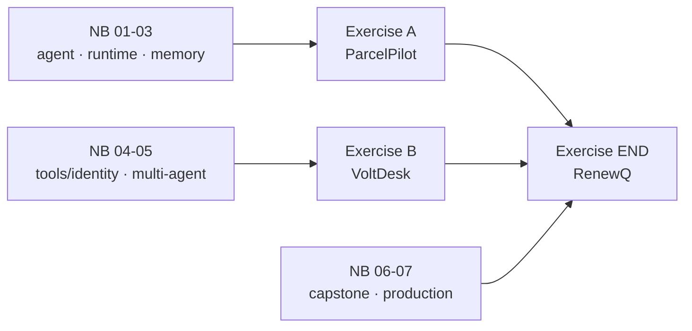

# AgentCore — Day Exercises

Three exercises for the AgentCore session day. The rhythm is **two lighter mid-session exercises + one integrative end-session exercise** — not a pile of busywork. Every exercise has the same shape:

- **Part 1 — think, don’t type.** Expand a deliberately thin brief into a buildable design: decompose, choose tools and patterns, design the memory model, define the contract, name the risks. No code. This is where understanding shows.
- **Part 2 — build it.** Implement with the exact components from the day, against a bounded “done.” Layered Base / Stretch / Advanced so mixed bands all have a real target.

Each exercise is a fresh domain (not TravelMind) on purpose — you apply the ideas, you don’t copy the capstone.

| Exercise | Run it after | Domain | Centers on | Time |
|---|---|---|---|---|
| **A — ParcelPilot** | Notebooks 01–03 | Last-mile delivery | Build an agent · Runtime · Memory | ~55 min |
| **B — VoltDesk** | Notebooks 04–05 | Electricity utility | Code Interpreter · multi-agent · pattern choice · Identity (design) | ~60 min |
| **END — RenewQ** | Notebooks 01–07 | B2B SaaS renewals | Everything + one production-hardening feature + a failure drill | ~90 min |

## How each maps to the day

## Shared ground rules (in every exercise)

- **Scenario first, code second.** Part 1 must be done before Part 2.
- **Bounded “done.”** Each tier states exactly what a complete submission looks like — no vague finish line.
- **Numbers are computed, not guessed.** Wherever money or quantities appear, the Code Interpreter owns them.
- **No copy-paste of the capstone.** The tools, memory namespaces, and contract must be designed for the exercise’s own domain.
- **One LLM-integrated reflection per exercise** (pass/fail): show an agent output, diagnose a weakness, fix it, show the improvement.
- **Viva-ready.** Be able to defend your design in ~2 minutes per question.

## Notes for facilitators / TAs

- Each file ends with a **Facilitator & TA notes** appendix: expected solution shape (not code), common confusions with *unstick hints* (questions, not answers), discussion prompts, viva questions, and a 30-second spot-check.
- Durations only — adapt to your own schedule.
- If a team stalls at Base, point them at the relevant notebook’s wiring (e.g., the capstone in 06) and let them keep their own domain logic; don’t hand them the answer.
- The mid-session rubrics are formative self-checks; the end-session rubric is gradeable and has a hard pass gate (pricing must run in the Code Interpreter).
