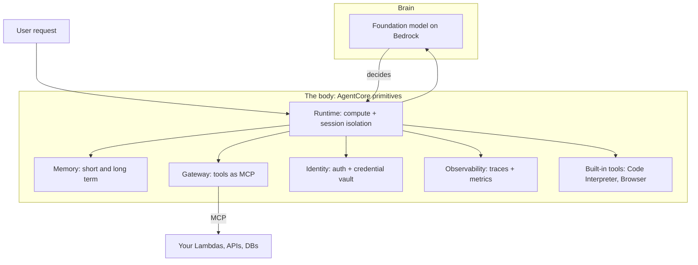
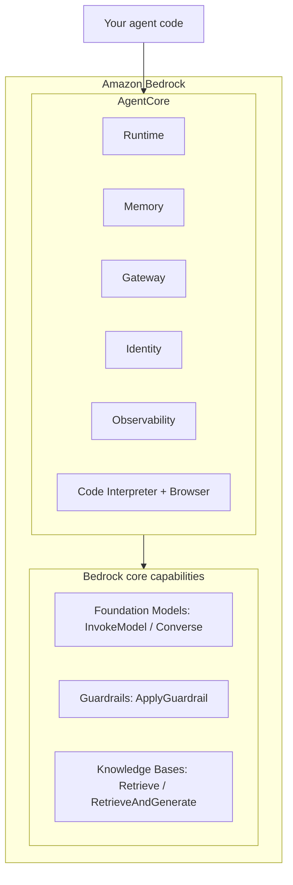
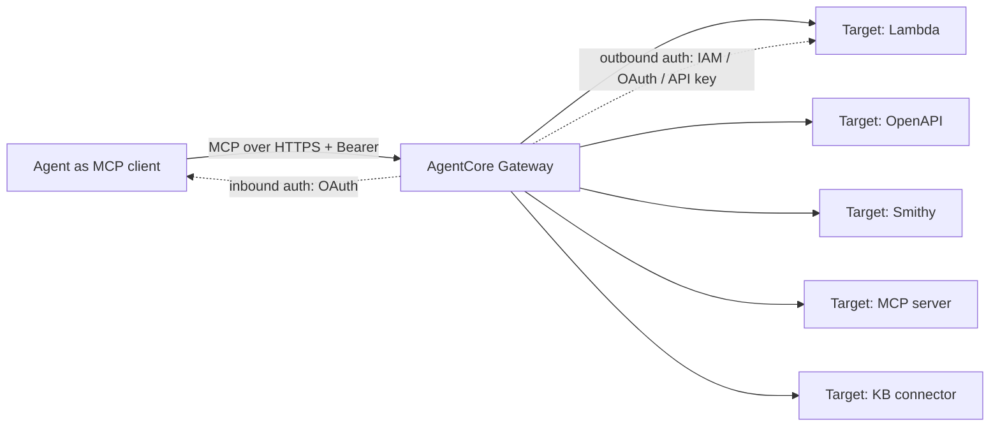

# Amazon Bedrock AgentCore: Foundations

**Track:** Agentic AI Bootcamp
**Level:** Intermediate to Advanced
**Prereqs:** You have built a working agent (Strands or LangGraph), called Bedrock via `InvokeModel`, and understand tools/MCP at a basic level.

---

## 1. The gap this closes

You already have an agent that runs in a notebook. It calls a model, picks a tool, loops, answers. On your laptop it works.

Now ship it. The moment "runs on my machine" becomes "runs for 500 users," a second system appears that has nothing to do with agent logic:

| Concern | Notebook reality | Production reality |
|---|---|---|
| Compute | Your kernel | Isolated, autoscaled, per-user |
| State between turns | A Python variable | Durable, per-user, survives restarts |
| Tools | Local functions | Governed, authenticated, versioned |
| Secrets | `os.environ` | Vaulted, rotated, never in model context |
| Failure | Traceback in your face | Retries, health checks, alarms |
| "What did it do?" | `print()` | Traces, spans, token/latency metrics |
| Session leakage | Not a thing (one user) | Hard isolation or you leak data between users |

The second system is the hard part. It is also the part that is identical across almost every agent you will ever build. Rebuilding it per project is the tax most teams pay.

AgentCore is AWS removing that tax. It is a set of managed building blocks for the second system, so you keep writing agent logic and stop writing infrastructure.

> **Skeptic checkpoint:** "I can wire this myself with Lambda + DynamoDB + Secrets Manager + CloudWatch." True. You can. The question is not *can you*, it is *do you want to own the glue, the upgrades, the session-isolation correctness, and the on-call for all of it, on every project, forever*. Keep that question live as we go. AgentCore is not magic, it is amortization.

---

## 2. The one mental model: brain vs body

An agent is not a model. If the model is the brain, everything else is the body: the compute it runs on, the memory it keeps, the hands it uses to touch the world, the identity it acts under, the eyes you watch it with.



Two things to lock in now:

1. **AgentCore is framework-agnostic.** It hosts Strands, LangGraph, LangChain, CrewAI, Google ADK, OpenAI Agents, or hand-rolled code. It does not replace your framework. It runs whatever you wrote.
2. **The primitives are composable and independent.** You can use Memory without Runtime, Gateway without Memory, Observability for an agent hosted on ECS. Pick the pieces you need. This is the single most misunderstood point about AgentCore, so we will keep returning to it.

---

## 3. The primitives at a glance

Seven core services. Read this table once, then we go deep on each.

| Primitive | One-line job | The pain it removes | Use it when |
|---|---|---|---|
| **Runtime** | Serverless host for agent/tool code | Compute, scaling, cold starts, per-session microVM isolation, up to 8h execution, 100MB payloads | You need to deploy an agent as an endpoint |
| **Memory** | Managed short-term + long-term memory | Storing turns, extracting facts/preferences/summaries, semantic recall across sessions | The agent must remember within or across conversations |
| **Gateway** | Turns APIs/Lambda into MCP tools | Per-API adapter code, MCP server hosting, inbound+outbound auth, tool discovery at scale | You have existing services to expose as governed tools |
| **Identity** | Auth + secure credential vault | OAuth flows, token refresh, keeping secrets out of model context | The agent acts on a user's behalf or calls authenticated services |
| **Observability** | OTEL traces + CloudWatch metrics | Instrumentation, span plumbing, a unified view of what the agent did | Always. You cannot operate what you cannot see |
| **Code Interpreter** | Sandboxed code execution | A secure Python/JS sandbox with filesystem, no infra to run | The agent must compute, analyze data, or validate its own answers |
| **Browser** | Cloud browser sandbox | A headless-Chromium fleet you would otherwise run yourself | The agent must navigate real websites |

Two more you will hear about, kept in your back pocket for now: **Policy** (Cedar-based, default-deny authorization over agent actions) and **Evaluations/Optimization** (score behavior on real traffic, get prompt/tool-description suggestions). We touch Policy briefly; Evaluations is a later session.

---

## 4. Where AgentCore sits (this trips everyone up)

AgentCore is one layer inside Bedrock. Some things you might call "AgentCore features" are actually Bedrock features that your AgentCore agent *consumes*. Getting this boundary right is the difference between an architecture doc and a hand-wave.



| Capability | Layer | Why the distinction matters |
|---|---|---|
| Runtime, Memory, Gateway, Identity, Observability, built-in tools | **AgentCore** | These are the "body" primitives, AgentCore-native |
| Guardrails | **Bedrock core** | A safety filter your agent calls (`apply_guardrail`) or attaches at model-invoke time. Not an AgentCore primitive |
| Knowledge Bases (RAG) | **Bedrock core** | A managed RAG store. Your agent calls `retrieve` / `retrieve_and_generate`, or you expose the KB through a Gateway connector target |
| The model itself | **Bedrock core** | AgentCore hosts the loop; the brain is still a Bedrock (or external) model |

You asked for Guardrails and Knowledge Bases in the hands-on. We will build both. Just be precise in the room: they are Bedrock capabilities the agent uses, and AgentCore is how you run and connect the agent that uses them. Calling a Knowledge Base an "AgentCore feature" in front of a technical audience is the kind of imprecision that costs credibility.

---

## 5. Deep dive per primitive

Format for each: **what it is → how you touch it → when to use → what else you could use instead.**

### 5.1 Runtime

**What.** A secure, serverless host for your agent or tool code. You wrap your code, it becomes an HTTP service with two endpoints (`/invocations` POST, `/ping` GET). AWS runs it on ARM64 (Graviton) with a dedicated microVM per session.

**How you touch it.** A three-line wrapper around code you already wrote:

```python
from bedrock_agentcore.runtime import BedrockAgentCoreApp

app = BedrockAgentCoreApp()

@app.entrypoint
def invoke(payload):
    # your existing agent runs here
    return {"result": ...}

if __name__ == "__main__":
    app.run()   # serves /invocations and /ping on :8080
```

What Runtime gives you beyond "it runs":

| Feature | Detail |
|---|---|
| Session isolation | Each session is a separate microVM: isolated CPU, memory, filesystem. VM is wiped after the session. This is how you avoid leaking one user's state into another |
| Extended execution | Real-time plus async jobs up to 8 hours (multi-agent, long tasks) |
| Large payloads | Up to 100 MB (text, images, audio, video, datasets) |
| Streaming | `async def` entrypoint that `yield`s streams back to the caller |
| Session context | `@app.entrypoint` can take `(payload, context)`; `context.session_id` groups traces and Memory events. Must be at least 16 characters or it fails validation |

**When to use.** You want an agent (or an MCP server, or an A2A server) deployed as a managed endpoint and you do not want to own the container, the autoscaler, or the isolation logic.

**Alternatives and the honest trade:**

| Option | Pick it when | Cost of picking it |
|---|---|---|
| **AgentCore Runtime** | You want managed isolation, long execution, big payloads, minimal ops | Less low-level control than raw containers |
| Lambda | Short (<15 min), stateless, spiky, you already live in Lambda | 15-min cap, cold starts, no built-in session microVM |
| ECS/EKS | You need full control of the container, sidecars, custom networking | You own scaling, isolation, patching, on-call |

> **Design note carried into the notebooks:** decouple *build time* from *serve time*. Construct the agent/graph, bind tools, choose the model once (module load). The `@app.entrypoint` function should be small: take a payload, run the already-built agent once, return. This keeps cold starts sane and makes the entrypoint testable.

### 5.2 Memory

**What.** Managed memory that solves the core problem of statelessness: without it, every turn is a stranger. Two kinds:

| Type | What it stores | Extraction | Availability |
|---|---|---|---|
| **Short-term (STM)** | Raw conversation events (turns) within a session | None. Exact messages | Immediate |
| **Long-term (LTM)** | Extracted insights: facts, preferences, summaries, across sessions | A memory *strategy* runs in the background | 2 to 5 minutes to provision; extraction takes ~1 minute after events land |

**Terminology you must say correctly:**

- **Actor** = who is interacting (`actor_id`), a user or another agent.
- **Session** = one continuous interaction (`session_id`).
- **Event** = the atomic unit of STM. Immutable, timestamped. A user message, an assistant reply, a tool call.
- **Strategy** = the config that decides how raw events become LTM records.

**Built-in strategies:**

| Strategy key | Extracts |
|---|---|
| `semanticMemoryStrategy` | Semantic facts ("customer flies out of BLR") |
| `userPreferenceMemoryStrategy` | Preferences ("prefers window seat, Gold tier") |
| `summaryMemoryStrategy` | Rolling session summaries |

You can also supply a custom prompt strategy when the built-ins do not fit your domain.

**How you touch it** (high-level SDK client, the cleanest surface):

```python
from bedrock_agentcore.memory import MemoryClient

client = MemoryClient(region_name="us-east-1")

# STM: no strategies
stm = client.create_memory_and_wait(
    name="TravelMind_STM",
    strategies=[],
    event_expiry_days=7,      # up to 365
)

# write a turn
client.create_event(
    memory_id=stm["id"],
    actor_id="Rao",
    session_id="pnr-JX48Q2-session-0001",   # >= 16 chars
    messages=[
        ("My BLR to DEL flight got cancelled", "USER"),
        ("Let me pull up PNR JX48Q2.", "ASSISTANT"),
    ],
)

# read recent context
turns = client.get_last_k_turns(
    memory_id=stm["id"], actor_id="Rao",
    session_id="pnr-JX48Q2-session-0001", k=3,
)
```

For LTM you add a strategy and later `retrieve_memories(memory_id, namespace, query)` for semantic recall.

**When to use.** The agent must remember, either within a call (STM) or across calls, days apart (LTM). If your agent is truly one-shot with no context, you may not need Memory at all.

**Alternatives:**

| Option | Pick it when |
|---|---|
| **AgentCore Memory** | You want managed extraction, semantic recall, framework hooks, no vector DB to run |
| DIY: DynamoDB + your own vector store | You have unusual retention/regulatory needs and want full control of the pipeline |
| Framework-native (LangGraph checkpointer / store) | You want it, *and* AgentCore has a bridge for it (`AgentCoreMemorySaver`, `AgentCoreMemoryStore`), so you get both. Covered in the LangGraph session |

> **Skeptic checkpoint:** LTM extraction is asynchronous and takes ~a minute. If your demo writes an event and immediately queries LTM, you will get nothing and think it is broken. It is not broken. It is eventually consistent. Design and demo around that, or you will debug a non-bug live.

### 5.3 Gateway

**What.** A fully managed MCP server that turns your existing APIs, Lambda functions, and services into MCP tools, with inbound and outbound auth handled for you. Your agent speaks one protocol (MCP over streamable HTTP) to reach anything.

**The shape:**



| Concept | Detail |
|---|---|
| Target types | Lambda, OpenAPI spec, Smithy model, MCP server, Knowledge Base connector, Web Search connector |
| Inbound auth | OAuth only (MCP authorization spec). Cognito, Okta, Auth0, or your IdP |
| Outbound auth | IAM (Lambda/Smithy), OAuth or API key (OpenAPI). Per-target credential provider |
| Transport | Streamable HTTP only |
| Endpoint | `https://{gatewayId}.gateway.bedrock-agentcore.{region}.amazonaws.com/mcp` |
| Extras | Semantic search over hundreds/thousands of tools; per-tool authorization |

**Tool naming gotcha you will hit:** the visible tool name is prefixed with the target name using a triple-underscore delimiter, `targetName___toolName`. Inside a Lambda target you strip the prefix from `context.client_context.custom['bedrockAgentCoreToolName']`. Miss this and your Lambda cannot tell which tool was called.

**How you touch it** (boto3, the most complete surface):

```python
import boto3
ctl = boto3.client("bedrock-agentcore-control", region_name="us-east-1")

target = ctl.create_gateway_target(
    gatewayIdentifier=gateway_id,
    name="TravelOps",
    targetConfiguration={"mcp": {"lambda": {
        "lambdaArn": "arn:aws:lambda:us-east-1:123456789012:function:GetPNR",
        "toolSchema": {"inlinePayload": [{
            "name": "get_pnr",
            "description": "Look up a booking by PNR",
            "inputSchema": {"type": "object",
                "properties": {"pnr": {"type": "string"}},
                "required": ["pnr"]},
        }]},
    }}},
    credentialProviderConfigurations=[{"credentialProviderType": "GATEWAY_IAM_ROLE"}],
)
```

**When to use.** You already have backend services (Lambdas, REST APIs) and want them available to one or many agents as governed, discoverable tools without writing MCP servers or auth glue.

**Alternatives:**

| Option | Pick it when |
|---|---|
| **Gateway** | You want managed MCP + centralized auth + tool discovery at scale |
| Framework-local tools (`@tool`) | Small tool count, in-process, you do not need governance or reuse across agents |
| Self-hosted MCP server | You have a specific MCP server already and do not need Gateway's governance layer in front |

### 5.4 Identity

**What.** Auth for agents, both directions, plus a secure token vault. It keeps credentials out of your code *and out of the model's context*, which is a threat surface people forget exists.

| Direction | Meaning | Mechanisms |
|---|---|---|
| **Inbound** | Who is allowed to invoke this agent/tool | IAM (SigV4) or JWT/OAuth (OIDC) |
| **Outbound** | The agent calling a downstream service as itself or on a user's behalf | API key or OAuth client (2-legged M2M or 3-legged on-behalf-of) |

**The pattern that matters** (two-layer function, token never touches the LLM):

```python
from bedrock_agentcore.identity.auth import requires_access_token

@requires_access_token(
    provider_name="github-oauth",
    scopes=["repo"],
    auth_flow="USER_FEDERATION",   # 3-legged, on behalf of user
)
async def call_github(*, access_token: str):
    # token injected by the decorator, never in the prompt
    ...
```

Pre-built integrations exist for GitHub, Slack, Salesforce, Google. Vault encrypts with your KMS key.

**When to use.** The agent acts on a user's behalf (their GitHub, their calendar) or calls any authenticated service. Any time a secret exists, it belongs here, not in `os.environ` inside a prompt-adjacent function.

**Alternatives:**

| Option | Pick it when |
|---|---|
| **AgentCore Identity** | Agent-specific auth, on-behalf-of flows, keeping tokens out of context |
| Secrets Manager alone | Simple static secret, no OAuth dance, no per-user delegation |
| Roll your own OAuth | Almost never. This is months of work AgentCore already did |

> **Skeptic checkpoint:** Why not just Secrets Manager? Because Secrets Manager stores a secret; it does not run a three-legged OAuth flow, bind a token to a user session, or guarantee the token never lands in the LLM's context window. Identity is a superset for the agent use case.

### 5.5 Observability

**What.** Traces, spans, and metrics for agent workloads, emitted in OpenTelemetry (OTEL) format, surfaced in CloudWatch (including a GenAI Observability page), and exportable to Datadog, LangSmith, or Langfuse.

| You get, by default | Detail |
|---|---|
| Session metrics | Session count, latency, duration, token usage, error rates |
| Per-resource metrics | For Runtime, Memory, Gateway, built-in tools, Identity |
| Traces/spans | Every LLM call, tool invocation, memory access, when you instrument with the ADOT SDK |

One-time setup: enable **CloudWatch Transaction Search**. For richer traces, instrument with the AWS Distro for OpenTelemetry (ADOT). Agents hosted *in* Runtime get session metrics automatically; Memory/Gateway/tool resources emit default data even if the agent runs outside AgentCore.

**When to use.** Always. "It answered wrong and I have no idea why" is not an operating posture. This is configuration, not code you maintain.

**Alternatives:** you can point the same OTEL stream at Datadog/LangSmith/Langfuse if that is your team's existing stack. You are not locked into CloudWatch.

### 5.6 Built-in tools: Code Interpreter and Browser

**Code Interpreter.** A sandboxed environment to run Python/JS/TS with a filesystem, isolated per session. The agent writes code, runs it, sees output, corrects itself. This is how you move from "the model asserts 7 x 8 = 54" to "the model computed it."

```python
from bedrock_agentcore.tools.code_interpreter_client import code_session

with code_session("us-east-1") as client:
    r = client.invoke("executeCode", {
        "language": "python",
        "code": "print(sum(range(1, 101)))",
        "clearContext": False,   # state persists across calls
    })
    for event in r["stream"]:
        print(event["result"])
```

**Browser.** A cloud browser sandbox (Playwright under the hood) so the agent can click, type, navigate, screenshot, against real sites, in its own isolated sandbox separate from the session microVM. There is even a live session view and a "take control" button for debugging.

**When to use each:**

| Tool | Use when | Do not use when |
|---|---|---|
| Code Interpreter | Math, data analysis, plotting, verifying claims, transforming data | A simple lookup a tool already answers |
| Browser | Site has no API, you must navigate/scrape/fill forms | An API or Gateway target exists (always prefer the API) |

**Alternatives:** running your own sandboxed executor or headless Chromium fleet. Possible, and now your problem to secure, scale, and patch.

---

## 6. Guardrails and Knowledge Bases (Bedrock capabilities your agent uses)

You wanted these in the build. Here is the correct framing plus the current API.

### 6.1 Guardrails

A configurable safety layer that evaluates inputs and/or outputs against policies (content filters, denied topics, PII/sensitive-info, contextual grounding, prompt-attack detection). Two ways to apply:

| Mode | Call | Use when |
|---|---|---|
| Inline at inference | Pass `guardrailIdentifier` + `guardrailVersion` to `invoke_model`, or `guardrailConfig` to `converse` | The guardrail should gate a specific model call |
| Standalone | `bedrock-runtime` `apply_guardrail(...)` | You run your own retrieval/generation and want to score input or output independently. The flexible path |

```python
import boto3
brt = boto3.client("bedrock-runtime", region_name="us-east-1")

resp = brt.apply_guardrail(
    guardrailIdentifier=GUARDRAIL_ID,
    guardrailVersion="1",
    source="INPUT",                       # or "OUTPUT"
    content=[{"text": {"text": user_prompt}}],
)
if resp["action"] == "GUARDRAIL_INTERVENED":
    ...   # blocked
```

**Correctness note you will not find in half the blog posts:** the intervention value is `"GUARDRAIL_INTERVENED"`, not `"INTERVENED"`. Multiple popular tutorials get this wrong and their block-check silently never fires. We verify against the boto3 reference, not folklore.

Guardrails operate at the model-invocation boundary. They stop bad prompts reaching the model; they do not replace application-level authorization. Both, not either.

### 6.2 Knowledge Bases (RAG)

Managed Retrieval-Augmented Generation: ingest your data, it handles chunking, embedding, vector storage, retrieval, and prompt augmentation.

| Call | Client | Returns |
|---|---|---|
| `retrieve` | `bedrock-agent-runtime` | Just the relevant chunks (you generate) |
| `retrieve_and_generate` | `bedrock-agent-runtime` | Chunks + a generated answer, one call |

```python
import boto3
kbr = boto3.client("bedrock-agent-runtime", region_name="us-east-1")

resp = kbr.retrieve_and_generate(
    input={"text": "What is the refund policy for cancelled flights?"},
    retrieveAndGenerateConfiguration={
        "type": "KNOWLEDGE_BASE",
        "knowledgeBaseConfiguration": {
            "knowledgeBaseId": KB_ID,
            "modelArn": MODEL_ARN,
            "generationConfiguration": {
                "guardrailConfiguration": {
                    "guardrailId": GUARDRAIL_ID, "guardrailVersion": "1"}},
        },
    },
    # sessionId is auto-generated on first call; reuse it for a conversation
)
```

**Two ways a KB reaches an AgentCore agent:**

1. **Directly:** the agent calls `retrieve` / `retrieve_and_generate` as a tool.
2. **Via Gateway:** expose the KB as a Gateway *Knowledge Base connector target*, so it shows up as an MCP tool alongside your other tools. Prefer this when the agent already talks to Gateway and you want one uniform tool surface.

---

## 7. The composability principle (say this three times)

You do not adopt "AgentCore" as a monolith. You adopt primitives.

| Starting point | Minimal adoption |
|---|---|
| "My LangGraph agent works, I just need to host it" | Runtime only |
| "It works but forgets everything" | Add Memory |
| "I have 20 internal APIs to expose as tools" | Add Gateway |
| "It must act on the user's GitHub" | Add Identity |
| "I have no idea why it fails in prod" | Add Observability (do this first, honestly) |

Each is consumption-priced and independent. Start with one. This is the opposite of "rewrite everything onto a platform," and it is why the migration cost is low.

---

## 8. Master decision matrix

Map a symptom to a primitive. This is the table to put on a slide.

| Symptom / requirement | Reach for |
|---|---|
| "Deploy it as an endpoint with isolation and scale" | Runtime |
| "Remember this within the conversation" | Memory (STM) |
| "Remember this user's preferences next week" | Memory (LTM + strategy) |
| "Give it my existing APIs as tools, safely" | Gateway |
| "Act on the user's behalf in a third-party app" | Identity (3-legged OAuth) |
| "Store an API key without leaking it to the prompt" | Identity (vault + `@requires_api_key`) |
| "Let it compute / analyze / plot / self-check" | Code Interpreter |
| "Let it use a website that has no API" | Browser |
| "Tell me what it did and how much it cost" | Observability |
| "Block unsafe prompts/outputs" | Guardrails (Bedrock) |
| "Answer from my documents" | Knowledge Bases (Bedrock) |
| "Enforce fine-grained rules on agent actions" | Policy (Cedar) |
| "Stop hand-wiring all of the above" | The Harness primitive (next session) |

---

## 9. Timing and provisioning realities

Demos die on timing assumptions. Keep these numbers:

| Operation | Expect |
|---|---|
| STM available after create | Immediate |
| LTM memory provisioning | 2 to 5 minutes |
| LTM extraction after events written | ~1 minute (async, eventually consistent) |
| Gateway + target setup | ~2 to 3 minutes |
| Runtime deploy (CodeBuild path) | A few minutes; check `agentcore status` |
| Runtime execution ceiling | Up to 8 hours |
| Payload ceiling | 100 MB |
| Code Interpreter session timeout | Configurable (e.g. 900s) |

---

## 10. The scenario we build (carried through every notebook)

**TravelMind**, an airline support agent. One consistent world so the pieces connect instead of feeling like disconnected demos.

| Fact | Value |
|---|---|
| Passenger | Rao, Gold tier |
| PNR | JX48Q2 |
| Situation | BLR to DEL flight cancelled, needs rebooking + refund guidance |
| Region | `us-east-1` |
| Model | `us.anthropic.claude-haiku-4-5-20251001-v1:0` (note the mandatory `us.` inference-profile prefix) |
| Account (for ARNs) | `123456789012` |

Each primitive gets demonstrated against this world: Memory remembers Rao's tier and the cancelled leg; Gateway exposes `get_pnr` / `rebook`; Code Interpreter computes refund amounts; Guardrails blocks a prompt-injection attempt; a KB answers refund-policy questions.

---

## 11. Two non-negotiable facts (verified, and people get them wrong)

| Claim | Reality |
|---|---|
| "`bedrock:Converse` / `bedrock:ConverseStream` are the IAM actions for the Converse API" | **Wrong.** They are not valid IAM actions. The IAM actions are `bedrock:InvokeModel` and `bedrock:InvokeModelWithResponseStream`, even when you call the Converse API |
| "You can call Claude on-demand with the bare model id" | **Wrong for Claude.** On-demand Claude requires a cross-region inference profile, which is why the `us.` prefix on the model id is mandatory |

These two cause the most "why is my IAM/model call denied" support tickets. Fix them before class, not during.

---

## 12. The recurring theme: notebook to production

Every notebook in this series ends the same way, and you should say it out loud each time:

| In the notebook | In production |
|---|---|
| Access keys via `aws configure` / env vars | IAM roles, no long-lived keys |
| Hardcoded region and model id | Config/environment, no hardcoding |
| Broad permissions to move fast | Least-privilege per resource |
| Happy-path only | Retries, timeouts, error handling |
| `print()` | Observability: traces, spans, metrics |
| Secrets in `os.environ` | Identity vault, never in context |

---

## 13. Decision checkpoints (discuss, do not just nod)

1. Your agent is stateless and one-shot. Which of the seven primitives can you skip entirely, and does skipping them ever come back to bite you?
2. You need one tool, in-process, used by exactly one agent. Gateway or a framework `@tool`? Defend the answer on governance and cost, not habit.
3. Observability is "always on" in the matrix. If you could only adopt one primitive this quarter, is the honest answer Runtime, or Observability? Why might it be the boring one?
4. A KB and Guardrails are both "Bedrock, not AgentCore." Does that boundary change anything about how you deploy, secure, or bill them? Where does it actually matter?
5. Someone says "let's just build the harness ourselves, it's a weekend." Cost it out for real: session isolation correctness, token-out-of-context guarantees, on-call, upgrades, across five projects. Is it still a weekend?

---

**Next:** hands-on notebook, each primitive individually against TravelMind (`02_agentcore_features.ipynb`), then harness engineering where we wire them into one agent two ways: by hand, and via the managed Harness primitive.
