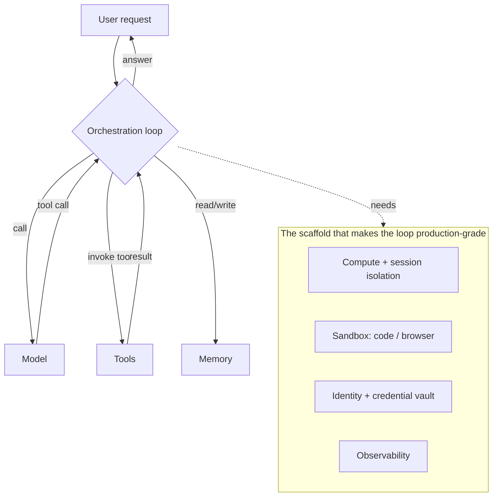
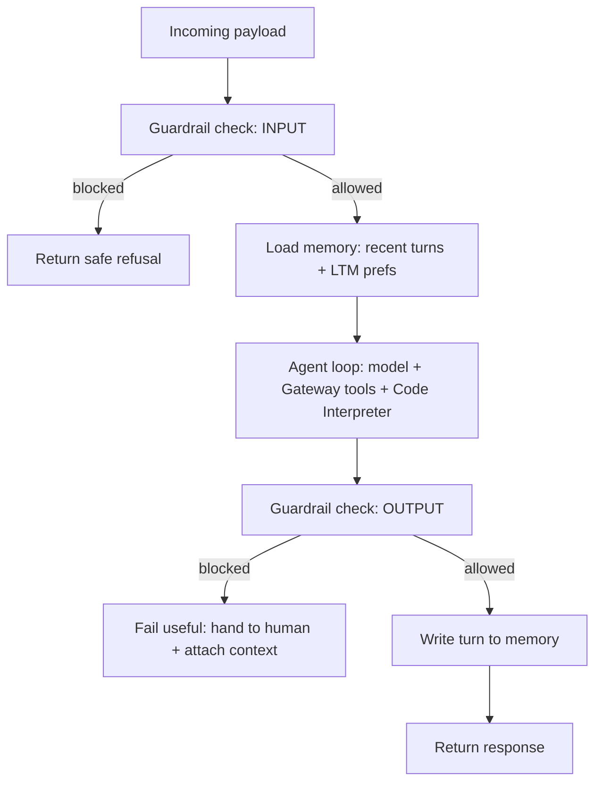

# Harness Engineering

**Track:** Agentic AI Bootcamp
**Level:** Advanced
**Prereqs:** `01_agentcore_foundations.md` and `02_agentcore_features.ipynb`. You know what each primitive does in isolation.

---

## 1. First, disambiguate the word "harness"

The term now means two different things, and confusing them wrecks a technical conversation.

| Meaning                               | What it is                                                                                                                                                                                             |
| ------------------------------------- | ------------------------------------------------------------------------------------------------------------------------------------------------------------------------------------------------------ |
| **Harness (the concept)**             | The engineering discipline of building the scaffold around a model that turns it into a running agent: the orchestration loop plus compute, memory, tools, identity, and observability, wired together |
| **AgentCore Harness (the primitive)** | A specific GA managed service where you*declare* that scaffold as configuration and AWS runs it. Three API calls, no orchestration code, no container                                                  |

This session covers both, in that order: the concept, how to build it by hand, then the managed primitive that does the wiring for you, and a matrix for choosing.

---

## 2. What a harness actually is

Every agent has an orchestration layer: a loop that calls the model, picks a tool, feeds the result back, manages the context window, handles failures, and stops. That loop is the small part.

Running it in production takes real infrastructure underneath: compute, a sandbox, secure tool connections, a filesystem, memory, identity, observability. That is the large part, and it is the same for almost every agent.



"An agent is more than a model. If the model is the brain, the harness is the body: everything the brain needs to get work done." Building the body correctly is harness engineering.

---

## 3. Building the harness by hand

You already have every piece from the last session. Harness engineering by hand is composing them around one agent, with the right seams.

**The recipe for TravelMind:**

| Layer      | Primitive              | Role in the harness                         |
| ---------- | ---------------------- | ------------------------------------------- |
| Host       | Runtime                | The endpoint, session isolation, scaling    |
| Loop       | Strands (or LangGraph) | Model + tool decision loop                  |
| Tools      | Gateway                | `get_pnr`, `rebook` as governed MCP tools   |
| Compute    | Code Interpreter       | Refund math, self-verification              |
| Memory     | Memory (STM + LTM)     | Remembers the session and Rao's preferences |
| Safety     | Guardrails (Bedrock)   | Pre-checks input, gates output              |
| Auth       | Identity               | On-behalf-of calls, tokens out of context   |
| Visibility | Observability          | Traces, tokens, latency, errors             |

**The order of operations inside a single turn** (this is the design that matters):



Two seams people get wrong:

1. **Guardrail on input runs before the model, not after.** Blocking a prompt injection after the model already saw it defeats the point.
2. **A blocked output should fail useful, not just fail closed.** "I can't help" dead-ends the user. "Let me connect you with an agent, here is your case context" keeps trust. Attach the retrieved context for the human.

**What by-hand wiring buys you:** total control over the loop, the seams, and the failure behavior. Branching state machines, human-in-the-loop approvals, multi-agent handoffs with bespoke routing, these still belong in hand-wired LangGraph / CrewAI / Strands, hosted on Runtime.

**What it costs you:** you write and maintain the wiring, on every project. Which is exactly the tax the next section removes.

---

## 4. The managed AgentCore Harness primitive

GA as of mid-2026. You declare the agent (model, tools, skills, instructions) and AWS runs the loop and the whole scaffold: environment, compute, memory, identity, networking, observability. Trying a different model or adding a tool becomes a config change, not a rewrite.

**Three API calls:**

| Operation       | Does                                         |
| --------------- | -------------------------------------------- |
| `CreateHarness` | Define the agent from config                 |
| `InvokeHarness` | Run it (returns streaming tool use, answers) |
| `UpdateHarness` | Change model / tools / prompt                |

**What you get without wiring it:**

| Capability                 | Detail                                                                                                                                                  |
| -------------------------- | ------------------------------------------------------------------------------------------------------------------------------------------------------- |
| Stateful sessions          | Each session isolated in its own microVM (backed by Runtime), with a filesystem and shell                                                               |
| Memory                     | Built-in by default, or bring your own                                                                                                                  |
| Any model provider         | Bedrock, OpenAI, Google Gemini, LiteLLM-compatible, and Bedrock Mantle (unlocks GPT-5.x on Bedrock). Switch provider mid-session without losing context |
| Tools, declarative         | A list; each entry has a`type` and `config`; the harness wires auth and execution                                                                       |
| Skills                     | Attach from Git, S3, or the AWS-curated catalog with a single toggle (`awsSkills`)                                                                      |
| Filesystem                 | Mount S3 Files or EFS across sessions                                                                                                                   |
| Observability              | Every action traced automatically, unified view                                                                                                         |
| Safe releases              | Immutable versions + named endpoints; roll back by pointing an endpoint at an earlier version                                                           |
| Evaluations / Optimization | Score behavior on real traffic, get prompt/tool-description suggestions, A/B with significance                                                          |
| Pipelines                  | `AgentCore InvokeHarness` is a first-class state in Step Functions                                                                                      |
| Escape hatch               | Export to Strands code (Claude Agent SDK export coming) and run on Runtime when config is not enough                                                    |

**The tool types you can declare:**

| Type                         | What it connects                                                                                                                                    |
| ---------------------------- | --------------------------------------------------------------------------------------------------------------------------------------------------- |
| `agentcore_gateway`          | An existing gateway by ARN; every target becomes a tool with auth handled                                                                           |
| `remote_mcp`                 | Any MCP server by URL (skip Gateway's governance layer)                                                                                             |
| `agentcore_browser`          | The cloud browser sandbox, one line                                                                                                                 |
| `agentcore_code_interpreter` | The sandboxed code executor, one line                                                                                                               |
| `agentcore_web_search`       | Managed web search via Gateway, no setup                                                                                                            |
| inline function              | A tool that executes client-side; the harness pauses and hands the call back to your code (this is the human-in-the-loop / custom-integration hook) |

**The config is a file, not code.** `harness.json`:

```json
{
  "name": "TravelMind",
  "model": { "provider": "bedrock", "modelId": "global.anthropic.claude-sonnet-4-6" },
  "tools": [
    { "type": "agentcore_code_interpreter", "name": "code-interpreter" },
    { "type": "agentcore_gateway", "name": "travel-ops",
      "config": { "agentCoreGateway": { "gatewayArn": "arn:aws:bedrock-agentcore:us-east-1:123456789012:gateway/<id>" } } }
  ],
  "skills": []
}
```

The system prompt lives in a separate `system-prompt.md`. Changing behavior is: edit the file, `agentcore deploy`. Changing model is: edit one line, redeploy.

**The three-call flow, by CLI:**

```bash
agentcore create                         # wizard: pick "Harness", name, model, tools
agentcore deploy                         # provisions it (~2-3 min)
agentcore invoke --harness TravelMind \
  --session-id "$(uuidgen)" \
  "My PNR JX48Q2 BLR-DEL was cancelled, what are my options?"
```

---

## 5. Harness vs Runtime vs by-hand: the decision that matters

This is the slide to argue over. Three ways to run an agent, in increasing control and increasing effort.

|                                          | Managed Harness                      | Runtime + framework             | By-hand primitives          |
| ---------------------------------------- | ------------------------------------ | ------------------------------- | --------------------------- |
| You write                                | Config (`harness.json`)              | Agent code + tiny entrypoint    | Agent code + all the wiring |
| Orchestration loop                       | AWS runs it (Strands under the hood) | Your framework                  | Your framework              |
| Change model                             | One config line                      | Code change                     | Code change                 |
| Custom routing / branching / multi-agent | Limited (config shape)               | Full (LangGraph/CrewAi/Strands) | Full                        |
| Human-in-the-loop                        | Inline-function tool                 | You build it                    | You build it                |
| Time to first production agent           | Minutes                              | Hours                           | Longer                      |
| Ceiling on control                       | Medium                               | High                            | Highest                     |

**Choose the managed Harness when:**

- The agent fits a "model + tools + memory" loop.
- You want config-first iteration and fast prototyping without throwing away the production path.
- You want central IAM, rate limits, network egress managed for you.
- Your tool surface is mostly MCP servers + AgentCore primitives.

**Choose Runtime + framework when:**

- You need custom orchestration: branching state machines, approval workflows, multi-agent handoffs with bespoke routing.
- You want the framework's full expressiveness but still want managed hosting, isolation, and long execution.

**Choose fully by-hand when:**

- You need control over every seam and failure path, or you are integrating primitives into an existing non-AgentCore system.

**The non-obvious insight:** these are not a ladder you climb once. The Harness *exports to Strands code*. Start on the managed Harness for speed; when config stops being enough, export and move to Runtime + framework without re-platforming. The migration cost between rungs is low by design. That changes the calculus: config-first is no longer a dead end you regret, it is a starting point with an exit.

---

## 6. Where the pieces we built go, in each approach

Same TravelMind capabilities, three placements.

| Capability                  | Managed Harness                    | Runtime + framework            | By-hand                        |
| --------------------------- | ---------------------------------- | ------------------------------ | ------------------------------ |
| Tools (`get_pnr`, `rebook`) | `agentcore_gateway` tool entry     | Gateway MCP client in code     | Gateway MCP client in code     |
| Refund math                 | `agentcore_code_interpreter` entry | `code_session` in a `@tool`    | `code_session` in a `@tool`    |
| Memory                      | Built-in (or BYO)                  | `MemoryClient` + hooks         | `MemoryClient` + hooks         |
| Guardrails                  | Around model calls / your logic    | `apply_guardrail` at the seams | `apply_guardrail` at the seams |
| Observability               | Automatic                          | ADOT + Transaction Search      | ADOT + Transaction Search      |
| Web search                  | `agentcore_web_search` entry       | Gateway web-search connector   | Gateway web-search connector   |

Note the pattern: the more managed the approach, the more each capability becomes a one-line declaration instead of code you wire and maintain.

---

## 7. Decision checkpoints (discuss)

1. Your agent needs a three-way branch based on the customer's tier, with a human approval step before issuing a refund over a threshold. Managed Harness or Runtime + framework? Which part specifically pushes the answer?
2. The Harness input-guardrail runs where in the loop, and why does running it after the model call defeat the purpose?
3. "Config-first is a toy; real teams write code." The Harness exports to Strands. Does the export change whether that statement is true? What is the honest remaining limitation of config-first?
4. A blocked output can "fail closed" or "fail useful." Write the difference in one sentence for TravelMind's refund-blocked case, and say what you attach for the human.
5. You could hand-wire the whole thing. Cost out managed Harness vs by-hand across five agents on: time-to-prod, on-call surface, upgrade burden, and control lost. Where is the crossover point for your team?

---

**Next:** framework-specific production deployment. `05_strands_with_agentcore.md` + notebook (when to use Strands features vs AgentCore features vs both), then the LangChain / LangGraph / LangSmith package.
