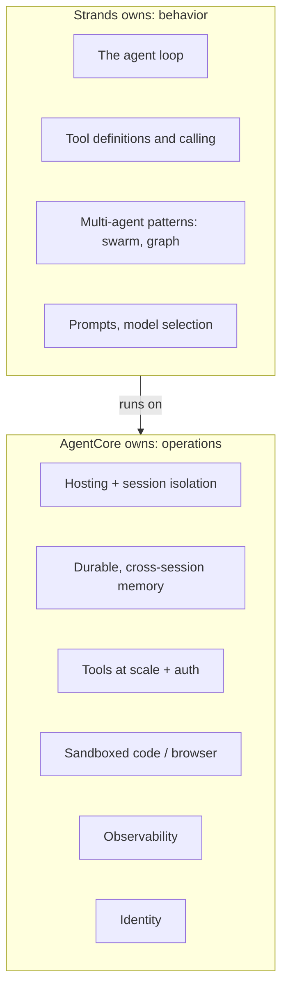

# Strands with AgentCore: Production Deployment and the Feature-Ownership Decision

**Track:** Agentic AI Bootcamp
**Level:** Advanced
**Prereqs:** Foundations, features notebook, harness engineering. You have built a Strands agent before.

---

## 1. The question this answers

You have a Strands agent. AgentCore also offers memory, tools, code execution, hosting. So a real decision appears on almost every feature:

> Do I use the **Strands-level** version, the **AgentCore-level** version, or **both**?

Getting this wrong two ways:
- Over-use AgentCore: you pay for managed services where an in-process Strands feature was enough.
- Over-use Strands: you ship a laptop-grade agent (in-memory state, local tools) and it falls over in production.

The clean way to think about it: **Strands owns behavior; AgentCore owns operations.**



Strands is a portable Python framework. That portability is the point: the same agent runs locally, on Lambda, on ECS, or on AgentCore Runtime. AgentCore is where you run it in production without owning the infrastructure.

---

## 2. Feature-by-feature: who owns it

Read this table once. It is the whole session in one place.

| Capability | Strands version | AgentCore version | Default choice |
|---|---|---|---|
| Orchestration loop | The Strands agent loop | (Runtime hosts it; Harness manages it) | **Strands.** This is Strands' job |
| Tools, few, in-process | `@tool`, `strands_tools` | Gateway MCP tools | **Strands** for a handful, in one agent |
| Tools, many / shared / governed | (would hand-roll MCP client) | Gateway | **AgentCore** past ~a dozen tools, or shared across agents, or needing auth |
| Session state (within a call) | Agent `state`, message history | Memory STM | **Strands** if single call; **AgentCore** if it must survive restarts or scale across VMs |
| Memory across sessions | (none native) | Memory LTM + strategies | **AgentCore.** Strands has no cross-session memory of its own |
| Code execution | `strands_tools` code interpreter tool (wraps AgentCore) | Code Interpreter | **AgentCore under the hood**, called through the Strands tool |
| Web browsing | Browser tool (wraps AgentCore) | Browser | **AgentCore under the hood** |
| Multi-agent | Swarm, Graph, agents-as-tools | A2A on Runtime, multi-agent workflows | **Strands** for in-process patterns; **AgentCore** to host and connect them across services |
| Model provider | `BedrockModel` (+ others) | (model is Bedrock/external either way) | **Strands** picks the model; both call Bedrock |
| Observability | `StrandsTelemetry` emits OTEL | Observability ingests OTEL | **Both, together.** Strands emits, AgentCore/CloudWatch collects |
| Auth to third parties | (would hand-roll) | Identity | **AgentCore** |
| Hosting | (portable code) | Runtime | **AgentCore** for production |

The pattern to internalize: **for anything operational (hosting, durability, scale, auth, visibility), AgentCore wins. For anything about how the agent thinks and acts, Strands wins. Several capabilities are "Strands calls AgentCore," not either/or.**

---

## 3. The three decision rules

When you are unsure which layer owns a feature, apply these in order.

**Rule 1: does it need to survive the process?**
If the state, tool, or memory must outlive a single request or scale across many isolated VMs, it belongs in AgentCore (Memory, Gateway). If it lives and dies within one invocation, Strands is fine.

**Rule 2: is it shared or governed?**
A tool used by one agent, in-process, with no auth needs, stays a Strands `@tool`. A tool shared across agents, or fronting an authenticated service, or one of many, belongs in Gateway.

**Rule 3: is it behavior or operations?**
The loop, the routing, the multi-agent choreography, the prompts, that is behavior; Strands. The compute, the isolation, the vault, the traces, that is operations; AgentCore.

> Skeptic checkpoint: "Just put everything in AgentCore, it's managed." Managed is not free. A three-tool, single-agent, single-user helper does not need Gateway, managed Memory, and a microVM per session. Match the machinery to the requirement. Rule 1 is the filter: if nothing needs to survive the process, you are probably over-building.

---

## 4. The "both" patterns (this is where teams get it right or wrong)

Three places where the answer is genuinely both, wired correctly.

### 4.1 Strands loop + AgentCore Memory (via hooks)

Strands runs the loop. AgentCore stores memory. The bridge is a Strands **hook**: on agent init, load recent turns from AgentCore Memory into the conversation; on each message, write it back for async extraction.

```python
from strands.hooks import HookProvider, HookRegistry, MessageAddedEvent, AgentInitializedEvent
from bedrock_agentcore.memory import MemoryClient

class MemoryHook(HookProvider):
    def __init__(self, client: MemoryClient, memory_id, actor_id, session_id):
        self.client, self.memory_id = client, memory_id
        self.actor_id, self.session_id = actor_id, session_id

    def register_hooks(self, registry: HookRegistry):
        registry.add_callback(AgentInitializedEvent, self.on_start)
        registry.add_callback(MessageAddedEvent, self.on_message)

    def on_start(self, event):
        turns = self.client.get_last_k_turns(
            memory_id=self.memory_id, actor_id=self.actor_id,
            session_id=self.session_id, k=4)
        # inject 'turns' into event.agent's context

    def on_message(self, event):
        # write the newest message to AgentCore Memory
        ...
```

This is the single most useful integration pattern in the whole framework. Strands stays stateless-per-process; AgentCore Memory makes it remember.

### 4.2 Strands MCP client + AgentCore Gateway

Strands is the MCP client; Gateway is the MCP server exposing your Lambdas/APIs as tools. The agent gets governed, authenticated tools without you writing a tool server.

```python
from strands.tools.mcp.mcp_client import MCPClient
from mcp.client.streamable_http import streamablehttp_client

gateway = MCPClient(lambda: streamablehttp_client(
    GATEWAY_MCP_URL, headers={"Authorization": f"Bearer {token}"}))
with gateway:
    tools = gateway.list_tools_sync()
    agent = Agent(model=..., tools=tools)
```

### 4.3 Strands telemetry + AgentCore Observability

Strands emits OTEL spans; AgentCore/CloudWatch collects them. One line on the Strands side, automatic collection on the AgentCore side.

```python
from strands.telemetry import StrandsTelemetry
StrandsTelemetry().setup_otlp_exporter()   # spans flow to CloudWatch GenAI Observability
```

---

## 5. Deploying a Strands agent to AgentCore Runtime, production-grade

The mechanics are three lines; the discipline is in the details.

**The wrapper** (same as any framework):

```python
from bedrock_agentcore.runtime import BedrockAgentCoreApp
from strands import Agent
from strands.models import BedrockModel

# build time: constructed once, at module load
agent = Agent(model=BedrockModel(model_id="us.anthropic.claude-haiku-4-5-20251001-v1:0",
                                 region_name="us-east-1"),
              tools=[...], system_prompt="...")
app = BedrockAgentCoreApp()

# serve time: tiny entrypoint
@app.entrypoint
async def invoke(payload, context):
    async for event in agent.stream_async(payload["prompt"]):
        yield event                       # streaming back to the caller

if __name__ == "__main__":
    app.run()
```

**Production checklist (the part that separates a demo from a deploy):**

| Item | Do this |
|---|---|
| Build vs serve | Construct the agent at module load; keep the entrypoint tiny. Do not rebuild the graph per request |
| Streaming | Use `async def` + `stream_async` + `yield` for responsive UX |
| Session id | Use `context.session_id` (>= 16 chars) to correlate memory + traces |
| Memory | Wire the memory hook (4.1); do not hold state in a module global |
| Tools | Gateway for anything shared/governed; keep secrets out of tool code (Identity) |
| Model access | Enable the model; remember `bedrock:InvokeModel` is the IAM action, not `bedrock:Converse` |
| Region + model | From config, not hardcoded |
| Observability | `StrandsTelemetry().setup_otlp_exporter()`; enable CloudWatch Transaction Search once |
| Errors | Handle tool/model failures; return a useful message, not a stack trace |
| Deploy | New CLI `agentcore create` / `deploy`; or legacy `agentcore configure -e file.py` / `launch` |
| Cleanup | `DeleteAgentRuntime` + delete Memory/Gateway when tearing down |

**Deploy commands:**

```bash
# new CLI (recommended)
npm install -g @aws/agentcore
agentcore create --defaults      # or the wizard for framework=Strands
agentcore deploy
agentcore invoke --prompt "PNR JX48Q2 refund?" --session-id "$(uuidgen)"

# legacy toolkit (still works)
pip install bedrock-agentcore-starter-toolkit
agentcore configure -e travelmind_agent.py
agentcore launch
agentcore invoke '{"prompt": "PNR JX48Q2 refund?"}'
```

Runtime is ARM64 (Graviton). The CLI handles architecture for you.

---

## 6. When NOT to use AgentCore with Strands

Honesty keeps the decision credible.

| Situation | Skip AgentCore, do this |
|---|---|
| Local experimentation / a notebook demo | Run Strands directly; no hosting needed yet |
| A short, stateless, single-user function | Lambda with the Strands code may be simpler and cheaper than Runtime |
| One or two in-process tools, no auth | Strands `@tool`; Gateway is overkill |
| No memory requirement at all | Skip Memory entirely; not every agent needs to remember |

The moment any of these flips (state must persist, users scale, tools multiply, auth appears), revisit. Adoption is incremental by design.

---

## 7. Decision checkpoints (discuss)

1. Your agent uses exactly two tools, in-process, no auth, one user. Which of Gateway / Memory / Runtime do you actually need, and which is over-building? Justify with Rule 1.
2. You need cross-session memory. Strands has no native version. What is the minimal AgentCore addition, and where does the bridge (the hook) run in the agent lifecycle?
3. "Observability is a both." Which side emits and which side collects, and how many lines is your part?
4. A multi-agent swarm: which layer owns the choreography, and which layer hosts and connects the agents across services?
5. You demoed a Strands agent from a notebook and it worked. Name three things that break the first time 200 users hit it, and which primitive fixes each.

---

**Next:** the same production question for the LangChain / LangGraph / LangSmith stack, where the feature-ownership map is different (LangGraph owns graph state and checkpointing; LangSmith owns tracing; AgentCore owns hosting and memory bridges). See `07_langchain_langgraph_langsmith_with_agentcore.md`.
