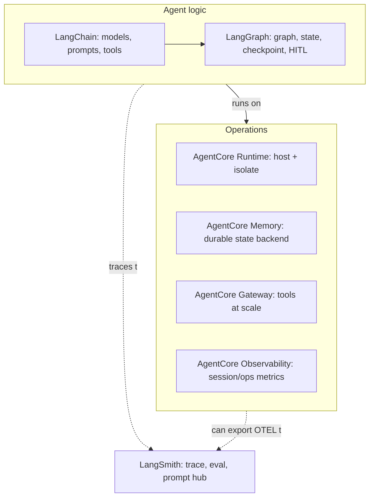

# LangChain, LangGraph, LangSmith with AgentCore: Four Tools, One Production Agent

**Track:** Agentic AI Bootcamp
**Level:** Advanced
**Prereqs:** Foundations, features, harness, and the Strands session. You have built a LangGraph agent before.

---

## 1. The question this answers

Now there are four things with overlapping capabilities: **LangChain**, **LangGraph**, **LangSmith**, and **AgentCore**. Each does memory, or tracing, or tools, or hosting, in some form. So on every feature you must decide whose version wins, and how to combine them in production.

The mistake is treating them as competitors. They are layers with different jobs. Get the jobs straight and the decisions become obvious.

| Tool | Its job | Not its job |
|---|---|---|
| **LangChain** | Model/provider abstraction, prompts, tools, integrations, the Runnable interface | Orchestration, hosting, durable infra |
| **LangGraph** | Orchestration: graph state, branching, cycles, checkpointing, human-in-the-loop | Model abstraction (uses LangChain), hosting |
| **LangSmith** | Tracing, evaluation, datasets, prompt hub, monitoring | Running the agent, storing production memory |
| **AgentCore** | Operations: hosting, durable memory, tools at scale, identity, observability | The agent's logic (that is LangGraph/LangChain) |



---

## 2. Feature-by-feature ownership

The whole session in one table.

| Concern | LangChain | LangGraph | LangSmith | AgentCore | Default choice |
|---|---|---|---|---|---|
| Model / provider abstraction | `init_chat_model` | uses LangChain | | (model is Bedrock either way) | **LangChain** |
| Orchestration: branching, cycles | | `StateGraph` | | (Runtime hosts it) | **LangGraph** |
| Short-term state / checkpoint | | checkpointer | | Memory (as the backend) | **LangGraph interface + AgentCore backend in prod** |
| Long-term memory | | store | | Memory (as the backend) | **LangGraph interface + AgentCore backend** |
| Human-in-the-loop | | `interrupt` | | (or Harness inline fn) | **LangGraph** |
| Tools, few, in-process | `@tool` | `ToolNode` | | | **LangChain / LangGraph** |
| Tools, many / shared / governed | | | | Gateway | **AgentCore** |
| Tracing for dev + eval | | | LangSmith | | **LangSmith** |
| Tracing for ops / session metrics | | | | Observability | **AgentCore** |
| Eval / datasets / prompt hub | | | LangSmith | (or AgentCore Evaluations) | **LangSmith** (or AgentCore Evals) |
| Auth to third parties | | | | Identity | **AgentCore** |
| Hosting | | | | Runtime | **AgentCore** |

The one non-obvious row, the one worth the whole session: **checkpointing and memory.** LangGraph gives you the *interface* (checkpointer + store). AgentCore gives you a *durable managed backend for that interface*. You keep LangGraph's API and get AgentCore's durability. That is the combine pattern, not a choice between them.

---

## 3. LangSmith vs AgentCore Observability: not either/or

Both trace. They watch different things.

| | LangSmith | AgentCore Observability |
|---|---|---|
| Sees | The graph: nodes, LLM calls, token usage, at the LangChain/LangGraph level | The operation: sessions, latency, duration, tokens, errors, at the hosting level |
| Best for | Debugging agent logic, running evals, managing datasets and prompts | Operating the deployed service, alarms, the unified session view |
| How on | Env vars: `LANGSMITH_TRACING=true`, `LANGSMITH_API_KEY`, `LANGSMITH_PROJECT` | Enable CloudWatch Transaction Search + instrument (ADOT) |
| Coexist? | Yes | Yes; AgentCore can also export its OTEL stream to LangSmith |

**Rule:** LangSmith for building and evaluating the agent; AgentCore Observability for operating it in production. Turn on both. If you want one pane, export AgentCore's OTEL to LangSmith.

---

## 4. The three combine patterns (this is the production architecture)

### 4.1 LangGraph checkpointer, AgentCore Memory backend

Short-term conversational state persists through LangGraph's checkpointer interface, backed by AgentCore Memory. You write normal LangGraph; state survives restarts and scales across isolated VMs.

```python
from langgraph_checkpoint_aws import AgentCoreMemorySaver

checkpointer = AgentCoreMemorySaver(MEMORY_ID, region_name="us-east-1")
graph = graph_builder.compile(checkpointer=checkpointer)

# actor_id + thread_id route the state
config = {"configurable": {"actor_id": "Rao", "thread_id": "pnr-JX48Q2-session"}}
graph.invoke({"messages": [{"role": "user", "content": "PNR JX48Q2 refund?"}]}, config)
```

### 4.2 LangGraph store, AgentCore Memory backend (long-term)

Cross-session facts and preferences via LangGraph's store interface, backed by AgentCore Memory's extraction. Save in a pre-model hook, search in the pre-model hook to inject context.

```python
from langgraph_checkpoint_aws import AgentCoreMemoryStore

store = AgentCoreMemoryStore(MEMORY_ID, region_name="us-east-1")

def pre_model_hook(state, config, *, store):
    actor_id = config["configurable"]["actor_id"]
    thread_id = config["configurable"]["thread_id"]
    # save the latest human message for async extraction
    store.put((actor_id, thread_id), str(uuid.uuid4()), {"message": state["messages"][-1]})
    # retrieve relevant long-term memories to prepend
    hits = store.search(("preferences", actor_id), query="traveler preferences", limit=5)
    return {"model_input_messages": state["messages"]}
```

### 4.3 LangSmith tracing + AgentCore hosting

Deploy the graph on Runtime; keep LangSmith tracing on for the graph internals.

```python
import os
os.environ["LANGSMITH_TRACING"] = "true"
os.environ["LANGSMITH_API_KEY"] = "..."      # inject via config/secrets, not hardcoded

from bedrock_agentcore.runtime import BedrockAgentCoreApp
app = BedrockAgentCoreApp()

@app.entrypoint
def invoke(payload, context):
    result = graph.invoke(
        {"messages": [{"role": "user", "content": payload["prompt"]}]},
        config={"configurable": {"actor_id": payload.get("actor_id", "Rao"),
                                 "thread_id": context.session_id}})
    return {"result": result["messages"][-1].content}
```

The full stack: LangChain models, LangGraph graph, AgentCore Memory backend for state, LangSmith for graph tracing/eval, AgentCore Runtime for hosting, Gateway for tools, AgentCore Observability for ops. Each tool in its lane.

---

## 5. Deploying a LangGraph agent to AgentCore Runtime

Same wrapper, different framework. Note the LangGraph specifics.

| Item | Detail |
|---|---|
| Model | `init_chat_model("us.anthropic.claude-haiku-4-5-20251001-v1:0", model_provider="bedrock_converse")`. Note the `bedrock_converse` provider and the `us.` inference-profile prefix |
| Build vs serve | Build the graph at module load; entrypoint just invokes it |
| State | `AgentCoreMemorySaver` checkpointer for durable short-term state |
| Session | `context.session_id` (>= 16 chars) as the LangGraph `thread_id` |
| Streaming | `graph.astream(..., stream_mode="values")`, `yield` chunks |
| Tools | `ToolNode` for in-process; Gateway (MCP) for shared/governed |
| Tracing | LangSmith env vars for graph traces; AgentCore Observability for ops |
| Deploy | `agentcore create` / `deploy` (new) or `agentcore configure -e file.py` / `launch` (legacy) |

**Deploy commands:**

```bash
# new CLI
npm install -g @aws/agentcore
agentcore create        # wizard: framework LangGraph
agentcore deploy
agentcore invoke --prompt "PNR JX48Q2 refund?" --session-id "$(uuidgen)"

# legacy toolkit
pip install bedrock-agentcore-starter-toolkit
agentcore configure -e langgraph_agent.py
agentcore launch
```

---

## 6. When to reach for which (quick reference)

| You need | Reach for |
|---|---|
| Branching / cyclic control flow with explicit state | LangGraph |
| A model provider abstraction and prompt templates | LangChain |
| Human approval mid-graph | LangGraph `interrupt` |
| Durable state that survives restarts / scales | AgentCore Memory via `AgentCoreMemorySaver` |
| Cross-session preferences/facts | AgentCore Memory via `AgentCoreMemoryStore` |
| To debug why the agent chose a branch, and eval it | LangSmith |
| Session/latency/error metrics of the deployed service | AgentCore Observability |
| Tools shared across agents or fronting authed services | AgentCore Gateway |
| To host it in production | AgentCore Runtime |
| Managed eval on production traffic | AgentCore Evaluations (or LangSmith for offline datasets) |

---

## 7. Two failure modes to avoid

| Anti-pattern | Why it hurts | Fix |
|---|---|---|
| In-memory LangGraph checkpointer in production | State dies on restart and does not cross VMs; users lose context | `AgentCoreMemorySaver` backed by AgentCore Memory |
| LangSmith **or** AgentCore Observability, forced choice | You lose either graph-level debugging or ops-level metrics | Run both; export OTEL to LangSmith if you want one pane |

---

## 8. Decision checkpoints (discuss)

1. LangGraph has an in-memory checkpointer and AgentCore has Memory. In production, which do you use, and what specifically breaks if you ship the in-memory one?
2. LangSmith traces and AgentCore Observability traces. Name one debugging task each is better at, and why you would keep both on.
3. The combine pattern is "LangGraph interface + AgentCore backend" for memory. Restate what LangGraph owns and what AgentCore owns in that sentence.
4. You need a human approval step before issuing a large refund. LangGraph `interrupt` or the Harness inline-function tool? What decides it?
5. Four tools, overlapping features. Give the one-word owner for: orchestration, model abstraction, dev tracing, hosting. If you can do that instantly, you have the session.

---

**End of the AgentCore production series.** You now have: the primitives (foundations + features), the harness (concept, by-hand, managed), and framework-specific production deployment for both Strands and the LangChain/LangGraph/LangSmith stack, with the feature-ownership decisions that keep architectures honest.
