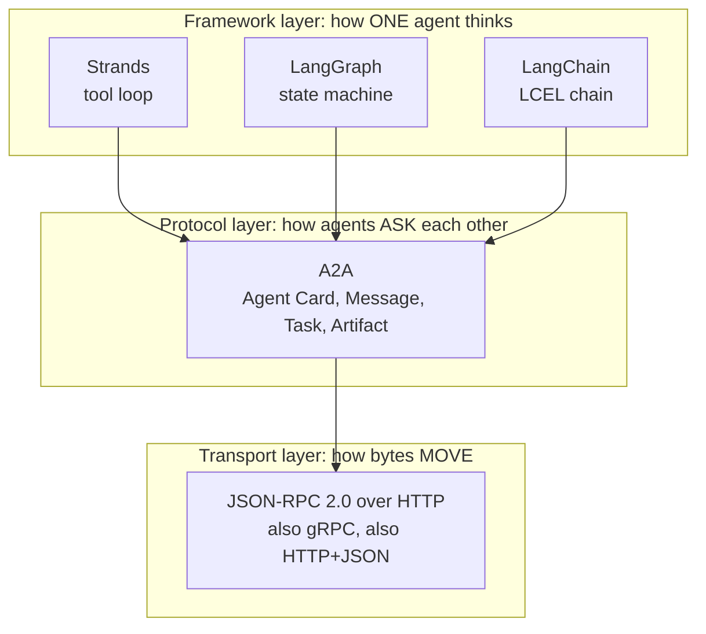
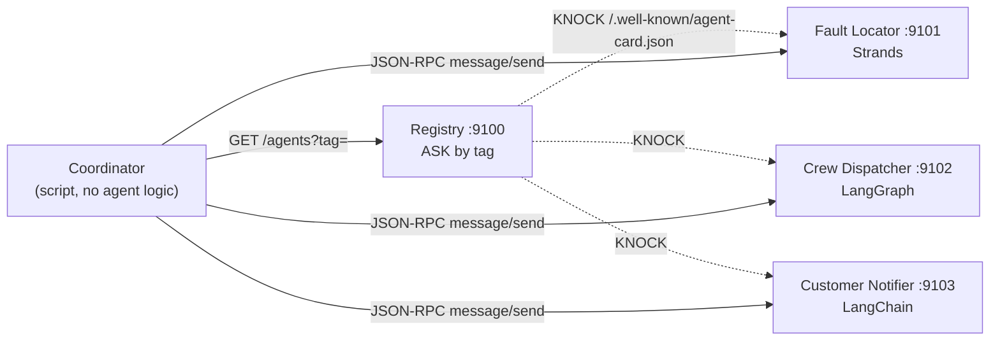
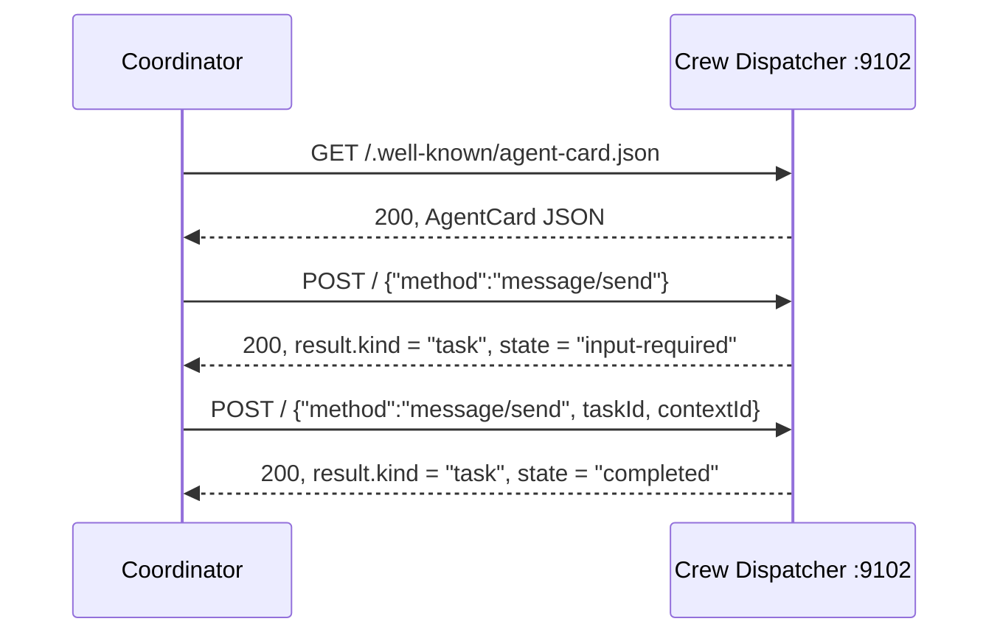
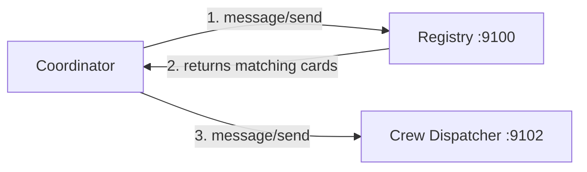
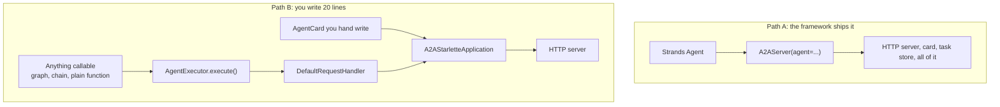
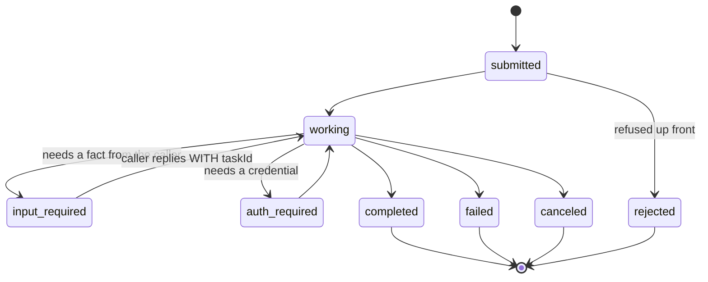
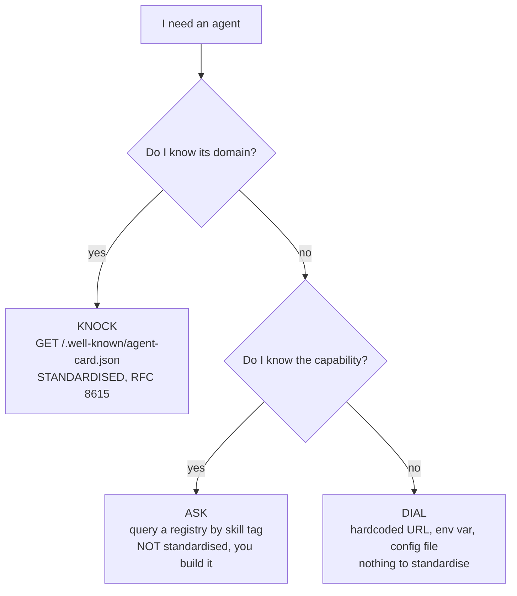
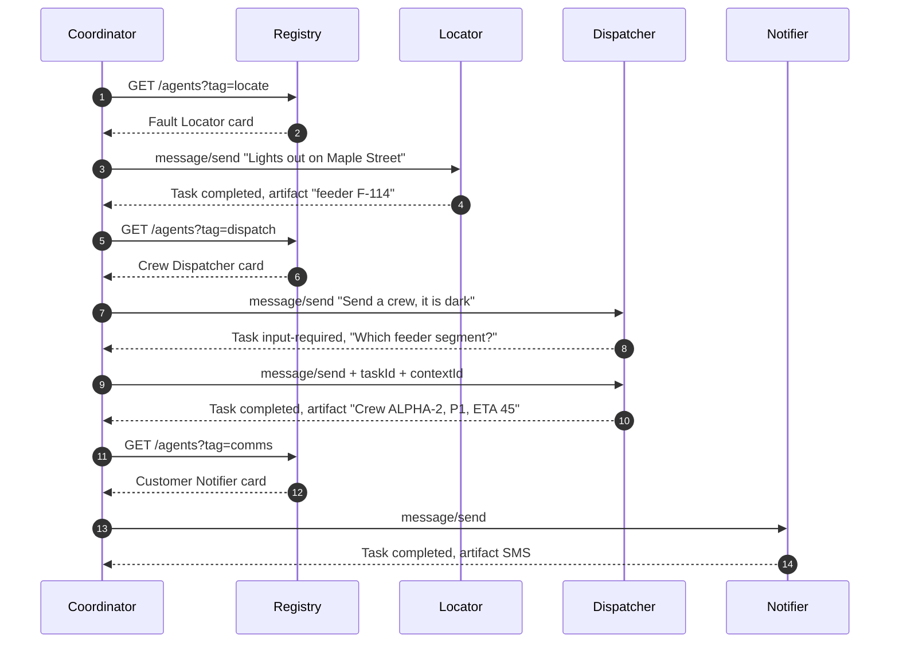
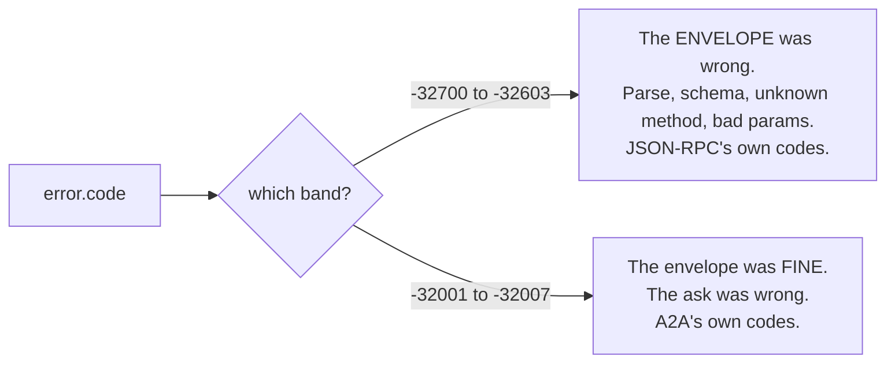

# Exercise: Aurora Grid, an A2A Outage Desk

**Language:** Python 3.10+, Bash
**Topics:** A2A protocol, Agent Card, JSON-RPC 2.0, tasks and messages, agent discovery and registries, Strands / LangGraph / LangChain
**Level:** Intermediate

---

## The case

A storm has knocked out power across three feeder segments. Aurora Grid runs an outage desk with three specialists who already exist, already work, and were built by three different teams in three different frameworks.

| Specialist | Job | Framework | Built by |
| --- | --- | --- | --- |
| Fault Locator | Complaint text goes in, feeder segment ID comes out | Strands | Network team |
| Crew Dispatcher | Feeder segment goes in, crew and priority come out | LangGraph | Field ops team |
| Customer Notifier | Dispatch plan goes in, customer SMS comes out | LangChain LCEL | Comms team |

Nobody is rewriting anyone else's agent. That constraint is the entire reason A2A exists.

---

## Part 0: three pictures before any code

### Picture 1: which layer you are working on



**Mental model.** The framework is the chef. A2A is the menu and the order slip. JSON-RPC is the waiter carrying it.

You can fire the chef and reopen tomorrow with a new one. The menu still works, because the menu never described the kitchen.

**The sibling question.** MCP is what is in your hands. A2A is who is in the room. MCP wires one agent down to tools and data. A2A wires one agent across to another agent that has its own model, its own memory, and its own deploy schedule.

### Picture 2: what you are building



Four processes, four terminals. That is not an inconvenience to work around. A2A agents are independent deployables, and folding them into one process would hide the only thing this exercise teaches.

### Picture 3: the Agent Card as four questions

Eight fields are required by the spec. They answer four questions.

| Question | Fields | The lie you can tell here |
| --- | --- | --- |
| **WHO** are you | `name`, `description`, `version` | A description too vague to route on |
| **WHERE** do I send | `url`, `preferredTransport` | A `url` reachable only from your own laptop |
| **WHAT** can you do | `skills[]` with `id`, `name`, `description`, `tags` | Empty `tags`, which makes you invisible to a registry |
| **HOW** do we talk | `capabilities`, `defaultInputModes`, `defaultOutputModes`, `securitySchemes` | Claiming `streaming: true` and never streaming |

**Mental model.** A card is a passport, not a manual. It states what you may ask for. It never states how the work gets done.

---

## Setup

```bash
python -m venv .venv && source .venv/bin/activate
pip install "strands-agents[a2a]==1.42.0" strands-agents-tools \
            "langchain==1.3.11" "langgraph==1.2.7" litellm

export AURORA_MOCK=1     # offline, no AWS, no spend (default)
# export AURORA_MOCK=0   # real Bedrock Haiku 4.5 in us-east-1, then: aws configure
```

### One version fact that will bite you

`pip install a2a-sdk` on its own gives you **1.1.2**, which implements A2A spec 1.0 and replaced every Pydantic type with protobuf. `strands-agents 1.42.0` pins `a2a-sdk<0.4.0`, so the install above correctly resolves to **0.3.26**.

| You will see | On 0.3.26 (this exercise) | On 1.1.x |
| --- | --- | --- |
| Card type | Pydantic `AgentCard` | protobuf `a2a_pb2.AgentCard` |
| Server class | `A2AStarletteApplication(...).build()` | `create_jsonrpc_routes(...)` plus `create_agent_card_routes(...)` |
| `a2a.server.apps` | exists | removed |

When a blog post does not match your code, check the version before you check yourself.

### Files you will create

| File | Stage | Blanks |
| --- | --- | --- |
| `aurora_common.py` | shared scaffolding, copy as is | none |
| `lab1_agents.py` | 1, three agents, no protocol | 1 to 5 |
| `lab2_serve.py` | 2, wrap them as A2A servers | 6 to 11 |
| `lab3_registry.py` | 3, the ASK door | 12 to 14 |
| `lab4_coordinator.py` | 4, discovery and orchestration | 15 to 18 |
| `lab5_wire.sh` | 5, raw JSON-RPC, no blanks | trace it |
| `lab6_debug.py` | 6, four silent bugs | 4 one line fixes |

Each `# ____` marker is one missing line. Directly above it sits a lettered bank. Exactly one option is right.

---

## `aurora_common.py`

Copy this verbatim. No blanks. Read it once, because every other file imports from it.

```python
"""
Aurora Grid A2A lab, shared setup.

One switch controls whether the lab talks to AWS or runs fully offline.

    AURORA_MOCK=1   (default)  no AWS, deterministic canned replies
    AURORA_MOCK=0              real Bedrock, us-east-1
"""

import itertools
import os

MOCK = os.getenv("AURORA_MOCK", "1") == "1"

BEDROCK_MODEL_ID = "us.anthropic.claude-haiku-4-5-20251001-v1:0"
AWS_REGION = os.getenv("AWS_REGION", "us-east-1")

PORTS = {"registry": 9100, "locator": 9101, "dispatcher": 9102, "notifier": 9103}
BASE = {name: f"http://127.0.0.1:{port}" for name, port in PORTS.items()}

# Port 9000 is deliberately unused. AgentCore Runtime binds 9000 and the Strands
# A2AServer default is also 9000, so any lab that uses it collides the moment a
# second process starts.


def strands_model(canned: str):
    """Model for a Strands agent. Mock or Bedrock, same call site."""
    if MOCK:
        from strands.models.litellm import LiteLLMModel

        # LiteLLM needs the bedrock/ prefix. Strands BedrockModel does not.
        return LiteLLMModel(
            model_id=f"bedrock/{BEDROCK_MODEL_ID}",
            params={"mock_response": canned},
        )
    from strands.models import BedrockModel

    return BedrockModel(model_id=BEDROCK_MODEL_ID, region_name=AWS_REGION)


def langchain_model(canned: str):
    """Chat model for LangChain and LangGraph. Mock or Bedrock, same call site."""
    if MOCK:
        from langchain_core.language_models.fake_chat_models import GenericFakeChatModel

        return GenericFakeChatModel(messages=itertools.cycle([canned]))
    from langchain_aws import ChatBedrockConverse

    return ChatBedrockConverse(model=BEDROCK_MODEL_ID, region_name=AWS_REGION)


def banner(role: str, port: int) -> None:
    mode = "MOCK (no AWS)" if MOCK else f"BEDROCK {AWS_REGION}"
    print(f"[{role}] listening on http://127.0.0.1:{port}  mode={mode}")
    print(f"[{role}] card:  http://127.0.0.1:{port}/.well-known/agent-card.json")
```

---

## Stage 0: read, do not type

No code runs in this stage.

### Q0.1 Trace the round trip



One line each:

1. Which of those four arrows is **not** JSON-RPC?
2. Why does the second `message/send` carry a `taskId` when the first one did not?
3. If arrow 3 were sent without `taskId`, what HTTP status comes back?

### Q0.2 Spot the wrong arrow

One edge below is wrong. Name it and say what it should be.



### Q0.3 Message or Task

For each request, decide whether the agent should reply with a bare `Message` or open a `Task`. State the rule you used.

| # | Request | Message or Task |
| --- | --- | --- |
| a | "What feeder is Maple Street on?" | |
| b | "Dispatch a crew and tell me when they arrive" | |
| c | "Is this address in our service area?" | |
| d | "Draft the outage notice, I will approve before it sends" | |

---

## Stage 1: three agents, zero protocol

**File: `lab1_agents.py`. Blanks 1 to 5.**

Nothing in this file knows what A2A is. Stage 2 wraps these exact three objects without editing their logic.

| Agent | What it is | Loop? | State? | Why this framework |
| --- | --- | --- | --- | --- |
| Fault Locator | `Agent(model, tools)` | Yes, the model decides when to call the tool | Conversation history | A lookup where the model picks the argument |
| Crew Dispatcher | `StateGraph`, two nodes | No, fixed path | Typed dict, checkpointed | A deterministic sequence you must be able to audit |
| Customer Notifier | `prompt \| model \| parser` | No | None | One shot text transform, no decisions |

```python
"""
STAGE 1 - three agents, three frameworks, zero protocol.

Run:  python lab1_agents.py
"""

from operator import add
from typing import Annotated, TypedDict

from aurora_common import langchain_model, strands_model

# ----------------------------------------------------------------------------
# AGENT 1 - Fault Locator (Strands)
# Job: turn a customer complaint into a feeder segment ID.
# ----------------------------------------------------------------------------
from strands import Agent, tool

FEEDER_MAP = {
    "maple": "F-114",
    "clinic": "F-114",
    "harbour": "F-207",
    "mill": "F-333",
}


# BLANK 1  bank: (a) @tool   (b) @strands.skill   (c) @a2a.skill
#                (d) nothing, plain functions work
# ____
def lookup_feeder(landmark: str) -> str:
    """Map a street or landmark to the feeder segment that supplies it."""
    for key, feeder in FEEDER_MAP.items():
        if key in landmark.lower():
            return f"{landmark} is on feeder {feeder}"
    return f"No feeder on record for {landmark}"


locator_agent = Agent(
    name="Fault Locator",
    description="Maps an outage complaint to the feeder segment that supplies it.",
    # BLANK 2  bank:
    #   (a) model=strands_model("Maple Street is on feeder F-114."), tools=[lookup_feeder]
    #   (b) llm=strands_model("Maple Street is on feeder F-114."), functions=[lookup_feeder]
    #   (c) model=BEDROCK_MODEL_ID, tools=[lookup_feeder]
    # ____
)

# ----------------------------------------------------------------------------
# AGENT 2 - Crew Dispatcher (LangGraph)
# Job: triage priority, then produce a dispatch plan. Two nodes, one edge.
# ----------------------------------------------------------------------------
from langgraph.checkpoint.memory import InMemorySaver
from langgraph.graph import END, START, StateGraph

PRIORITY_KEYWORDS = ("clinic", "hospital", "water", "school")


class DispatchState(TypedDict):
    request: str
    priority: str
    plan: str
    # BLANK 3  every node writes to `trace`. You want both writes to survive.
    # bank: (a) trace: list[str]
    #       (b) trace: Annotated[list[str], add]
    #       (c) trace: Annotated[list[str], "append"]
    # ____


def triage(state: DispatchState) -> dict:
    hit = any(word in state["request"].lower() for word in PRIORITY_KEYWORDS)
    return {"priority": "P1" if hit else "P3", "trace": ["triage"]}


def assign(state: DispatchState) -> dict:
    crew = "ALPHA-2" if state["priority"] == "P1" else "DELTA-7"
    eta = 45 if state["priority"] == "P1" else 180
    return {"plan": f"Crew {crew}, {state['priority']}, ETA {eta} min", "trace": ["assign"]}


_builder = StateGraph(DispatchState)
_builder.add_node("triage", triage)
_builder.add_node("assign", assign)
# BLANK 4  pick THREE lines from this bank and place them in the right order:
#   (a) _builder.add_edge("assign", END)
#   (b) _builder.add_edge(START, "triage")
#   (c) _builder.add_edge("triage", "assign")
#   (d) _builder.set_entry_point("assign")
#   (e) _builder.add_edge(END, START)
# ____
# ____
# ____
dispatcher_graph = _builder.compile(checkpointer=InMemorySaver())

# ----------------------------------------------------------------------------
# AGENT 3 - Customer Notifier (LangChain LCEL chain)
# Job: turn a dispatch plan into an SMS. No tools, no loop.
# ----------------------------------------------------------------------------
from langchain_core.output_parsers import StrOutputParser
from langchain_core.prompts import ChatPromptTemplate

notifier_chain = (
    ChatPromptTemplate.from_template(
        "Write one SMS under 160 characters for an Aurora Grid customer.\n"
        "Facts: {facts}\nNo apology, no filler, state the ETA."
    )
    # BLANK 5  pick TWO lines from this bank and place them in the right order:
    #   (a) | StrOutputParser()
    #   (b) | langchain_model("Aurora Grid: fault found on feeder F-114. "
    #                         "Crew ALPHA-2 en route, power back by 15:05.")
    #   (c) | JsonOutputParser()
    #   (d) .invoke(langchain_model(...))
    # ____
    # ____
)

# ----------------------------------------------------------------------------
if __name__ == "__main__":
    print("--- 1. Fault Locator (Strands) ---")
    locator_agent("Lights out on Maple Street near the clinic")  # streams to stdout

    print("\n--- 2. Crew Dispatcher (LangGraph) ---")
    out = dispatcher_graph.invoke(
        {"request": "Outage on feeder F-114 near the clinic", "trace": []},
        config={"configurable": {"thread_id": "demo-1"}},
    )
    print(f"priority={out['priority']}  plan={out['plan']}  trace={out['trace']}")

    print("\n--- 3. Customer Notifier (LangChain) ---")
    print(notifier_chain.invoke({"facts": "feeder F-114, crew ALPHA-2, ETA 45 min"}))

# ============================================================================
# TEST INPUTS - vary these and predict before you run:
#
#   locator_agent("Lights out on Maple Street")   -> tool fires, returns F-114
#   locator_agent("Outage at Harbour Road")       -> tool fires, returns F-207
#   locator_agent("Outage at Nowhere Lane")       -> tool fires, no feeder on record
#   dispatcher_graph.invoke({"request": "pole down on Mill Road", ...})
#   dispatcher_graph.invoke({"request": "clinic dark", ...})
#   notifier_chain.invoke({"facts": ""})          -> still returns text, no guardrail yet
#
# In MOCK mode the model reply is fixed, so the tool result and the graph state
# are the only things that change. That is deliberate: it isolates orchestration
# from generation.
# ============================================================================
```

### Checkpoint

Run it. Expected in mock mode:

```
priority=P1  plan=Crew ALPHA-2, P1, ETA 45 min  trace=['triage', 'assign']
```

**If `trace` prints one entry instead of two, blank 3 is wrong.** Nothing raised. Work out what happened to the first write before you look at anything else.

---

## Stage 2: wrap them in A2A

**File: `lab2_serve.py`. Blanks 6 to 11.**

```bash
python lab2_serve.py locator      # 9101, Strands ships the whole server
python lab2_serve.py dispatcher   # 9102, you write the executor
python lab2_serve.py notifier     # 9103, you write the executor
```

### Two ways to become an A2A server



Path B is the one that matters. It proves A2A has no opinion about what sits behind the executor. The Customer Notifier has no agent loop at all, and the protocol cannot tell.

### The Task state machine



**Four ways out, two ways to wait.**

| Exit | Meaning | Who decided |
| --- | --- | --- |
| `completed` | Work finished | Agent |
| `canceled` | Caller pulled the plug mid flight | Caller |
| `failed` | Agent broke while working | Circumstance |
| `rejected` | Agent refused before starting | Agent, deliberately |

| Wait | Meaning |
| --- | --- |
| `input-required` | Agent needs one more fact. Not an error |
| `auth-required` | Agent needs a credential. Not an error |

The gap between `failed` and `input-required` is the single most common design mistake in this stage. A missing feeder ID is not a failure. It is a question.

### The executor shape, memorised

```
submit    -> only if this task id is new
start_work
  ... do the work ...
requires_input   OR   add_artifact + complete   OR   failed
```

```python
"""
STAGE 2 - put the same three agents behind A2A.

    python lab2_serve.py locator | dispatcher | notifier

Three terminals, three processes.
"""

import sys

from aurora_common import BASE, PORTS, banner
from lab1_agents import dispatcher_graph, locator_agent, notifier_chain

from a2a.server.agent_execution import AgentExecutor, RequestContext
from a2a.server.apps import A2AStarletteApplication
from a2a.server.events import EventQueue
from a2a.server.request_handlers import DefaultRequestHandler
from a2a.server.tasks import InMemoryTaskStore, TaskUpdater
from a2a.types import AgentCapabilities, AgentCard, AgentSkill


# ============================================================================
# ROLE A - Fault Locator. Strands ships the whole A2A server.
# ============================================================================
def serve_locator() -> None:
    from strands.multiagent.a2a import A2AServer

    server = A2AServer(
        agent=locator_agent,
        host="127.0.0.1",
        port=PORTS["locator"],
        version="1.0.0",
        # BLANK 6  one of these keeps task.history readable when the agent streams.
        # bank: (a) enable_a2a_compliant_streaming=True
        #       (b) enable_a2a_compliant_streaming=False
        #       (c) stream=False
        #       (d) omit it, the default is already spec compliant
        # ____
        # BLANK 7  the registry filters on skill tags. Fill the tags list.
        skills=[
            AgentSkill(
                id="locate_fault",
                name="Locate fault",
                description="Map an outage complaint to the feeder segment that supplies it.",
                # bank: (a) tags=[]
                #       (b) tags=["outage", "locate"]
                #       (c) tags="outage,locate"
                #       (d) drop the skills argument entirely and let Strands derive it
                # ____
                examples=["Lights out on Maple Street"],
            )
        ],
    )
    banner("locator", PORTS["locator"])
    server.serve()


# ============================================================================
# ROLE B - Crew Dispatcher. Hand written executor over a LangGraph graph.
# This is the shape you write for any framework A2A does not ship a wrapper for.
# ============================================================================
class DispatcherExecutor(AgentExecutor):
    async def execute(self, context: RequestContext, event_queue: EventQueue) -> None:
        updater = TaskUpdater(event_queue, context.task_id, context.context_id)

        # BLANK 8  a follow-up turn must NOT re-submit an existing task.
        # bank: (a) await updater.submit()
        #       (b) if not context.current_task:
        #               await updater.submit()
        #       (c) if context.current_task:
        #               await updater.submit()
        # ____
        await updater.start_work()

        text = context.get_user_input()

        # A refusal that is not a failure: the agent needs one more fact.
        # This is the state that makes a Task different from a Message.
        if "f-" not in text.lower():
            # BLANK 9  bank:
            #   (a) await updater.failed(
            #           updater.new_agent_message(
            #               [{"kind": "text", "text": "Which feeder segment?"}]))
            #   (b) await updater.reject(
            #           updater.new_agent_message(
            #               [{"kind": "text", "text": "Which feeder segment?"}]))
            #   (c) await updater.requires_input(
            #           updater.new_agent_message(
            #               [{"kind": "text",
            #                 "text": "Which feeder segment? Reply with the feeder ID, e.g. F-114."}]))
            #   (d) raise ValueError("missing feeder")
            # ____
            return

        result = await dispatcher_graph.ainvoke(
            {"request": text, "trace": []},
            config={"configurable": {"thread_id": context.context_id}},
        )
        # BLANK 10  pick TWO lines and place them in the right order.
        # bank: (a) await updater.complete()
        #       (b) await updater.add_artifact(
        #               [{"kind": "text", "text": result["plan"]}], name="dispatch_plan")
        #       (c) await updater.update_status("completed")
        #       (d) return result["plan"]
        # ____
        # ____

    async def cancel(self, context: RequestContext, event_queue: EventQueue) -> None:
        # Honest refusal beats a silent no-op. The client gets a real error code.
        raise Exception("Crew Dispatcher does not support cancellation")


# ============================================================================
# ROLE C - Customer Notifier. Same executor shape, an LCEL chain behind it.
# A2A does not care that there is no agent loop here at all.
# ============================================================================
class NotifierExecutor(AgentExecutor):
    async def execute(self, context: RequestContext, event_queue: EventQueue) -> None:
        updater = TaskUpdater(event_queue, context.task_id, context.context_id)
        if not context.current_task:
            await updater.submit()
        await updater.start_work()

        sms = await notifier_chain.ainvoke({"facts": context.get_user_input()})
        await updater.add_artifact([{"kind": "text", "text": sms}], name="customer_sms")
        await updater.complete()

    async def cancel(self, context: RequestContext, event_queue: EventQueue) -> None:
        raise Exception("Customer Notifier does not support cancellation")


def build_card(role: str, name: str, description: str, skill: AgentSkill) -> AgentCard:
    return AgentCard(
        name=name,
        description=description,
        # BLANK 11  this value is a promise to every caller.
        # bank: (a) url=f"{BASE[role]}/"
        #       (b) url="/"
        #       (c) url=f"http://localhost:{PORTS[role]}"
        # ____
        version="1.0.0",
        capabilities=AgentCapabilities(streaming=False),
        default_input_modes=["text"],
        default_output_modes=["text"],
        skills=[skill],
    )


def serve_executor(role: str, card: AgentCard, executor: AgentExecutor) -> None:
    import uvicorn

    handler = DefaultRequestHandler(agent_executor=executor, task_store=InMemoryTaskStore())
    app = A2AStarletteApplication(agent_card=card, http_handler=handler).build()
    banner(role, PORTS[role])
    uvicorn.run(app, host="127.0.0.1", port=PORTS[role], log_level="warning")


CARDS = {
    "dispatcher": (
        "Crew Dispatcher",
        "Assigns a field crew and priority to a confirmed feeder segment.",
        AgentSkill(
            id="dispatch_crew",
            name="Dispatch crew",
            description="Assign a crew and priority to a feeder segment.",
            tags=["outage", "dispatch"],
            examples=["Dispatch to feeder F-114 near the clinic"],
        ),
    ),
    "notifier": (
        "Customer Notifier",
        "Turns a dispatch plan into a customer SMS under 160 characters.",
        AgentSkill(
            id="draft_notice",
            name="Draft outage notice",
            description="Write a customer facing SMS from a dispatch plan.",
            tags=["outage", "comms"],
            examples=["feeder F-114, crew ALPHA-2, ETA 45 min"],
        ),
    ),
}

EXECUTORS = {"dispatcher": DispatcherExecutor, "notifier": NotifierExecutor}

if __name__ == "__main__":
    role = sys.argv[1] if len(sys.argv) > 1 else "locator"
    if role == "locator":
        serve_locator()
    elif role in EXECUTORS:
        name, desc, skill = CARDS[role]
        serve_executor(role, build_card(role, name, desc, skill), EXECUTORS[role]())
    else:
        print(f"unknown role: {role}. Use locator | dispatcher | notifier")
        sys.exit(1)
```

### Checkpoint

```bash
curl -s localhost:9101/.well-known/agent-card.json | python -m json.tool
```

Confirm three things: `protocolVersion` is `0.3.0`, `skills[0].tags` is not empty, `url` matches the port you started.

---

## Stage 3: the door the spec refuses to build

**File: `lab3_registry.py`. Blanks 12 to 14.**

The A2A spec names three discovery strategies and standardises exactly one of them.



**KNOCK, ASK, DIAL.** Three doors, one acronym, and only the first has a spec behind it.

| Door | You supply | You get back | Fails when |
| --- | --- | --- | --- |
| KNOCK | A domain | One card | You do not know who to ask |
| ASK | A capability tag | Zero or more cards | Nobody runs the registry |
| DIAL | A URL | One card | The URL moves |

Notice the recursion in the file below: the registry populates itself by KNOCKing on a DIALed seed list. Someone always has to know the first address. There is no discovery without a bootstrap.

**Why the spec left this open.** It says registries return cards "based on various criteria" and stops. No endpoint, no query grammar, no registration call. Enterprises need selective disclosure, signed cards, and approval workflows that no single API shape survives.

The practical consequence: **your registry is your governance surface.** Skill attestation, prompt injection scanning, tenant scoping, and card signature verification all live here, because there is nowhere else for them to live.

```python
"""
STAGE 3 - the registry the A2A spec deliberately does not define.

    python lab3_registry.py            -> serves on 9100
    curl localhost:9100/refresh
    curl "localhost:9100/agents?tag=dispatch"
"""

import httpx
import uvicorn
from starlette.applications import Starlette
from starlette.responses import JSONResponse
from starlette.routing import Route

from aurora_common import BASE, PORTS, banner

from a2a.client import A2ACardResolver

# DIAL, one level down. Someone always has to know the first address.
SEEDS = [BASE["locator"], BASE["dispatcher"], BASE["notifier"]]

CATALOG: dict[str, dict] = {}


async def refresh(request):
    """KNOCK on every seed, cache what answers. Dead agents drop out."""
    CATALOG.clear()
    errors = []
    async with httpx.AsyncClient(timeout=10) as hx:
        for base in SEEDS:
            try:
                # BLANK 12  bank:
                #   (a) card = await A2ACardResolver(
                #           httpx_client=hx, base_url=base).get_agent_card()
                #   (b) card = await hx.post(base, json={"method": "agent/getCard"})
                #   (c) card = A2ACardResolver(base).card
                # ____
                CATALOG[card.name] = card.model_dump(exclude_none=True, by_alias=True)
            except Exception as exc:
                errors.append({"base": base, "error": type(exc).__name__})
    return JSONResponse({"registered": sorted(CATALOG), "unreachable": errors})


async def agents(request):
    """ASK. Filter by skill tag, the query a domain name cannot answer."""
    tag = request.query_params.get("tag")
    if not tag:
        return JSONResponse(list(CATALOG.values()))
    # BLANK 13  bank: (a) if tag in skill.get("tags", [])
    #                 (b) if tag == card["name"]
    #                 (c) if tag in card["description"]
    #                 (d) if tag in skill["id"]
    hits = [
        card
        for card in CATALOG.values()
        for skill in card["skills"]
        # ____
    ]
    return JSONResponse(hits)


async def registry_card(request):
    """The registry publishes its own card, so clients bootstrap with one URL."""
    return JSONResponse(
        {
            "name": "Aurora Registry",
            "description": "Catalog of Aurora Grid outage agents, queryable by skill tag.",
            "url": f"{BASE['registry']}/",
            "version": "1.0.0",
            "protocolVersion": "0.3.0",
            "capabilities": {"streaming": False},
            "defaultInputModes": ["text"],
            "defaultOutputModes": ["text"],
            "skills": [
                {
                    "id": "find_agents",
                    "name": "Find agents",
                    "description": "GET /agents?tag=<tag> returns matching agent cards.",
                    "tags": ["registry", "discovery"],
                }
            ],
        }
    )


app = Starlette(
    routes=[
        # BLANK 14  pick THREE lines from this bank, any order.
        #   (a) Route("/agents", agents)
        #   (b) Route("/.well-known/agent-card.json", registry_card)
        #   (c) Route("/refresh", refresh)
        #   (d) Route("/message/send", registry_card)
        # ____
        # ____
        # ____
    ]
)

if __name__ == "__main__":
    banner("registry", PORTS["registry"])
    print("[registry] API:  /refresh   /agents   /agents?tag=dispatch")
    uvicorn.run(app, host="127.0.0.1", port=PORTS["registry"], log_level="warning")
```

### Checkpoint

```bash
curl -s localhost:9100/refresh | python -m json.tool
curl -s "localhost:9100/agents?tag=dispatch" | python -m json.tool
```

Now kill the notifier process and hit `/refresh` again. It should appear under `unreachable` and vanish from `/agents`. A registry that never re-KNOCKs is a list of ghosts.

---

## Stage 4: the coordinator

**File: `lab4_coordinator.py`. Blanks 15 to 18.**

The coordinator has no model, no tools, and no prompt. It is pure protocol.



### Where the answer lives

| Task state | Read the text from | Field path |
| --- | --- | --- |
| `completed` | The artifact | `task.artifacts[].parts[].root.text` |
| `input-required` | The status message | `task.status.message.parts[].root.text` |

Two places. A client that checks only one prints nothing on half its traffic.

```python
"""
STAGE 4 - the coordinator. No agent logic, only protocol.

    python lab4_coordinator.py
"""

import asyncio

import httpx

from aurora_common import BASE

from a2a.client import ClientConfig, ClientFactory, create_text_message_object
from a2a.types import AgentCard, Message, Role, TextPart, TransportProtocol


async def find_by_tag(hx: httpx.AsyncClient, tag: str) -> AgentCard:
    """ASK door. Capability in, address out."""
    # BLANK 15  bank:
    #   (a) resp = await hx.get(f"{BASE['registry']}/agents", params={"tag": tag})
    #   (b) resp = await hx.get(f"{BASE['registry']}/.well-known/agent-card.json")
    #   (c) resp = await hx.get(f"{BASE[tag]}/agents")
    # ____
    resp.raise_for_status()
    hits = resp.json()
    if not hits:
        raise LookupError(f"no agent registered for tag '{tag}'")
    return AgentCard.model_validate(hits[0])


def text_of(task_or_message) -> str:
    """Artifacts carry the answer on a completed task. status.message carries
    the question on an input-required task. Both are lists of Parts."""
    chunks = [
        p.root.text
        for a in (getattr(task_or_message, "artifacts", None) or [])
        for p in a.parts
        if isinstance(p.root, TextPart)
    ]
    if chunks:
        # BLANK 16  a streaming agent emits one part per chunk.
        # bank: (a) separator = " "
        #       (b) separator = ""
        #       (c) separator = ", "
        # ____
        return separator.join(chunks)
    status_msg = getattr(getattr(task_or_message, "status", None), "message", None)
    if status_msg:
        return " ".join(p.root.text for p in status_msg.parts if isinstance(p.root, TextPart))
    if hasattr(task_or_message, "parts"):
        return " ".join(p.root.text for p in task_or_message.parts if isinstance(p.root, TextPart))
    return ""


async def call(factory: ClientFactory, card: AgentCard, message: Message):
    """One message/send round trip. Returns the Task or Message the agent chose."""
    client = factory.create(card)
    last = None
    async for event in client.send_message(message):
        last = event[0] if isinstance(event, tuple) else event
    return last


def followup(text: str, task) -> Message:
    """The lines that separate a resumed task from an orphaned one."""
    msg = create_text_message_object(Role.user, text)
    # BLANK 17  pick TWO lines. Leave them out and the server issues a new task.
    #   (a) msg.task_id = task.id
    #   (b) msg.context_id = task.context_id
    #   (c) msg.message_id = task.id
    #   (d) msg.reference_task_ids = [task.id]
    # ____
    # ____
    return msg


async def main() -> None:
    async with httpx.AsyncClient(timeout=120) as hx:
        await hx.get(f"{BASE['registry']}/refresh")
        factory = ClientFactory(
            ClientConfig(
                httpx_client=hx,
                streaming=False,
                # BLANK 18  the card already declared preferredTransport JSONRPC.
                # bank: (a) supported_transports=[TransportProtocol.jsonrpc]
                #       (b) supported_transports=[TransportProtocol.grpc]
                #       (c) supported_transports=["JSON-RPC"]
                # ____
            )
        )

        # 1. locate
        locator = await find_by_tag(hx, "locate")
        print(f"[ASK] tag=locate     -> {locator.name} @ {locator.url}")
        found = await call(
            factory, locator,
            create_text_message_object(Role.user, "Lights out on Maple Street near the clinic"),
        )
        print(f"  locator says: {text_of(found)!r}\n")

        # 2. dispatch, turn 1: deliberately vague
        dispatcher = await find_by_tag(hx, "dispatch")
        print(f"[ASK] tag=dispatch   -> {dispatcher.name} @ {dispatcher.url}")
        task = await call(
            factory, dispatcher,
            create_text_message_object(Role.user, "Send a crew, it is dark near the clinic"),
        )
        print(f"  state={task.status.state.value}  task={task.id}")
        print(f"  agent asks: {text_of(task)!r}")

        # 3. dispatch, turn 2: same task id, so the agent resumes
        task2 = await call(factory, dispatcher, followup("Feeder F-114, clinic block", task))
        same = "SAME task" if task2.id == task.id else "NEW task - context lost"
        print(f"  state={task2.status.state.value}  {same}")
        print(f"  plan: {text_of(task2)!r}\n")

        # 4. notify
        notifier = await find_by_tag(hx, "comms")
        print(f"[ASK] tag=comms      -> {notifier.name} @ {notifier.url}")
        sms = await call(
            factory, notifier,
            create_text_message_object(Role.user, f"feeder F-114, {text_of(task2)}"),
        )
        print(f"  sms: {text_of(sms)!r}")


if __name__ == "__main__":
    asyncio.run(main())

# ============================================================================
# TEST INPUTS - swap these in and predict before you run:
#
#   "Lights out on Maple Street"     -> locator returns F-114
#   "Lights out on Harbour Road"     -> locator returns F-207
#   "Lights out on Nowhere Lane"     -> locator returns no feeder on record
#   turn 1 "Send a crew"             -> input-required, agent asks for feeder
#   turn 2 WITH followup(...)        -> completed, same task id
#   turn 2 WITHOUT followup(...)     -> completed, NEW task id, question orphaned
#   find_by_tag(hx, "billing")       -> LookupError, nothing registered
#   registry stopped                 -> ConnectError before any agent is called
# ============================================================================
```

### Checkpoint

If the resumed turn prints `NEW task - context lost`, blank 17 is wrong.

---

## Stage 5: the wire

**File: `lab5_wire.sh`. No blanks. Trace it.**

Everything the SDKs did for you in Stages 2 to 4 was this, typed on your behalf.

### JSON-RPC 2.0, complete

**Out: four keys. Never more, never fewer.**

```json
{
  "jsonrpc": "2.0",
  "id": "wire-1",
  "method": "message/send",
  "params": { "message": { "kind": "message", "messageId": "m-1",
                           "role": "user",
                           "parts": [{"kind": "text", "text": "..."}] } }
}
```

**Back: `jsonrpc`, `id`, and exactly one of `result` or `error`. Never both.**

**Mental model.** Every envelope carries a stamp (`jsonrpc`), a return address (`id`), a verb (`method`), and a parcel (`params`).

### The ten methods, grouped

| Group | Methods | When |
| --- | --- | --- |
| Talk | `message/send`, `message/stream` | Every interaction starts here |
| Track | `tasks/get`, `tasks/cancel`, `tasks/resubscribe` | Long running work |
| Tell me later | `tasks/pushNotificationConfig/set` `/get` `/list` `/delete` | Replaces polling |
| Privileged card | `agent/getAuthenticatedExtendedCard` | Extra skills for authenticated callers |

One mismatch worth memorising: the JSON-RPC **method** is `agent/getAuthenticatedExtendedCard`, the HTTP **path** is `/agent/authenticatedExtendedCard`. Not the same string.

### The error code split



| Code | Name | Trigger you can reproduce |
| --- | --- | --- |
| -32700 | Invalid JSON payload | Truncated body |
| -32600 | Request validation error | Missing `jsonrpc` key |
| -32601 | Method not found | `"method": "message/sned"` |
| -32602 | Invalid parameters | `message` with no `parts` |
| -32603 | Internal error | Unhandled exception in the executor |
| -32001 | Task not found | `tasks/get` on an id never issued |
| -32002 | Task cannot be canceled | `tasks/cancel` on a task in a terminal state |
| -32003 | Push notification not supported | Card says `pushNotifications: false` |
| -32004 | Operation not supported | A method the agent declines |
| -32005 | Incompatible content types | Sending a file to a text only agent |
| -32006 | Invalid agent response | A downstream agent broke the contract |
| -32007 | Extended card not configured | `supportsAuthenticatedExtendedCard` is absent |

```bash
#!/usr/bin/env bash
# STAGE 5 - the wire. No SDK, no Python. Just the envelope.
# Start the four services first, then:  bash lab5_wire.sh

set -u
LOC=http://127.0.0.1:9101
DIS=http://127.0.0.1:9102
pp() { python3 -m json.tool 2>/dev/null || cat; }
get() { python3 -c "import sys,json;d=json.load(sys.stdin);print(d['result']$1)"; }

echo "### 1. KNOCK. The card is a plain GET. No JSON-RPC involved."
curl -s "$LOC/.well-known/agent-card.json" | pp

echo
echo "### 2. The retired path still answers, and logs a deprecation warning server side."
curl -s -o /dev/null -w "  /.well-known/agent.json -> HTTP %{http_code}\n" "$LOC/.well-known/agent.json"

echo
echo "### 3. message/send, turn one. Four keys out: jsonrpc, id, method, params."
R1=$(curl -s -X POST "$DIS/" -H 'Content-Type: application/json' -d '{
  "jsonrpc": "2.0",
  "id": "wire-1",
  "method": "message/send",
  "params": {
    "message": {
      "kind": "message",
      "messageId": "m-1",
      "role": "user",
      "parts": [{"kind": "text", "text": "Send a crew, it is dark near the clinic"}]
    }
  }
}')
echo "$R1" | pp
TASK_ID=$(echo "$R1" | get "['id']")
CTX_ID=$(echo "$R1" | get "['contextId']")
echo "  taskId=$TASK_ID"
echo "  contextId=$CTX_ID"

echo
echo "### 4. Turn two WITHOUT taskId. Watch the id change. No error is raised."
curl -s -X POST "$DIS/" -H 'Content-Type: application/json' -d '{
  "jsonrpc":"2.0","id":"wire-2a","method":"message/send",
  "params":{"message":{"kind":"message","messageId":"m-2a","role":"user",
  "parts":[{"kind":"text","text":"Feeder F-114, clinic block"}]}}}' \
  | python3 -c "import sys,json;r=json.load(sys.stdin)['result'];print('  state:',r['status']['state'],'| taskId:',r['id'])"
echo "  original was: $TASK_ID"

echo
echo "### 5. Turn two WITH taskId and contextId. Same ticket, resumed."
curl -s -X POST "$DIS/" -H 'Content-Type: application/json' -d "{
  \"jsonrpc\":\"2.0\",\"id\":\"wire-2b\",\"method\":\"message/send\",
  \"params\":{\"message\":{\"kind\":\"message\",\"messageId\":\"m-2b\",\"role\":\"user\",
  \"taskId\":\"$TASK_ID\",\"contextId\":\"$CTX_ID\",
  \"parts\":[{\"kind\":\"text\",\"text\":\"Feeder F-114, clinic block\"}]}}}" \
  | python3 -c "import sys,json;r=json.load(sys.stdin)['result'];print('  state:',r['status']['state'],'| taskId:',r['id']);print('  artifacts:',[[p['text'] for p in a['parts']] for a in r.get('artifacts',[])])"

echo
echo "### 6. tasks/get. Polling, the thing push notifications exist to replace."
curl -s -X POST "$DIS/" -H 'Content-Type: application/json' \
  -d "{\"jsonrpc\":\"2.0\",\"id\":\"wire-3\",\"method\":\"tasks/get\",\"params\":{\"id\":\"$TASK_ID\"}}" \
  | python3 -c "import sys,json;r=json.load(sys.stdin)['result'];print('  state:',r['status']['state'],'| history entries:',len(r.get('history',[])))"

echo
echo "### 7. Four ways to break it. Read the code, not the message."
for probe in \
  'e1|typo in the method name|{"jsonrpc":"2.0","id":"e1","method":"message/sned","params":{}}' \
  'e2|task id never issued|{"jsonrpc":"2.0","id":"e2","method":"tasks/get","params":{"id":"nope"}}' \
  'e3|params that fail schema|{"jsonrpc":"2.0","id":"e3","method":"message/send","params":{"message":{"role":"user"}}}' \
  ; do
  LABEL=$(echo "$probe" | cut -d'|' -f2)
  BODY=$(echo "$probe" | cut -d'|' -f3-)
  printf "  %-26s -> " "$LABEL"
  curl -s -X POST "$DIS/" -H 'Content-Type: application/json' -d "$BODY" \
    | python3 -c "import sys,json;e=json.load(sys.stdin).get('error',{});print(e.get('code'),e.get('message'))"
done
printf "  %-26s -> " "cancel a completed task"
curl -s -X POST "$DIS/" -H 'Content-Type: application/json' \
  -d "{\"jsonrpc\":\"2.0\",\"id\":\"e4\",\"method\":\"tasks/cancel\",\"params\":{\"id\":\"$TASK_ID\"}}" \
  | python3 -c "import sys,json;e=json.load(sys.stdin).get('error',{});print(e.get('code'),e.get('message'))"
```

### Trace questions

1. Steps 4 and 5 send the **same text** to the **same agent**. Why does only one of them complete the original ticket?
2. Step 6 reports a history count. Name every entry, in order, and say why the final answer is not among them.
3. Step 7 returns `-32002` with a reason attached. Which task states **can** you cancel from?

---

## Stage 6: four bugs that raise nothing

**File: `lab6_debug.py`.**

Every bug below returns HTTP 200 and a well formed JSON-RPC result. None throws. That is why they pass review and die in production. Each has a **one line** fix.

```python
"""
STAGE 6 - four bugs that raise nothing.

Run with the four services up:  python lab6_debug.py
"""

import asyncio

import httpx

from aurora_common import BASE

from a2a.client import A2ACardResolver, ClientConfig, ClientFactory, create_text_message_object
from a2a.types import Role, TextPart, TransportProtocol


async def send(factory, card, message):
    client = factory.create(card)
    last = None
    async for event in client.send_message(message):
        last = event[0] if isinstance(event, tuple) else event
    return last


async def bug_1_orphaned_task(hx, factory):
    """BUG 1. The follow-up answers a question nobody is listening to."""
    card = await A2ACardResolver(httpx_client=hx, base_url=BASE["dispatcher"]).get_agent_card()
    t1 = await send(factory, card, create_text_message_object(Role.user, "Send a crew, it is dark"))

    reply = create_text_message_object(Role.user, "Feeder F-114")
    # FIX-1: two attributes are missing from `reply` before it is sent.
    t2 = await send(factory, card, reply)

    print(f"  turn 1 task: {t1.id}  state={t1.status.state.value}")
    print(f"  turn 2 task: {t2.id}  state={t2.status.state.value}")
    print(f"  VERDICT: {'same ticket' if t1.id == t2.id else 'ORPHANED, new ticket issued'}")


async def bug_2_shredded_artifact(hx, factory):
    """BUG 2. The answer arrives intact and the client mangles it."""
    card = await A2ACardResolver(httpx_client=hx, base_url=BASE["locator"]).get_agent_card()
    task = await send(factory, card, create_text_message_object(Role.user, "Lights out on Maple Street"))

    # FIX-2: one character in this join is wrong.
    text = " ".join(
        p.root.text for a in (task.artifacts or []) for p in a.parts if isinstance(p.root, TextPart)
    )
    print(f"  parts on the wire: {sum(len(a.parts) for a in (task.artifacts or []))}")
    print(f"  reassembled: {text!r}")


def bug_3_untagged_skill():
    """BUG 3. The agent is healthy, published, and undiscoverable."""
    from strands.multiagent.a2a import A2AServer

    from lab1_agents import locator_agent

    # FIX-3: one keyword argument is missing from this constructor.
    server = A2AServer(agent=locator_agent, host="127.0.0.1", port=9199, version="1.0.0")

    card = server.public_agent_card
    print(f"  card skills: {[(s.id, s.tags) for s in card.skills]}")
    matches = [s.id for s in card.skills if "locate" in s.tags]
    print(f"  a registry query for tag=locate would match: {matches or 'NOTHING'}")


async def bug_4_unreachable_url(hx):
    """BUG 4. The card is valid, well formed, and lies to anyone off box."""
    card = await A2ACardResolver(httpx_client=hx, base_url=BASE["notifier"]).get_agent_card()
    print(f"  card.url = {card.url}")
    # FIX-4: name the one field a caller on another host cannot use, and what
    #        it should be built from instead. No code change runs here.
    print("  VERDICT: usable from this machine only")


async def main():
    async with httpx.AsyncClient(timeout=120) as hx:
        factory = ClientFactory(
            ClientConfig(httpx_client=hx, streaming=False,
                         supported_transports=[TransportProtocol.jsonrpc])
        )
        print("\nBUG 1 - orphaned task")
        await bug_1_orphaned_task(hx, factory)
        print("\nBUG 2 - shredded artifact")
        await bug_2_shredded_artifact(hx, factory)
        print("\nBUG 3 - untagged skill")
        bug_3_untagged_skill()
        print("\nBUG 4 - unreachable url")
        await bug_4_unreachable_url(hx)


if __name__ == "__main__":
    asyncio.run(main())

# ============================================================================
# TEST INPUTS - after each fix, rerun and check the line that must change:
#
#   FIX-1 applied   -> "turn 2 task" equals "turn 1 task", state completed
#   FIX-1 missing   -> two different ids, the agent's question never answered
#   FIX-2 applied   -> a clean sentence
#   FIX-2 missing   -> spaces inside the words
#   FIX-3 applied   -> the tag query matches
#   FIX-3 missing   -> tags empty, query matches NOTHING, agent stays invisible
#   FIX-4           -> written answer, no code change
# ============================================================================
```

### The fifth bug, which you will hit for real

Strands `A2AServer` defaults to port **9000**. AgentCore Runtime is required to bind **9000**. Start both and the second dies with `address already in use`, or worse, the first silently takes the traffic.

This exercise uses 9100 to 9103 for exactly that reason. When you diagnose it live, `lsof -i :9000 -sTCP:LISTEN` is the correct incantation. Without `-sTCP:LISTEN` you will match your own process and kill your own kernel.

---

## Checkpoint: 16 questions

### Q1 (MCQ) Which statement about the Agent Card is true?

- a) It is fetched with a JSON-RPC call to `agent/getCard`
- b) It is fetched with a plain HTTP GET on a well known path
- c) It is returned inside the first `message/send` response
- d) It is only available after authentication

### Q2 (multi-select) Which of these are required fields on an `AgentCard`? Choose all.

- a) `name`
- b) `provider`
- c) `skills`
- d) `securitySchemes`
- e) `defaultInputModes`
- f) `iconUrl`
- g) `url`

### Q3 (code reading MCQ) What does this print?

```python
class DispatchState(TypedDict):
    trace: list[str]

def a(s): return {"trace": ["a"]}
def b(s): return {"trace": ["b"]}
# graph: START -> a -> b -> END
print(graph.invoke({"trace": []})["trace"])
```

- a) `['a', 'b']`
- b) `['b']`
- c) `['a']`
- d) `[]`

### Q4 (true or false) Mark each.

| # | Statement | T/F |
| --- | --- | --- |
| a | `input-required` is a terminal task state | |
| b | A2A standardises a registry query API | |
| c | The same `contextId` can span several `taskId` values | |
| d | An agent may reply to `message/send` with a bare `Message` and no task | |
| e | `-32601` means the agent understood the method and declined it | |

### Q5 (matching) Match the code to the failure. Two entries on the right are distractors.

| Code | | Failure |
| --- | --- | --- |
| 1. `enable_a2a_compliant_streaming` left at default | | A. Registry tag query returns `[]` forever |
| 2. `AgentSkill(..., tags=[])` | | B. `task.history` gains one entry per stream chunk |
| 3. Follow-up message without `task_id` | | C. Reassembled text has spaces inside words |
| 4. `" ".join(...)` over artifact parts | | D. Server issues a new task, question orphaned |
| | | E. Server returns `-32602 Invalid parameters` |
| | | F. Card fails schema validation at startup |

### Q6 (ordering) Put the executor calls in the order a **first turn that needs more input** would make them.

- a) `await updater.start_work()`
- b) `await updater.requires_input(...)`
- c) `await updater.submit()`
- d) `context.get_user_input()`

### Q7 (ordering) Same executor, a **second turn that completes**. Which one line from Q6 must not run again, and why?

### Q8 (trace a flow) Using the Stage 4 sequence diagram, how many HTTP requests does the coordinator make for one full outage, counting registry calls?

### Q9 (pick the correct diagram) Which state transition is legal?

- a) `completed --> working`
- b) `input-required --> working`
- c) `rejected --> submitted`
- d) `canceled --> completed`

### Q10 (predict output) The dispatcher is asked "pole down on Mill Road, feeder F-333". Give `priority`, `crew`, and `ETA`.

### Q11 (code review) Review this executor. Name two defects.

```python
async def execute(self, context, event_queue):
    updater = TaskUpdater(event_queue, context.task_id, context.context_id)
    await updater.submit()
    await updater.start_work()
    text = context.get_user_input()
    if "F-" not in text:
        await updater.failed(updater.new_agent_message(
            [{"kind": "text", "text": "Which feeder?"}]))
        return
    await updater.complete()
```

### Q12 (debugging) One line is wrong. Give the line and its one line fix.

```python
reply = create_text_message_object(Role.user, "Feeder F-114")
reply.message_id = task.id
result = await send(factory, card, reply)
```

### Q13 (debugging) One line is wrong. Give the line and its one line fix.

```python
hits = [card for card in CATALOG.values()
        for skill in card["skills"]
        if tag in card["description"]]
```

### Q14 (scenario) Aurora Grid acquires a second utility. Its Crew Dispatcher runs in a different data centre, behind a load balancer that strips path prefixes, and it is written in Java.

- a) Which single thing must change on your coordinator's side?
- b) Which single field on their card must be correct for you to reach them?
- c) Does Java change anything in your code? Justify in one sentence.

### Q15 (scenario) The Customer Notifier starts taking 90 seconds under storm load. Polling `tasks/get` every second from 40 coordinators is melting it.

- a) Which A2A method group replaces the polling?
- b) Which card field must be true before a client may use it?
- c) Which error code comes back if the client tries anyway?

### Q16 (write code) Write the smallest `AgentCard` that a registry filtering on `tag="restore"` will match, for an agent named `Restoration Verifier` on port 9104. Ten lines or fewer.

---

## Where this fails

An honest list. None of it is solved by this exercise.

| Gap | What actually happens | What you need on top |
| --- | --- | --- |
| **No registry standard** | Every vendor invents an incompatible query API. Your coordinator is coupled to your registry | Treat the registry client as a port with one adapter per environment |
| **Cards are self asserted** | Any agent can claim any skill. `tags` are marketing copy until someone verifies them | `AgentCardSignature` plus an issuer allowlist held by the registry |
| **`url` is a promise, not a fact** | Cards go stale, hosts move, load balancers rewrite paths. Nothing revalidates | Health check on refresh, short cache TTL, treat `url` as a hint |
| **No cost or quota in the protocol** | A2A has no field for price, rate limit, or token budget. A runaway coordinator fans out without limit | Enforce at your gateway, not in the agent |
| **No transaction semantics** | Dispatcher completes, Notifier fails, the crew is rolling and nobody was told. There is no rollback | Idempotency keys and a compensating action per side effect, in the coordinator |
| **Errors are shallow** | `-32603 Internal error` tells you nothing about which of five downstream agents broke | Trace ID propagated as message metadata, plus your own observability |
| **Streaming is inconsistent across SDKs** | The Strands default emits non compliant chunk messages until you flip a flag | Assert on `task.history` length in CI, not just on the final text |
| **`input-required` has no timeout** | A task can sit waiting for a human forever, holding a queue slot | Your own reaper, since the protocol will not do it |

---

## One page summary

| Layer | Object | Carries | Verb that touches it |
| --- | --- | --- | --- |
| Discovery | Agent Card | WHO, WHERE, WHAT, HOW | `GET /.well-known/agent-card.json` |
| Conversation | Message | `role`, `parts[]`, `messageId` | `message/send` |
| Work | Task | `id`, `contextId`, `status.state`, `history[]` | `tasks/get`, `tasks/cancel` |
| Result | Artifact | `name`, `parts[]` appended | Read off a completed Task |
| Wire | JSON-RPC | `jsonrpc`, `id`, `method`, `params` | POST to the card's `url` |

**Three doors:** KNOCK a domain, ASK a registry, DIAL a config.
**Four exits:** completed, canceled, failed, rejected.
**Two waits:** input-required, auth-required.
**Two error bands:** -326xx is the envelope, -320xx is the ask.
