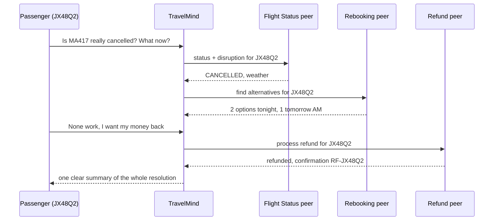
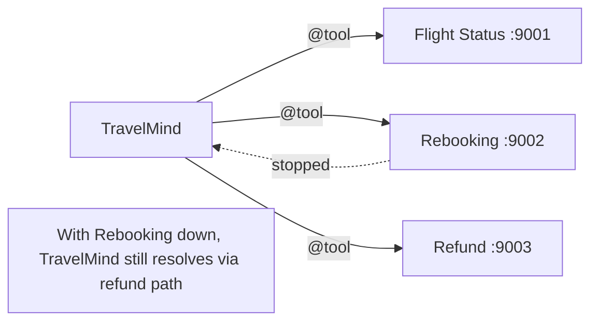
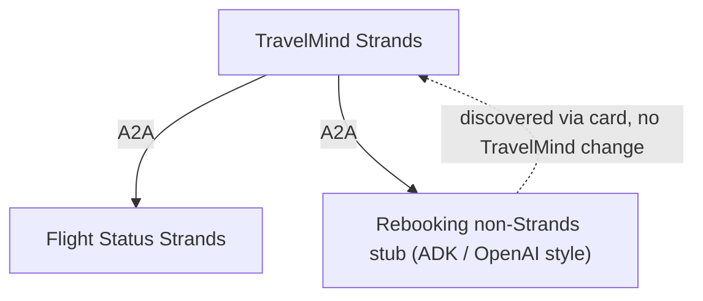

# Mini-Project: Build the Airline's Agent Mesh

**Type:** End-of-session capstone | **Time:** 75 to 90 minutes core, portfolio polish after | **Work:** solo or pairs

> The scene: It is 22:10. **Meridian Airways** flight **MA417** just got cancelled. 180 passengers, one TravelMind, and a long night. TravelMind cannot fix this alone. It has to confirm the cancellation, find each passenger a rebooking, and refund the ones who give up. The catch: flight status, rebooking, and refunds are three separate teams' agents. TravelMind has never imported a line of their code. It only knows their URLs.
>
> Your job: build the mesh that gets these passengers home.

This is everything from the session in one build. You will stand up specialist peers, discover them, and orchestrate a multi-step resolution across agents you do not own. Climb as far as you can.

---

## What you are building



Three peers, one orchestrator, one passenger journey resolved end to end.

---

## Learning goals

- Compose a working multi-agent mesh over A2A from scratch
- Coordinate a multi-step scenario across peers you do not own
- Handle a peer being down without dropping the passenger
- Take at least one peer to production shape on AgentCore
- Tell the story to a non-engineer in one page

---

## Setup

```bash
pip install -q 'strands-agents[a2a]' 'strands-agents-tools[a2a_client]' bedrock-agentcore-starter-toolkit
```

| Need | Value |
|---|---|
| Model | `us.anthropic.claude-haiku-4-5-20251001-v1:0` |
| Region | `us-east-1`, account `123456789012` |
| Credentials | required throughout (peers call a model) |
| Reference | `01_A2A_with_Strands.ipynb` (all parts) and `02_A2A_on_AgentCore.ipynb` |

You may reuse the Flight Status agent from Exercise 1, the Baggage and Refund patterns from Exercise 2, and the AgentCore-ready server from Notebook 2.

### The three peers and their skills

| Peer | Tools | Returns (mock) |
|---|---|---|
| Flight Status | `get_flight_status(flight_no)`, `is_disrupted(pnr)` | status, disruption reason |
| Rebooking | `find_alternatives(pnr)`, `rebook(pnr, option_id)` | list of options, a new PNR |
| Refund | `look_up_booking(pnr)`, `process_refund(pnr, amount_usd)` | fare, eligibility, confirmation id |

Run each on its own port locally (9001, 9002, 9003) so all three live at once. Each `A2AServer` defaults to 9000, so pass a port.

### Repo layout (you will hand this in)

```
meridian-agent-mesh/
  servers/
    flight_status_server.py
    rebooking_server.py
    refund_server.py
  orchestrator/
    travelmind.py
  requirements.txt
  README.md          # how to run the whole mesh in order
  MEMO.md            # the one-page executive case study (Tier A)
```

---

## Task ladder

Everyone ships Tier C. Higher tiers are open, never locked. The rubric rewards the tier you actually complete.

### Tier C: Two-agent mesh, single step (Base, target 40 points)

Stand up **one** peer (Refund or Flight Status) and a **TravelMind** orchestrator. TravelMind discovers the peer and resolves one single-step request end to end.

Example: "Is my booking JX48Q2 affected by the MA417 cancellation?" routed to the Flight Status peer, answered in plain language.

**Requirements**
- One peer server boots with correct skills on its own port
- `travelmind.py` discovers the peer (tool provider or `@tool` wrapper) and returns a coherent answer
- `README.md` says exactly how to run it: start the server, then run the orchestrator

**Bounded done:** from a clean checkout, following only the README, the mesh starts and answers one passenger question by delegating to one peer. No manual fixups.

### Tier B: Three-agent mesh, full journey, graceful under failure (Stretch, target +30)

Bring all three peers online. TravelMind handles the **full cancellation journey**: confirm the cancellation, fetch rebooking options, and on the passenger's "no good options" reply, process the refund.

Then prove resilience: stop the Rebooking peer and run the journey again. TravelMind must still confirm the cancellation and offer the refund path instead of crashing.



**Requirements**
- All three peers run together; TravelMind routes across them in one multi-step flow
- Stopping any one peer does not produce a stack trace to the passenger
- The orchestrator's routing logic is readable, not a tangle

**Bounded done:** the full journey completes with three peers up. With Rebooking stopped, the passenger still gets a useful, calm answer naming what could not be reached and what TravelMind can still do.

### Tier A: Production shape and the memo (Advanced, target +20)

1. **AgentCore-ready.** Convert at least one peer to the Notebook 2 pattern: read `http_url` from `AGENTCORE_RUNTIME_URL`, add `GET /ping` returning `{"status":"healthy"}`, mount the A2A app at root, serve on port 9000, `serve_at_root=True`. Write the deploy steps in the README:

   ```bash
   agentcore configure -e servers/refund_server.py --protocol A2A
   agentcore deploy
   # returns: arn:aws:bedrock-agentcore:us-east-1:123456789012:runtime/refund_server-xxxx
   ```

2. **Read errors like production.** Add handling that inspects the JSON-RPC `error.code` (the HTTP status is `200` even on failure). At minimum, when you see `-32505` (RuntimeClientError), surface "the peer crashed, check CloudWatch" rather than a generic failure.

3. **The memo.** Write `MEMO.md`, one page, framed as an interview case study. Sections below.

**Bounded done:** one peer boots in AgentCore-ready form locally (`/ping` healthy, card at root), the deploy commands are written correctly, error handling distinguishes a crashed peer from a wiring problem, and the memo explains the design to a non-engineer in one page.

### Bonus: Prove cross-framework (any finisher)

This is the real payoff of A2A and the line that separates it from plain microservices.

Pick one:

- Stub a peer that speaks A2A but is **not** Strands (mirror the AWS incident-response reference arch: a Google ADK or OpenAI Agents SDK style peer). Make TravelMind discover and call it with **zero changes** to TravelMind.
- Or, if you cannot stand up another framework in the time, **design the Agent Card contract** for one peer so precisely that a non-Strands team could implement it and slot in. Write it as a short contract doc and argue why TravelMind would not need to change.



**Bounded done:** either a non-Strands peer is discovered and called unchanged, or a card contract exists that a different team could build against with no orchestrator changes, with your reasoning.

---

## LLM-integrated task (required, pass or fail, separate from the score)

The Agent Card contract is what lets a peer you do not own get discovered and called correctly. Vague contracts cause silent misrouting.

1. Ask the model to draft either (a) one peer's full Agent Card contract (skills, descriptions, input shapes) or (b) TravelMind's routing `system_prompt` that decides which peer handles what.
2. Paste the prompt and the model's raw output.
3. Find at least **two** weaknesses. Examples: a description so generic two peers would match it, a routing prompt that would send a refund request to the rebooking peer, or input fields a caller could not guess.
4. Show the corrected version and one sentence on why it routes correctly now.

You must include all four parts. Missing this gate means the project is incomplete regardless of points earned.

---

## The memo (Tier A): `MEMO.md`

One page. Write it for a Meridian VP who does not code, as if it were your interview case study.

| Section | Content |
|---|---|
| Situation | MA417 cancelled, 180 passengers, three teams' systems |
| What you built | The mesh, in two sentences and the sequence diagram |
| Why A2A here | Three separate teams and deploys. What you deliberately kept in-process or put on MCP, and why |
| Tradeoffs and risks | The slowest hop, the peer most likely to fail, your mitigation |
| Production readiness | AgentCore deploy, auth, session isolation, error handling |
| Next steps | What you would build next with one more week |

---

## Rubric (100 points)

The LLM-integrated task is a pass or fail gate and is **not** in these points. Complete it or the project is incomplete.

| Area | Points | What earns them |
|---|---|---|
| **Tier C: working two-agent mesh** | **40** | Peer boots with correct skills (10). Discovery plus delegation returns a coherent single-step answer (20). Repo runs from README with no hand-holding (10). |
| **Tier B: three-agent journey + resilience** | **30** | Third peer integrated and multi-step journey resolves (15). Graceful peer-down, no stack trace to passenger (10). Readable routing logic (5). |
| **Tier A: production + memo** | **20** | One peer AgentCore-ready with correct port, path, ping, http_url, serve_at_root, plus deploy steps written (8). Error handling reads `error.code` and handles `-32505` to logs (4). One-page memo covers all sections (8). |
| **Thinking: reflection + tradeoffs** | **10** | Seam and tradeoff reasoning is correct (5). Reflection shows real judgment on when A2A versus in-process versus MCP (5). |

A Tier A student who ships only Tier C work scores like Tier C. The bar is the same; the plate is different.

Bonus is extra credit on top, capped at 10, awarded for a genuine cross-framework demo or a defensible card contract.

---

## Reflection (write 6 lines)

- Which peer would fail first under a 10x passenger surge, and how does your mesh stay calm?
- You wired three peers as tools. Which one had the weakest Agent Card, and how did you know?
- Where in this mesh did you choose **not** to use A2A, and why was that the right call?

---

## Skeptic's corner

"You built three microservices and called them agents." Fair challenge. The answer is in the bonus: a microservice mesh shares an API you designed and control. This mesh shares the A2A discovery and message standard, so the Operations team could rewrite Flight Status in Go, or a partner airline could plug in their own refund agent, and TravelMind would not change. If all three peers will always be your Python in your repo, the skeptic wins and you should collapse them in-process. Knowing which world you are in is the whole skill.

---

<details>
<summary><b>Facilitator notes (do not project)</b></summary>

### Solution shape

**A peer on a custom port:**

```python
from strands import Agent, tool
from strands.multiagent.a2a import A2AServer
from strands.models import BedrockModel

@tool
def find_alternatives(pnr: str) -> dict:
    """Find alternative flights for a disrupted booking. Returns a list of options."""
    return {"pnr": pnr, "options": [
        {"id": "OPT1", "depart": "tonight 23:50", "arrive": "+1 02:10"},
        {"id": "OPT2", "depart": "tomorrow 06:30", "arrive": "tomorrow 09:00"},
    ]}

@tool
def rebook(pnr: str, option_id: str) -> dict:
    """Rebook a passenger onto a chosen alternative. Returns a new PNR."""
    return {"pnr": pnr, "new_pnr": "RB" + pnr[-4:], "option": option_id}

agent = Agent(name="Rebooking Agent",
              description="Finds alternative flights for disrupted bookings and rebooks passengers onto a chosen option.",
              model=BedrockModel(model_id="us.anthropic.claude-haiku-4-5-20251001-v1:0"),
              tools=[find_alternatives, rebook], callback_handler=None)

A2AServer(agent=agent, host="127.0.0.1", port=9002).serve()
```

**Orchestrator with peers as guarded tools:**

```python
from strands import Agent, tool
from strands.models import BedrockModel
from strands.agent.a2a_agent import A2AAgent

MODEL = "us.anthropic.claude-haiku-4-5-20251001-v1:0"
PEERS = {"flight": "http://127.0.0.1:9001",
         "rebook": "http://127.0.0.1:9002",
         "refund": "http://127.0.0.1:9003"}

def make_peer_tool(name, url, desc):
    peer = A2AAgent(endpoint=url, name=name)
    @tool(name=f"ask_{name}", description=desc)
    def _ask(question: str) -> str:
        try:
            return str(peer(question).message)
        except Exception as e:
            return f"The {name} service is unreachable right now: {e}"
    return _ask

tools = [
    make_peer_tool("flight", PEERS["flight"], "Check flight status and disruption."),
    make_peer_tool("rebook", PEERS["rebook"], "Find alternative flights and rebook."),
    make_peer_tool("refund", PEERS["refund"], "Check eligibility and process refunds."),
]

travelmind = Agent(
    name="TravelMind",
    system_prompt=("You are Meridian Airways support. For a cancellation, first confirm "
                   "status, then offer rebooking options, and process a refund only if the "
                   "passenger declines all options. Never invent fares or PNRs; use the tools."),
    model=BedrockModel(model_id=MODEL), tools=tools, callback_handler=None)

print(travelmind("MA417 was cancelled. My booking is JX48Q2. What are my options?").message)
```

The guarded tool returning a string is the resilience pattern. When a peer is down, the model reads the apology and routes around it.

**AgentCore-ready peer (Tier A):** identical to Notebook 2's `my_a2a_server.py`. The byte-for-byte same file deploys.

**Error-code handling (Tier A):**

```python
def hint_for(code):
    return {-32501: "wrong URL/ARN", -32502: "bad request", -32503: "throttled, retry",
            -32504: "session conflict", -32505: "peer crashed, check CloudWatch"}.get(code, "see message")
```

### Three common errors

1. **Port collision.** All three peers default to 9000 and the second one fails to bind. Make them pass `port=900X`. The startup error is the tell.
2. **No guard on peer calls.** Tier B resilience fails because an unreachable peer throws and kills the turn. The fix is try/except inside each tool.
3. **Refund before rebooking.** The orchestrator processes a refund without offering options because the system prompt did not order the steps. Tighten the routing prompt. This is also exactly what the LLM-integrated task should have caught.

### Five discussion prompts

- Why run each peer on its own port locally, and what replaces ports in production?
- Where does retry-on-throttle belong: peer, tool wrapper, or orchestrator?
- Two peers could both answer "refund." How does TravelMind disambiguate?
- What in the cancellation flow must be ordered, and how do you enforce order across agents?
- The bonus peer is not Strands. What is the only thing TravelMind relies on from it?

### Five viva questions (easy to hard)

1. Walk me through the cancellation journey, agent by agent.
2. You stopped the Rebooking peer. What does the passenger see and why no crash?
3. Show me the line that makes one peer AgentCore-ready and explain what it does.
4. A call returns HTTP 200 with `error.code -32505`. What happened and where do you look?
5. Convince me this mesh is more than three microservices. Then tell me when it would not be.

### Grading guidance

- Tier C is most of the grade and must run from the README. If it needs hand-holding, it is not done. Dock the repo-runs row hard.
- Grade the memo and the seam reasoning harder than the wiring. The session's real lesson is judgment, not glue.
- The LLM-integrated gate is binary. A polished mesh with no LLM critique is incomplete; say so plainly.

### Timing

Tier C ~35 min, Tier B ~25 min, Tier A ~25 min. The bonus and memo polish are portfolio work that can spill past the session. Tell fast finishers to start the memo early; writing the story while the build is fresh is the highest-value use of spare time.
</details>
