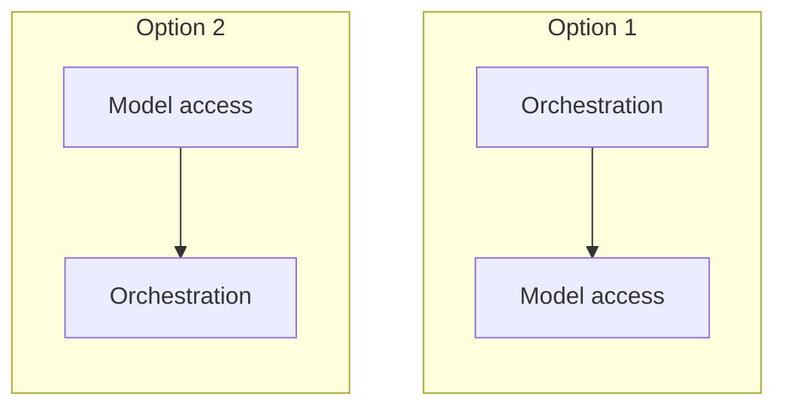

# Exercise 1: The map and the mindset

**Language:** concept and pseudocode  **Topics:** eight-layer map, three axes, build vs managed, placement discipline  **Level:** foundational (recognition, no code)

First foundation. Everything here is recognition and placement: no code to write or read yet. Attempt each item, then reveal. One correct answer per item.

**Q1.** A new library lets your agent hand a sub-task to a different team's agent over the network. On the eight-layer map it belongs to:

- A) Interop, since it connects one agent to another
- B) Orchestration, since it adds a step to the loop
- C) Managed runtime, since the remote agent needs hosting somewhere
- D) Knowledge, since the other agent may fetch facts for you

Show answer

**A)** Agent-to-agent delegation is A2A, on the Interop layer. Placement tells you it is a wiring choice, not a new step in your own loop.

**Q2.** Exactly one placement below is wrong. Which?

- A) MLflow to Abstraction and observability
- B) Guardrails to Orchestration
- C) Reranking to Knowledge
- D) AgentCore to Managed runtime and deploy

Show answer

**B)** Guardrails are Safety and governance (layer 7), a rule outside the model, not part of orchestration.

**Q3.** Which are genuine reasons to pick build-your-own over a managed service? *(select all that apply)*

- A) You need portability the day the managed service is deprecated
- B) You want less to operate and a faster path to a first version
- C) You need control over chunking and ranking that the managed option hides
- D) You want the provider to run and patch the retrieval loop for you

Show answer

**A and C.** The other two are arguments for the managed option. Build-your-own buys control and portability at the cost of more to run.

**Q4.** Order these from cheapest to most powerful, the way the ambition ladder climbs:
`agent loop` · `single call plus RAG` · `automation` · `workflow`

- A) automation, workflow, single call plus RAG, agent loop
- B) single call plus RAG, automation, workflow, agent loop
- C) automation, single call plus RAG, workflow, agent loop
- D) workflow, automation, single call plus RAG, agent loop

Show answer

**C)** No model (automation), then one grounded call, then fixed branches (workflow), then a model that picks its own path (agent).

**Q5.** Your design is one Strands agent that remembers the session and wires its own vector store. Match each axis to where this design sits. Bank: `build-your-own` · `managed` · `one agent` · `many agents` · `stateless` · `stateful`

1. Build vs managed
2. One vs many
3. Stateless vs stateful

Show answer

1 = **build-your-own**, 2 = **one agent**, 3 = **stateful**. It wires its own store, is a single loop, and keeps session state.

**Q6.** Match each tool to the layer it lives on. Bank of layer numbers: `1 Model access` · `2 Abstraction and observability` · `5 Knowledge` · `7 Safety` · `8 Managed runtime` (one is a decoy).

1. MLflow
2. A reranker
3. Guardrails
4. AgentCore

Show answer

1 = **2**, 2 = **5**, 3 = **7**, 4 = **8**. Layer 1 (Model access) is the decoy here.

**Q7.** A flashy technique trends online. The program's first question about it is:

- A) Does it beat our current metric on a public benchmark
- B) Is it supported on Bedrock yet
- C) What does it cost to run at our scale
- D) Which of the eight layers is it

Show answer

**D)** Placement first. The map turns hype into a layer, and the layer tells you what the technique competes with.

**Q8.** "Knowledge Bases versus a hand-built chunk, embed, retrieve pipeline" is an instance of which axis?

- A) Build your own vs managed
- B) Stateless vs stateful
- C) One agent vs many
- D) Single call vs multi-step

Show answer

**A)** Same capability, one you assemble and one the provider runs.

**Q9.** True or False: a cheaper model swapped in for the same task is a change on the Model access layer (layer 1), not the Orchestration layer.

- A) True
- B) False

Show answer

**A) True.** The model itself is layer 1. The loop that drives it is layer 3, and it does not change when you only swap the model.

**Q10.** A single agent with two local tools and a plain-text reply needs which interop protocols on day one?

- A) MCP, so the two tools are callable at all
- B) None; interop is for multiple agents, teams, or a richer UI
- C) A2A and MCP, so the two local tools can coordinate their calls
- D) A2UI, so the plain-text reply renders correctly

Show answer

**B)** Interop earns its place with multiple agents, shared tools, or a UI beyond text. Reaching for it earlier is architecture for scale you do not have.

**Q11.** Which items are Interop-layer concerns? *(select all that apply)*

- A) MCP
- B) A2A
- C) Session memory
- D) A2UI

Show answer

**A, B, and D.** Session memory is layer 4, not Interop. MCP, A2A, and A2UI are the three Interop plugs.

**Q12.** Two candidate dependency sketches for the stack. Which is correct?

- A) Option 1
- B) both are valid
- C) Option 2
- D) neither, the two layers do not depend on each other

Show answer

**C)** Read bottom to top: orchestration depends on model access, so model access is the base. Option 1 has the dependency backwards.

**Q13.** Someone argues managed services are easier, so building your own is over-engineering. The strongest counter is:

- A) build-your-own is cheaper at every scale, so effort is not the deciding factor
- B) managed services cannot satisfy enterprise security or compliance rules
- C) build-your-own is the only route to portability, low latency, and low cost all at once
- D) when a managed service is deprecated, your control plane becomes the vendor's roadmap

Show answer

**D)** Portability is a cost you pay on purpose. The day a managed service closes, your roadmap becomes theirs.

**Q14.** True or False: S3 Vectors and OpenSearch Serverless sit on the Memory layer, because both persist data across sessions.

- A) True
- B) False

Show answer

**B) False.** Both are vector stores on the Knowledge layer. Persisting data is not the same as session memory.

**Q15.** On the three axes, which end is the safest default for a first production launch?

- A) whichever end fits the job in front of you, not the fanciest
- B) always the richer, more capable end, since it tends to scale further later
- C) always managed, one agent, stateless
- D) always build-your-own, many agents, stateful

Show answer

**A)** Same capability, different cost, control, and effort at each end. The job picks the end, not a preference for power.

