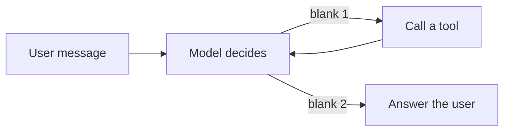
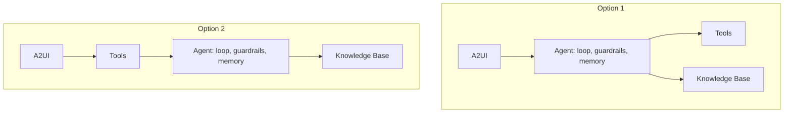

# Exercise 4: The lifecycle and building the agent

**Language:** Python, concept, diagrams  **Topics:** P0 to P3, gates, ambition ladder, doors, tools as contracts, the loop and its guard  **Level:** applied (debugging enters here)

Fourth foundation. Reading and spotting are assumed now; you also find and fix bugs. Each fix is one specific change, given as an option.

**Q1.** A team ships to P3 with no eval suite and no instrumentation. Which gate did they fail, and the named consequence?

- A) P2 to P3, they have nothing to test against
- B) P0 to P1, they built something that never earns out
- C) P1 to P2, they built with no acceptance bar
- D) P3 to operate, they shipped without a sign-off

<details><summary>Show answer</summary>

**A)** A supervised MVP with instrumentation and an eval suite is the P2-to-P3 gate. Skip it and P3 cannot begin.
</details>

**Q2.** The agent can (i) show rebooking options and (ii) confirm a rebooking that charges a fare difference. Autonomy differs because:

- A) both are irreversible, so both need human approval
- B) showing options is reversible and can run automatically; a charge is hard to undo and needs approval
- C) confirming can be automated once it is well tested; showing options is the part that actually risks misinformation
- D) both are safe to automate once the agent is well tested

<details><summary>Show answer</summary>

**B)** A two-way door can run on its own. A charge is a one-way door, so it needs a human. The axis is reversibility, not test coverage.
</details>

**Q3.** This loop has one defect that makes it unsafe before QA even starts. The fix is:

```python
def run_agent(msg):
    messages = [{"role": "user", "content": [{"text": msg}]}]
    while True:
        resp = client.converse(modelId=MODEL, messages=messages, toolConfig=TOOL_CONFIG)
        messages.append(resp["output"]["message"])
        if resp["stopReason"] != "tool_use":
            return resp["output"]["message"]["content"][0]["text"]
        block = tool_use_block(resp)
        result = TOOLS[block["name"]](**block["input"])
        messages.append({"role": "user",
                         "content": [{"toolResult": {"toolUseId": block["toolUseId"],
                                                     "content": [{"json": result}]}}]})
```

- A) the `toolResult` is missing its `toolUseId`, so the model cannot bind it
- B) the assistant message is appended before the tool runs, corrupting order
- C) `while True` has no turn cap, so a mis-stepping model loops without end
- D) `stopReason` should be compared with `end_turn`, not `tool_use`

<details><summary>Show answer</summary>

**C)** The id is present and the ordering is fine. The missing piece is a bound like `for turn in range(max_turns)`. No stop condition is a runaway.
</details>

**Q4.** This loop returns the right answer for a Gold passenger but is still broken. The bug is:

```python
    for _ in range(6):
        resp = client.converse(modelId=MODEL, messages=messages, toolConfig=TOOL_CONFIG)
        messages.append(resp["output"]["message"])
        if resp["stopReason"] != "tool_use":
            return resp["output"]["message"]["content"][0]["text"]
        block = tool_use_block(resp)
        result = TOOLS[block["name"]](**block["input"])
        messages.append({"role": "user",
                         "content": [{"toolResult": {"toolUseId": "tool",
                                                     "content": [{"json": result}]}}]})
```

- A) the turn cap of 6 is too low for three tool calls
- B) the tool result should be appended with role `assistant`, not `user`
- C) `TOOLS[block["name"]]` should be handed the whole tool-use block object, not only its parsed input dictionary
- D) `toolUseId` is hardcoded to `"tool"` instead of `block["toolUseId"]`, so results do not bind to their calls

<details><summary>Show answer</summary>

**D)** A fixed id happens to work with one call in flight, then binds results to the wrong call. Use `block["toolUseId"]`.
</details>

**Q5.** Complete the agent loop. Bank: **a)** has enough  **b)** needs data  **c)** on error  **d)** on approval



<details><summary>Show answer</summary>

blank 1 = **b** (needs data), blank 2 = **a** (has enough). The `T --> M` edge is the loop-back: read the result, decide again.
</details>

**Q6.** Order the six agent parts the way they were assembled, given that model access is already in place:
`guardrails` · `tools` · `orchestration` · `instructions` · `memory` · `model`

- A) model, instructions, tools, memory, orchestration, guardrails
- B) model, tools, instructions, memory, guardrails, orchestration
- C) instructions, model, tools, orchestration, memory, guardrails
- D) model, instructions, memory, tools, guardrails, orchestration

<details><summary>Show answer</summary>

**A)** Model, then the role and rules, then the tools, then session memory, then the loop that drives them, then the guardrails around it.
</details>

**Q7.** A handler runs the same three steps every time, no judgement, no branching. On the ambition ladder it is:

- A) an agent loop, because it calls more than one tool
- B) automation, because the steps are fixed and need no model
- C) a single call plus RAG, because it may need some facts
- D) a workflow, because three steps already implies branching

<details><summary>Show answer</summary>

**B)** Fixed steps with no judgement need no model at all. Climb only when a lower rung genuinely cannot do the job.
</details>

**Q8.** Two candidate wirings for the same agent. Which is correct?



- A) Option 2
- B) both are valid
- C) Option 1
- D) neither, tools must sit above the agent

<details><summary>Show answer</summary>

**C)** The UI reaches the agent; the agent then calls tools and the knowledge base. In Option 2 the tools sit between the UI and the agent, which is wrong.
</details>

**Q9.** Match each gate to what must be true to pass it. Bank: **a)** value beats cost and the task needs an agent  **b)** autonomy set, tools contracted, acceptance bar written  **c)** supervised MVP runs, instrumentation on, eval suite exists  **d)** eval passes the bar, guardrails hold, sign-off signed

1. P0 to P1
2. P1 to P2
3. P2 to P3
4. P3 to operate

<details><summary>Show answer</summary>

1 = **a**, 2 = **b**, 3 = **c**, 4 = **d**.
</details>

**Q10.** Which of these are one-way doors that need a human gate? *(select all that apply)*

- A) showing the passenger the alternative trains
- B) confirming a rebooking that charges a fare difference
- C) reading the PNR record
- D) issuing a refund to the passenger's card

<details><summary>Show answer</summary>

**B and D.** A charge and a refund are hard to undo. Showing options and reading a record are reversible.
</details>

**Q11.** Why is the P1-to-P2 acceptance bar called the hinge of the whole build?

- A) it caps the budget that P2 spending is not allowed to exceed
- B) it is the final gate before the agent reaches production
- C) it decides which model and which tools are chosen before a single line of code is written
- D) it defines good enough up front, so P3 validates against evidence, not opinion

<details><summary>Show answer</summary>

**D)** You cannot validate in P3 what you did not define in P1. The bar turns QA from an argument into an evidence check.
</details>

**Q12.** The brain looks up the booking, finds the cancellation cause, then fetches alternatives. For `cancel RZ73KP, options?` the trajectory is:

- A) `lookup_pnr` then `get_cancellation_cause` then `get_alt_trains`
- B) `lookup_pnr` then `get_alt_trains`
- C) `get_alt_trains` then `lookup_pnr` then `get_cancellation_cause`
- D) `lookup_pnr` then `get_cancellation_cause`

<details><summary>Show answer</summary>

**A)** Look up the booking, find why the train died, then fetch alternatives for the PNR and tier.
</details>

**Q13.** Match each loop line to its effect. Bank: **a)** records the model's turn in history  **b)** binds the tool result to the call that asked for it  **c)** ends the loop once the model stops asking for tools

```python
1  messages.append(resp["output"]["message"])
2  "toolUseId": block["toolUseId"]
3  if resp["stopReason"] != "tool_use": return ...
```

<details><summary>Show answer</summary>

1 = **a**, 2 = **b**, 3 = **c**.
</details>

**Q14.** Why does the tool-use loop need a maximum-turn guard even before QA begins?

- A) without it the model cannot tell when it has enough information
- B) without a stop condition, a mis-stepping loop can run without end
- C) the guard is what matches the `toolResult` id to the `toolUse` id
- D) it limits how many tools the agent is allowed to register

<details><summary>Show answer</summary>

**B)** No stop condition means a runaway loop that burns tokens. The guard is also what makes did it stop an answerable question in QA.
</details>

**Q15.** True or False: a one-way door like a charge should sit behind a human gate, while a two-way door like showing options can run automatically.

- A) True
- B) False

<details><summary>Show answer</summary>

**A) True.** Autonomy follows reversibility: reversible actions can run on their own, irreversible ones get a human.
</details>
