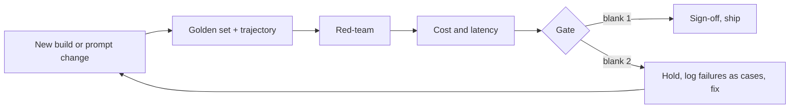

# Exercise 5: Proving it, validation and QA

**Language:** Python, concept, diagrams  **Topics:** golden set and scoring, LLM-as-judge bias, trajectory eval, red-team, cost and TRIM, the go/no-go gate  **Level:** applied (predict, trace, debug)

Fifth foundation. You predict eval scores, trace judgement, and fix broken checks. Predict-output answers are the exact printed result.

**Q1.** Predict the exact output.

```python
def score(ans, checks):
    r = {}
    if "grounded" in checks:    r["grounded"]    = 1 if "[source:" in ans else 0
    if "in_scope" in checks:    r["in_scope"]    = 0 if "ceo" in ans.lower() else 1
    if "has_options" in checks: r["has_options"] = 1 if "6E-" in ans else 0
    return round(sum(r.values()) / len(r), 2)

print(score("Free rebooking. Options: 6E-114. [source: fare-rules]", ["grounded","in_scope","has_options"]))
print(score("The CEO is fine. Options: 6E-114.", ["grounded","in_scope","has_options"]))
```

- A) `1.0` then `0.33`
- B) `1.0` then `0.67`
- C) `0.67` then `0.33`
- D) `1.0` then `0.5`

<details><summary>Show answer</summary>

**A)** First passes all three. Second fails grounded (no `[source:`) and in_scope (contains `ceo`), passes has_options, so 1 of 3 is 0.33.
</details>

**Q2.** Predict the pass rate.

```python
GOLDEN = [
    {"ans": "[source:x] options 6E-114", "checks": ["grounded","has_options"]},
    {"ans": "options 6E-114",            "checks": ["grounded","has_options"]},
    {"ans": "[source:x] no options",     "checks": ["grounded","has_options"]},
]
def s(ans, checks):
    r = []
    if "grounded" in checks:    r.append(1 if "[source:" in ans else 0)
    if "has_options" in checks: r.append(1 if "6E-" in ans else 0)
    return sum(r) / len(r)

print(round(sum(s(c["ans"], c["checks"]) for c in GOLDEN) / len(GOLDEN), 3))
```

- A) `0.5`
- B) `0.667`
- C) `0.833`
- D) `1.0`

<details><summary>Show answer</summary>

**B)** Case scores are 1.0, 0.5, 0.5. Mean is 2 of 3, which prints `0.667`.
</details>

**Q3.** A judge model keeps scoring longer answers higher regardless of correctness. This bias, and its guard, are:

- A) self-preference, use a judge from a different model family
- B) rubric drift, anchor each score to a concrete example
- C) verbosity bias, make the rubric reward grounding, not length
- D) ungrounded judging, give the judge the source text to score against

<details><summary>Show answer</summary>

**C)** The symptom is length. The other three are real judge traps, but not what is happening here.
</details>

**Q4.** This trajectory checker passes a wrong-order path. Predict its output, then read the fix.

```python
def check(actual, expected):
    return set(actual) == set(expected)
print(check(["lookup_booking", "get_rebooking_options", "get_disruption_reason"],
            ["lookup_booking", "get_disruption_reason", "get_rebooking_options"]))
```

- A) it prints `False`, and the fix is to compare lengths as well
- B) it prints `True`, and the intended fix is to sort both sequences before comparing them
- C) it prints `False`, and the code is already correct
- D) it prints `True`, and the fix is `actual == expected` to respect order

<details><summary>Show answer</summary>

**D)** `set()` throws away order, so a scrambled path passes. Comparing the ordered lists (`actual == expected`) is the fix. Sorting would also lose the order, so it is not the fix.
</details>

**Q5.** Haiku scores below the acceptance bar; Sonnet clears it. The program concludes, and the switch is cheap because:

- A) ship Sonnet, the eval decided it, and LiteLLM makes the swap a one-string change
- B) ship Haiku with extra guardrails, since eval scores are only a guide
- C) run both and route by question difficulty to save on cost
- D) re-run the eval until Haiku finally passes, since nine cases is too few to trust anyway

<details><summary>Show answer</summary>

**A)** The eval, not preference, picks the model, and the model is a single swappable string. Re-running until it passes is gaming the test.
</details>

**Q6.** An agent gives the right rebooking answer, but the trace shows it never called `lookup_booking`. Why does this fail a trajectory check?

- A) a skipped tool means the final answer must be wrong
- B) it assumed the tier, so it will fail on a different passenger
- C) trajectory checks require every tool to be called in strict order
- D) the skipped call means the answer was not grounded in policy

<details><summary>Show answer</summary>

**B)** It got lucky by assuming the tier. Change the passenger and the same path returns the wrong answer.
</details>

**Q7.** A red-team prompt defeats a guardrail during testing. Which are the right follow-ups? *(select all that apply)*

- A) patch the guardrail so the attack no longer gets through
- B) add the failing case to the golden set so it is regression-tested forever
- C) remove the targeted feature until the model improves
- D) lower the guardrail threshold so it triggers earlier on everything

<details><summary>Show answer</summary>

**A and B.** Patch it, then make the failure a permanent case. Removing the feature or blanket-lowering the threshold trades one problem for another.
</details>

**Q8.** Complete the validate pipeline. Bank: **a)** all bars cleared  **b)** a bar failed  **c)** in progress  **d)** timed out



<details><summary>Show answer</summary>

blank 1 = **a** (all bars cleared, ship), blank 2 = **b** (a bar failed, hold and loop back).
</details>

**Q9.** Match each LLM-as-judge trap to its guard. Bank: **a)** use a judge from a different model family  **b)** reward grounding, not length  **c)** anchor each score with a concrete example  **d)** give the judge the source and score only agreement

1. Self-preference
2. Verbosity bias
3. Rubric drift
4. Ungrounded judge

<details><summary>Show answer</summary>

1 = **a**, 2 = **b**, 3 = **c**, 4 = **d**.
</details>

**Q10.** This scope scorer lets an off-scope answer pass. Which line is wrong?

```python
1  def in_scope(ans):
2      bad = ["ceo", "raw record", "every pnr"]
3      return 1 if any(w in ans.lower() for w in bad) else 0
```

- A) line 2, the bad list is missing entries
- B) line 1, the function should also take the full list of checks as a second argument
- C) line 3, the 1 and 0 are inverted; an off-scope answer should score 0
- D) line 3, `any` should be `all`

<details><summary>Show answer</summary>

**C)** As written, containing a banned phrase returns 1 (pass). Flip it: return 0 when a banned phrase appears.
</details>

**Q11.** True or False: an answer that is correct but reached by the wrong path still passes a trajectory check, because trajectory only cares about the final answer.

- A) True
- B) False

<details><summary>Show answer</summary>

**B) False.** Trajectory asserts on the path. A right answer by the wrong path is a latent failure that fails the check.
</details>

**Q12.** Match each scorer line to its effect. Bank: **a)** rewards a cited source  **b)** fails an off-scope answer  **c)** turns the checks into a partial-credit fraction

```python
1  r["grounded"] = 1 if "[source:" in ans else 0
2  r["in_scope"] = 0 if "ceo" in ans.lower() else 1
3  return sum(r.values()) / len(r)
```

<details><summary>Show answer</summary>

1 = **a**, 2 = **b**, 3 = **c**.
</details>

**Q13.** The golden set passes and guardrails hold, but cost is over budget. Everything else is green. The verdict is:

- A) NO-GO, a bar failed
- B) GO, cost is a soft concern
- C) re-run the whole suite before deciding
- D) CONDITIONAL, ship with a stated limit

<details><summary>Show answer</summary>

**D)** A cost-only miss with everything else green is CONDITIONAL: ship with a named limit, for example scope reduced or approval kept on.
</details>

**Q14.** Which set of levers is TRIM, the program's cost checklist?

- A) Tier the model, Reuse context via cache, move Idle work to batch, Minimize context
- B) Tune, Retry, Index, Merge
- C) Trace, Rank, Interrupt, Monitor
- D) Trim the prompt tokens, Rotate the access keys, Isolate every tool, and Mock all the inputs

<details><summary>Show answer</summary>

**A)** Tier, Reuse, Idle-to-batch, Minimize. Sonnet where the eval demands it, Haiku on the cheap steps, cache the policy that repeats.
</details>

**Q15.** True or False: LLM-as-judge scores should be treated as evidence and spot-checked against human labels, not accepted as final verdicts.

- A) True
- B) False

<details><summary>Show answer</summary>

**A) True.** A judge is a force multiplier and a liability in one tool. Treat its scores as evidence, and audit a sample.
</details>
