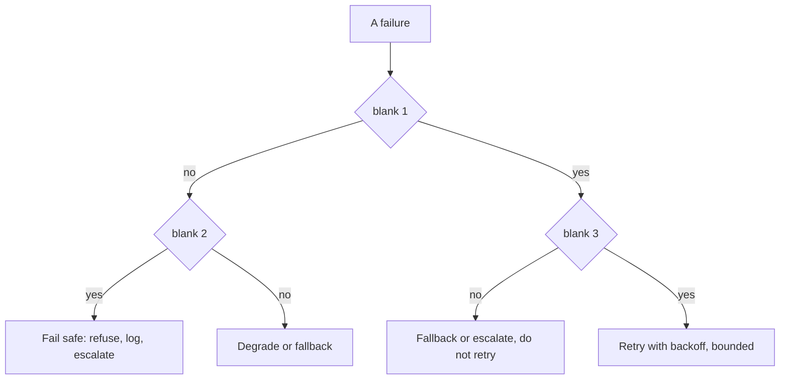
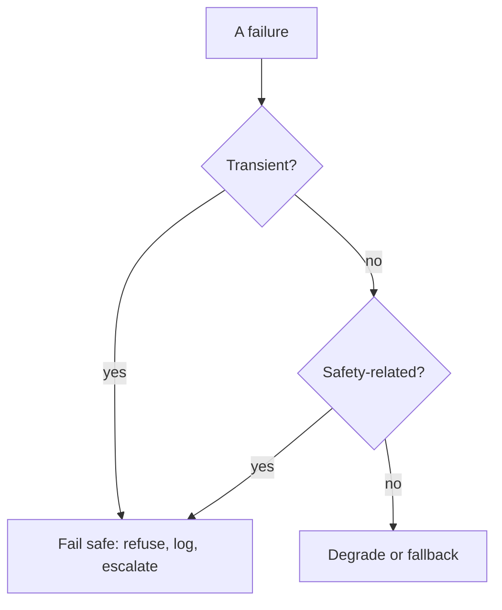

# Exercise 6: From classroom to production, and gate failures

**Language:** Python, concept, diagrams  **Topics:** why production flips, promotion path, retry vs fallback vs fail-safe, rollback, idempotency  **Level:** applied (predict, debug, decide)

Sixth foundation. The hardest set: production reasoning under failure. Predict-output answers are the exact printed result.

**Q1.** Why does production replace access keys with an IAM role on the compute?

- A) roles issue short-lived, auto-rotating credentials the SDK reads on its own
- B) roles are simpler to paste into environment variables
- C) access keys cannot reach Bedrock from inside AWS at all
- D) roles grant broader default permissions, which is what leads to fewer runtime failures

<details><summary>Show answer</summary>

**A)** Static keys leak and never rotate. A role gives temporary, rotating credentials with no secret in the code to lose.
</details>

**Q2.** Predict the exact output.

```python
def call_with_retry(op, max_attempts=3):
    attempts = 0
    while attempts < max_attempts:
        attempts += 1
        if op(attempts):
            return {"ok": True, "attempts": attempts}
    return {"ok": False, "attempts": attempts}

print(call_with_retry(lambda a: a == 2))     # succeeds on attempt 2
print(call_with_retry(lambda a: False))       # never succeeds
```

- A) `{'ok': True, 'attempts': 1}` then `{'ok': False, 'attempts': 3}`
- B) `{'ok': True, 'attempts': 2}` then `{'ok': False, 'attempts': 3}`
- C) `{'ok': True, 'attempts': 2}` then `{'ok': False, 'attempts': 0}`
- D) it loops forever on the second call

<details><summary>Show answer</summary>

**B)** The bound works: attempt 2 succeeds, and the failing op stops after 3. The danger is calling this around a non-idempotent write.
</details>

**Q3.** Predict the exact output. This is the write the retry helper must never blindly repeat.

```python
booked = []
def commit(pnr, flight, key, seen=set()):
    if key in seen:
        return {"status": "duplicate ignored"}
    seen.add(key); booked.append((pnr, flight))
    return {"status": "confirmed"}

print(commit("R1", "6E-114", "idem-1"))
print(commit("R1", "6E-114", "idem-1"))   # a retry with the same key
print("bookings:", len(booked))
```

- A) `confirmed`, `confirmed`, bookings: 2
- B) `duplicate ignored`, `confirmed`, bookings: 1
- C) `confirmed`, `duplicate ignored`, bookings: 1
- D) `confirmed`, `duplicate ignored`, bookings: 2

<details><summary>Show answer</summary>

**C)** The idempotency key makes the retry a no-op, so the booking is written once. That is what makes retrying a write safe.
</details>

**Q4.** A tool call fails intermittently. An automatic retry is:

- A) always safe, provided the number of attempts is capped
- B) safe for any call wrapped in exponential backoff
- C) dangerous only when the tool is external to your own account rather than internal
- D) safe for an idempotent read, dangerous for a write like committing a booking

<details><summary>Show answer</summary>

**D)** Capping attempts or adding backoff does not make a write safe to repeat. The axis is idempotency.
</details>

**Q5.** A safety-related check fails at runtime and you cannot tell whether the action is safe. The correct default is:

- A) fail safe, refuse or escalate rather than guess
- B) fail open, proceed and log so the user is not blocked
- C) retry the check a few times, then proceed if it clears
- D) degrade to a cheaper model and keep serving the request

<details><summary>Show answer</summary>

**A)** When safety is uncertain, stop. Failing open ships the very risk the check exists to catch.
</details>

**Q6.** Complete the runtime-failure decision flow. Bank: **a)** Transient?  **b)** Idempotent?  **c)** Safety-related?  **d)** Recovered?  **e)** Over budget?



<details><summary>Show answer</summary>

blank 1 = **a** (Transient?), blank 2 = **c** (Safety-related?), blank 3 = **b** (Idempotent?). Non-transient routes to the safety question; transient routes to the idempotency question. **d** and **e** are decoys here.
</details>

**Q7.** Order the promotion path from a notebook to live traffic:
`Canary` · `Local mock` · `Staging with shadow traffic` · `Dev on real Bedrock` · `Production` · `CI eval`

- A) Local mock, CI eval, Dev on real Bedrock, Staging with shadow traffic, Canary, Production
- B) Local mock, Dev on real Bedrock, CI eval, Staging with shadow traffic, Canary, Production
- C) Dev on real Bedrock, Local mock, CI eval, Canary, Staging with shadow traffic, Production
- D) Local mock, Dev on real Bedrock, Staging with shadow traffic, CI eval, Canary, Production

<details><summary>Show answer</summary>

**B)** Prove logic offline, hit real Bedrock in dev, gate every change in CI, load-test on shadow traffic in staging, then a canary, then production.
</details>

**Q8.** A deploy passes CI but trips a regression alarm in production. The first response, framed as the deploy-level retry:

- A) page on-call and start a live debugging session on production
- B) re-run the eval gate against the production build
- C) auto-rollback to the last-good version, then debug offline
- D) apply TRIM to cut load until the regression clears

<details><summary>Show answer</summary>

**C)** Revert to the pinned last-good version, then investigate away from the customer. Rollback is the deploy analog of a bounded retry.
</details>

**Q9.** Match each lab-to-production flip to the reason it flips. Bank: **a)** static secrets leak and never rotate  **b)** a change becomes a redeploy and blocks region failover  **c)** it dies on restart and cannot serve concurrent load  **d)** it gets skipped under deadline pressure

1. access keys become an IAM role
2. a hardcoded model string becomes config
3. an in-memory index becomes a managed store
4. manual eval becomes a CI gate

<details><summary>Show answer</summary>

1 = **a**, 2 = **b**, 3 = **c**, 4 = **d**.
</details>

**Q10.** Predict the exact output.

```python
def call_with_retry(op, max_attempts=3):
    a = 0
    while a < max_attempts:
        a += 1
        if op(a):
            return {"ok": True, "attempts": a}
    return {"ok": False, "attempts": a}

print(call_with_retry(lambda a: a == 1))                 # succeeds first try
print(call_with_retry(lambda a: False, max_attempts=2))  # never, cap 2
```

- A) `{'ok': True, 'attempts': 0}` then `{'ok': False, 'attempts': 3}`
- B) `{'ok': True, 'attempts': 1}` then `{'ok': False, 'attempts': 3}`
- C) `{'ok': True, 'attempts': 2}` then `{'ok': False, 'attempts': 2}`
- D) `{'ok': True, 'attempts': 1}` then `{'ok': False, 'attempts': 2}`

<details><summary>Show answer</summary>

**D)** Success on the first try reports one attempt; the failing op with a cap of 2 gives up after two.
</details>

**Q11.** At staging with shadow traffic, the condition to clear before canary is:

- A) p95 latency and cost stay within budget on mirrored traffic, with no regressions
- B) the golden set passes on the chosen model
- C) every guardrail has been red-teamed at least once in CI
- D) on-call rotation and automatic rollback have both been configured, staffed, and tested

<details><summary>Show answer</summary>

**A)** The eval and red-team gates cleared earlier, and on-call belongs to production. Staging proves load and cost on shadow traffic.
</details>

**Q12.** One arrow in this decision flow is wrong. Which?



- A) Transient? no to Safety-related?
- B) Transient? yes to Fail safe
- C) Safety-related? yes to Fail safe
- D) the diagram is correct

<details><summary>Show answer</summary>

**B)** A transient failure should route toward a bounded retry, not straight to fail safe. Fail safe is for the safety branch.
</details>

**Q13.** Which of these are release or pre-ship gates rather than per-request runtime gates? *(select all that apply)*

- A) the CI eval gate
- B) a tool-call timeout
- C) the red-team gate
- D) the sign-off gate

<details><summary>Show answer</summary>

**A, C, and D.** A tool-call timeout is a runtime failure. The eval, red-team, and sign-off gates run before ship, where the team decides.
</details>

**Q14.** True or False: a rollback restores the last-good version and lets you debug offline, rather than fixing the bug live in production first.

- A) True
- B) False

<details><summary>Show answer</summary>

**A) True.** Pin the last-good version, revert on alarm, then debug away from the customer.
</details>

**Q15.** Match each retry-helper line to its effect. Bank: **a)** bounds the number of attempts  **b)** stops as soon as a try succeeds  **c)** reports failure after the bound is spent

```python
1  while attempts < max_attempts:
2      if op(attempts): return {"ok": True, "attempts": attempts}
3  return {"ok": False, "attempts": attempts}
```

<details><summary>Show answer</summary>

1 = **a**, 2 = **b**, 3 = **c**.
</details>
