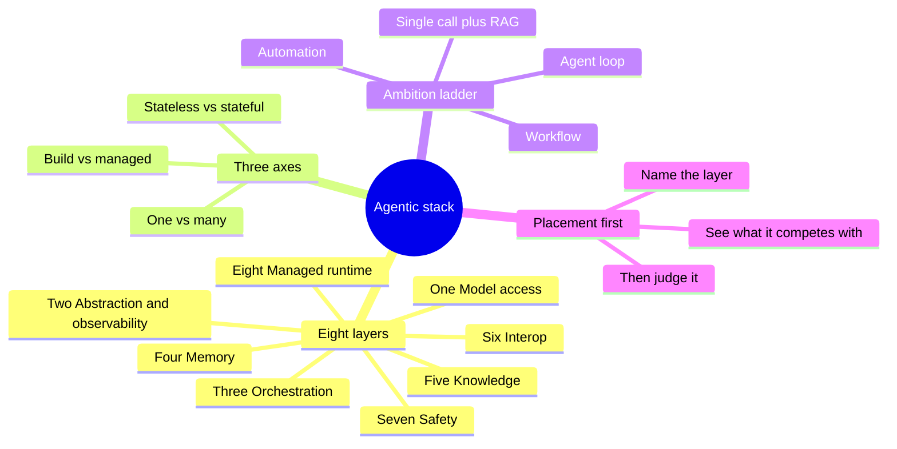
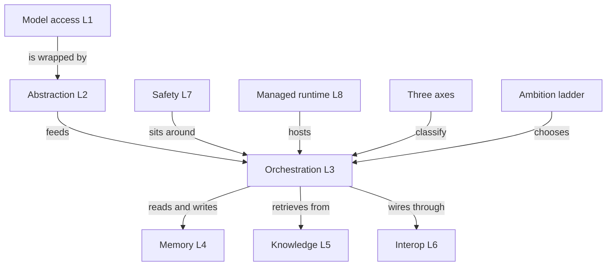
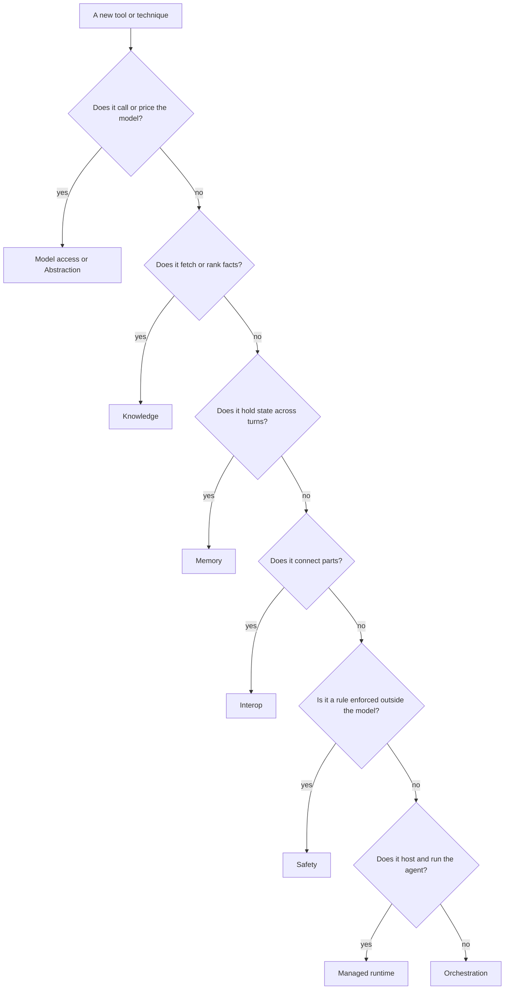

# Solution 1: The map and the mindset

Model solutions and study companion for Exercise 1. Answers are given by content and by the current option letter.

## What this set tests

| Cluster | Core idea |
|---|---|
| The eight layers | Every technique lives on exactly one layer; the layer tells you what it competes with |
| The three axes | Build vs managed, one vs many, stateless vs stateful classify any design |
| The ambition ladder | Pick the cheapest rung that solves the job, climb only when forced |
| Placement discipline | The first question about anything new is which layer, not is it good |

## Concept recap

**The eight layers, bottom to top**

| # | Layer | What it does | Examples |
|---|---|---|---|
| 1 | Model access | Raw calls to a model | Bedrock `converse` |
| 2 | Abstraction and observability | One interface over providers, plus tracing | LiteLLM, MLflow |
| 3 | Orchestration | The loop or graph that drives the model | LangChain, LangGraph, Strands |
| 4 | Memory | State that survives across turns | session and long-term stores |
| 5 | Knowledge | Facts from documents, retrieved and ranked | RAG, Knowledge Bases, vector stores, rerankers |
| 6 | Interop | Wiring between parts | MCP, A2A, A2UI |
| 7 | Safety | Rules enforced outside the model | Guardrails |
| 8 | Managed runtime | Someone else hosts and runs the agent | AgentCore, Agent Builder |

**The three axes**

| Axis | One end | Other end | The trade |
|---|---|---|---|
| Build vs managed | You assemble it | Provider runs it | Control and portability vs less to operate |
| One vs many | Single agent | Many agents | Simplicity vs division of labour |
| Stateless vs stateful | No memory | Keeps state | Cheap and simple vs continuity |

**The ambition ladder** (cheapest to most powerful)

$$\text{automation} \rightarrow \text{single call} + \text{RAG} \rightarrow \text{workflow} \rightarrow \text{agent loop}$$

Read it as a set of questions in order: fixed steps with no judgement (automation), just needs facts (single call plus RAG), known branches (workflow), must pick tools and adapt (agent loop).

## Mind map

## Concept map

## Frameworks to apply

**Placement framework** (given anything new, name the layer)

**Ambition ladder framework** (climb only when a lower rung fails)

| Ask, in order | If yes | Rung |
|---|---|---|
| Fixed steps, no judgement | stop here | automation, no model |
| Just needs facts from documents | stop here | single call plus RAG |
| Known branches, fixed plan | stop here | workflow (graph) |
| Must pick tools and adapt mid-run | stop here | agent loop |

**Build vs managed decision** (translate to a choice)

| Question | Lean build | Lean managed |
|---|---|---|
| Do you need control over internals | yes | no |
| Do you need portability if it is deprecated | yes | no |
| Is speed to a first version the priority | no | yes |
| Do you want the provider to patch and run it | no | yes |

## Model solutions

**Q1. Correct: A) Interop.**
A2A connects one agent to another, so it lives on the Interop layer. Placement tells you it is a wiring choice.
Traps: Orchestration confuses wiring with a loop step; Managed runtime confuses needing hosting with the connection; Knowledge confuses what the other agent might do with what the protocol is.

**Q2. Correct: B) Guardrails to Orchestration is the wrong placement.**
Guardrails are Safety and governance (layer 7), a rule enforced outside the model. The other three placements (MLflow to Abstraction, reranking to Knowledge, AgentCore to Managed runtime) are correct.

**Q3. Correct: A and C.**
Build-your-own buys control over chunking and ranking (C) and portability when a managed service is deprecated (A). B and D describe reasons to choose the managed option.

**Q4. Correct: C) automation, single call plus RAG, workflow, agent loop.**
No model first, then one grounded call, then fixed branches, then a model that picks its own path. The other orderings scramble that climb.

**Q5. Correct matching:** 1 = build-your-own, 2 = one agent, 3 = stateful.
It wires its own store (build), is a single loop (one agent), and keeps session state (stateful).

**Q6. Correct matching:** MLflow = 2, reranker = 5, guardrails = 7, AgentCore = 8. Layer 1 (Model access) is the decoy with no match.

**Q7. Correct: D) which of the eight layers is it.**
Placement comes first, before benchmark, Bedrock support, or cost. The layer tells you what the technique competes with, which frames every later question.

**Q8. Correct: A) build your own vs managed.**
A Knowledge Base is the provider running the retrieval loop; the hand-built pipeline is you assembling it. Same capability, two ends of the build axis.

**Q9. Correct: A) True.**
The model itself is layer 1. Swapping it does not touch the loop that drives it (layer 3), so a model swap is a Model access change.

**Q10. Correct: B) None.**
Interop earns its place with multiple agents, shared tools, or a UI beyond text. A single agent with local tools and a text reply needs none. Reaching for a protocol early is scale you do not have.

**Q11. Correct: A, B, and D.**
MCP, A2A, and A2UI are the three Interop plugs. Session memory is layer 4, not Interop.

**Q12. Correct: C) Option 2.**
Read the dependency bottom to top: orchestration depends on model access, so model access is the base. Option 1 draws the dependency backwards.

**Q13. Correct: D) when a managed service is deprecated, your control plane becomes the vendor's roadmap.**
Portability is a cost you pay on purpose. The counter is not about cost or security absolutes; it is about who owns your future when a service closes.

**Q14. Correct: B) False.**
S3 Vectors and OpenSearch Serverless are vector stores on the Knowledge layer. Persisting data is not the same as session memory.

**Q15. Correct: A) whichever end fits the job in front of you, not the fanciest.**
Each axis end trades cost, control, and effort differently. The job picks the end, not a default preference for power.

## Facts, context, and gotchas

- The map is provider-neutral. The layers stay the same whether you build on Bedrock, run LiteLLM, or use a managed runtime.
- Placement stops most bad debates. Two tools on the same layer are alternatives; two tools on different layers are not competitors and can both be used.
- The ambition ladder is a cost ranking and a risk ranking at once. Every rung up adds a place the system can misbehave, so the cheapest rung that works is also the safest.
- Vector store choice is a Knowledge-layer decision, not a memory decision. S3 Vectors is the cheap default for demos; OpenSearch Serverless carries a monthly idle floor near 350 dollars.

## Right and wrong

| Right | Wrong |
|---|---|
| Name the layer before judging a technique | Ask is it good before asking what it is |
| Climb the ladder only when a rung fails | Default to an agent because it sounds capable |
| Add interop when parts actually need wiring | Add MCP or A2A to a single local agent |
| Treat build vs managed as a trade | Treat managed as always easier or build as always over-engineering |
| Put vector stores on Knowledge | Call a vector store memory because it persists |
