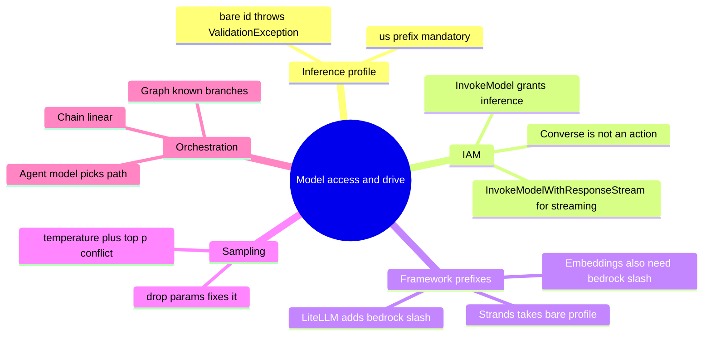
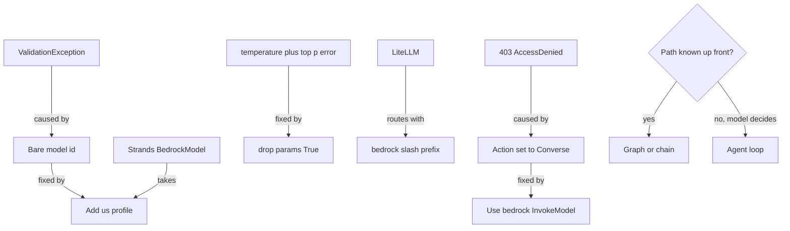
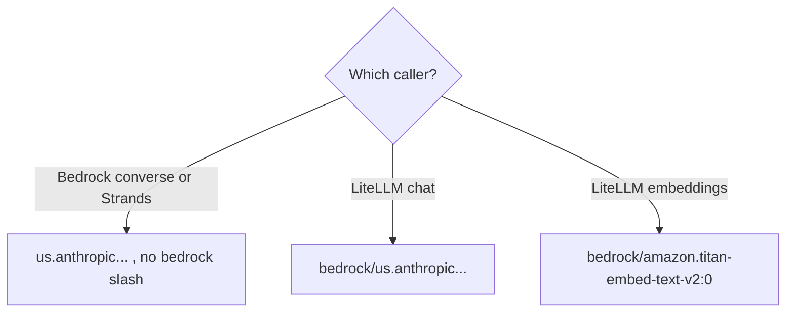
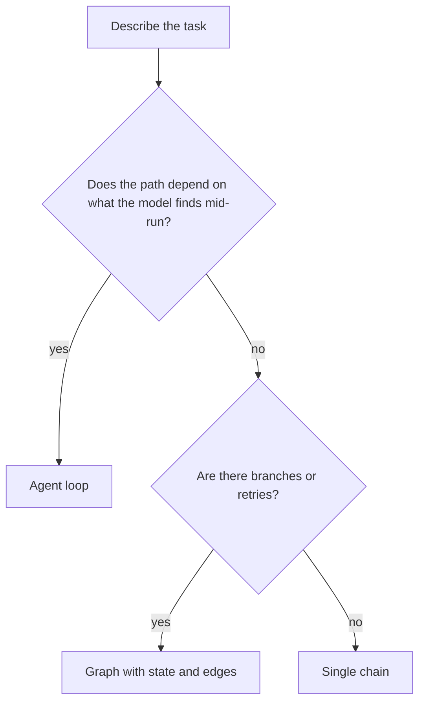

# Solution 2: Model access, LiteLLM, orchestration

Model solutions and study companion for Exercise 2. Answers are given by content and by the current option letter.

## What this set tests

| Cluster | Core idea |
|---|---|
| Inference profiles | The `us.` prefix is mandatory; the bare id throws ValidationException |
| IAM actions | `InvokeModel` grants inference; `Converse` is an API operation, not an action |
| Framework prefixes | LiteLLM needs `bedrock/`; Strands takes the bare `us.` profile |
| Sampling conflict | `temperature` and `top_p` together need `drop_params` |
| Orchestration | Chain for linear, graph for known branches, agent only when the model picks the path |

## Concept recap

**The model string, by caller**

| Caller | String it needs |
|---|---|
| Bedrock `converse` via boto3 | `us.anthropic.claude-haiku-4-5-20251001-v1:0` |
| Strands `BedrockModel` | `us.anthropic.claude-haiku-4-5-20251001-v1:0` |
| LiteLLM chat | `bedrock/us.anthropic.claude-haiku-4-5-20251001-v1:0` |
| LiteLLM embeddings | `bedrock/amazon.titan-embed-text-v2:0` |

The `us.` piece is the cross-region inference profile. Without it the call fails with ValidationException. The `bedrock/` piece is how LiteLLM routes to the Bedrock provider, so it stacks on top of the `us.` profile for LiteLLM only.

**IAM: the action name matters**

| You wrote | Result |
|---|---|
| `bedrock:InvokeModel` | works, this is the grantable action |
| `bedrock:InvokeModelWithResponseStream` | works, the streaming action |
| `bedrock:Converse` | 403, `Converse` is an API operation, not an IAM action |
| `bedrock:ConverseStream` | 403, same reason |

**Sampling**

Bedrock rejects `temperature` and `top_p` set together. Under LiteLLM, `drop_params=True` drops the unsupported one and the call goes through, rather than throwing.

**Orchestration, three shapes**

| Shape | When | The tell |
|---|---|---|
| Chain | fixed, linear, no branching | steps always run in the same order |
| Graph | known branches, retries, fixed plan | the path is decided up front |
| Agent loop | the model must choose tools and adapt | the path depends on what the model finds |

## Mind map

## Concept map

## Frameworks to apply

**The two errors worth memorising** (symptom to fix)

| Symptom | Cause | Fix |
|---|---|---|
| ValidationException the moment you set the model id | bare id, missing the `us.` profile | prefix with `us.anthropic...` |
| 403 AccessDenied on every model call | IAM action is `Converse` or `ConverseStream` | use `bedrock:InvokeModel` and `bedrock:InvokeModelWithResponseStream` |
| error when both `temperature` and `top_p` are set | Bedrock rejects the pair | set `drop_params=True` in LiteLLM |

**Prefix decision** (which string do I pass)

**Orchestration chooser** (translate the task to a shape)

## Model solutions

**Q1. Correct: A) `bedrock/us.anthropic...` then `us.anthropic...`.**
LiteLLM needs the `bedrock/` prefix; Strands takes the bare `us.` profile. The other pairs either drop the prefix on the wrong caller or apply it to both.

**Q2. Correct: B) replace the actions with `bedrock:InvokeModel` and `bedrock:InvokeModelWithResponseStream`.**
`Converse` and `ConverseStream` are API operations, not IAM actions, so they grant nothing. Adding ARNs (a real 403 cause elsewhere) does not help when the action name itself is invalid.

**Q3. Correct: C) prefix the id with the `us.` inference profile.**
The symptom is a ValidationException on the id string, not a permissions or region error. Removing `temperature` or switching to `invoke_model` addresses the wrong problem.

**Q4. Correct: D) the unsupported parameter is dropped and the call succeeds.**
`drop_params` drops what Bedrock will not accept rather than throwing. It does not drop both, retry with a lower `top_p`, or merely warn.

**Q5. Correct: A) graph.**
Known branches and retries on a fixed plan are a graph. An agent is only warranted when the model must choose the path; a chain has no branches.

**Q6. Correct: B) line 3, the model id is missing the `us.` inference profile.**
`toolConfig` is valid, the region is fine, and `converse` is current. Only the bare id is wrong.

**Q7. Correct: C) prefix the model with `bedrock/`.**
Under LiteLLM, the embeddings model needs `bedrock/` exactly like the chat model. Downgrading to v1, passing a provider argument, or re-wrapping the input all miss the routing issue.

**Q8. Correct: D) `lookup_booking` then `get_disruption_reason` then `get_rebooking_options`.**
All three fire in order, because the booking yields a segment and a tier to feed the next calls. The shorter chains skip a needed step; the scrambled order calls a tool before it has its inputs.

**Q9. Correct matching:** LiteLLM chat = `bedrock/us.anthropic...`, Strands = `us.anthropic...`, LiteLLM embeddings = `bedrock/amazon.titan-embed-text-v2:0`. The bare `anthropic...` without `us.` is the decoy.

**Q10. Correct: A) True.**
`InvokeModelWithResponseStream` is the streaming IAM action; `ConverseStream` is an API operation you cannot grant.

**Q11. Correct matching:** line 1 = picks the model through its cross-region profile, line 2 = gives the model the tools it may call, line 3 = pulls the assistant's text out of the response.

**Q12. Correct: A) create the client, set the `us.` profile id, call `converse`, read the text.**
Client first, then the profile id, then the call, then read the output. The other orderings run steps before their prerequisites exist.

**Q13. Correct: B) a chain.**
Fixed, linear, no judgement is a chain. A graph or agent is cost you do not need when nothing branches.

**Q14. Correct: B) False.**
Strands takes the bare `us.anthropic...` profile with no `bedrock/`. Only LiteLLM needs that prefix.

**Q15. Correct: C) the first text block of the assistant's message.**
`resp["output"]["message"]["content"][0]["text"]` reaches into the assistant message and reads its first content block, not tool results, the stop reason, or usage.

## Facts, context, and gotchas

- The `us.` profile and the `bedrock/` prefix solve different problems and can both be needed at once under LiteLLM. Strip either and the call fails for a different reason.
- The 403 story is a classic mislead: many 403s really are missing ARNs, so if the exercise did not pin the action to `Converse`, ARNs would be a live suspect. Read the exact symptom before choosing a fix.
- `converse` is the current, tool-aware Bedrock call. It is not deprecated in favour of `invoke_model`; both exist.
- Choosing an agent when a graph would do is the most common over-reach. Reserve the loop for when the model genuinely decides the next step.

## Right and wrong

| Right | Wrong |
|---|---|
| Read the symptom, then pick the fix | Reach for ARNs on every 403 |
| Prefix `us.` for all Bedrock callers | Send a bare model id |
| Add `bedrock/` only for LiteLLM | Add `bedrock/` to Strands |
| Use `drop_params` for the sampling conflict | Remove `temperature` and hope |
| Use a graph for known branches | Use an agent because it sounds flexible |
