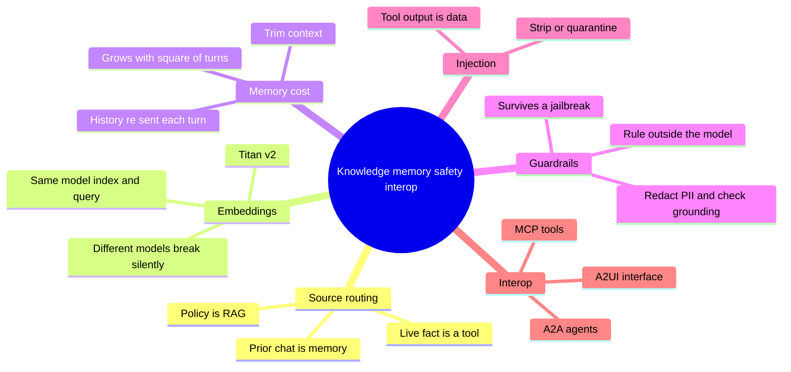
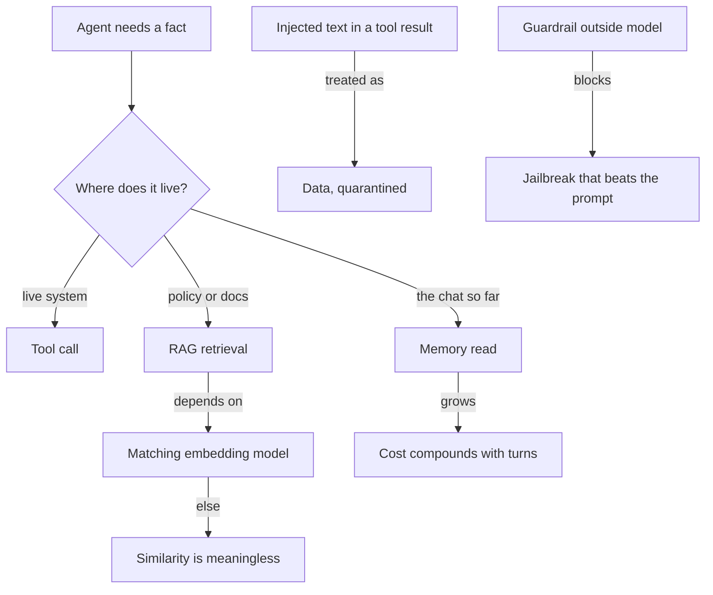
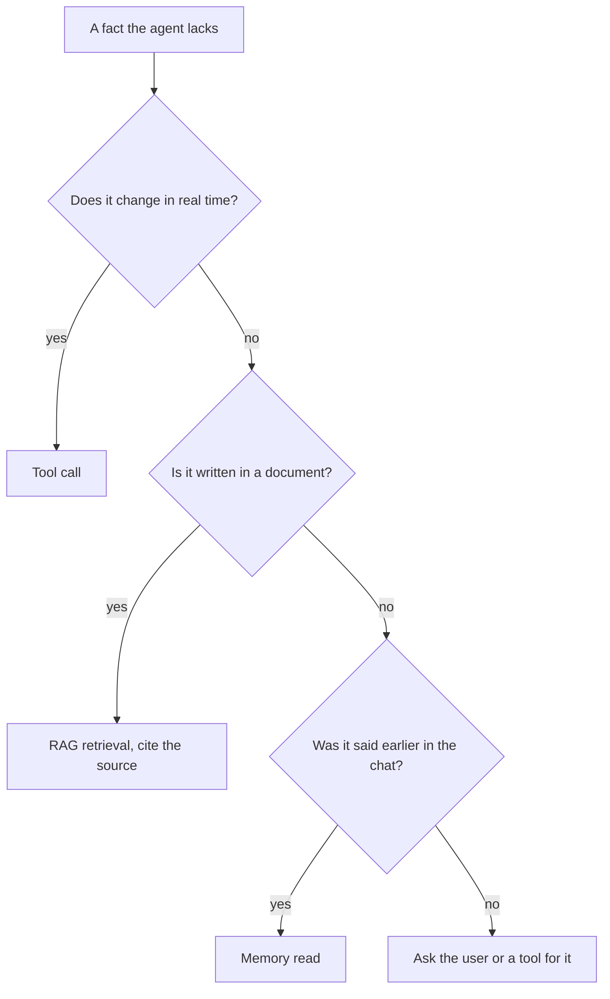

# Solution 3: Knowledge, memory, safety, interop

Model solutions and study companion for Exercise 3. Answers are given by content and by the current option letter.

## What this set tests

| Cluster | Core idea |
|---|---|
| Source routing | A live fact is a tool, policy is RAG, prior chat is memory |
| Embeddings | Index and query must use the same model or similarity is meaningless |
| Memory cost | Re-sending history makes cost grow faster than linearly |
| Guardrails | A rule outside the model survives a jailbreak; a prompt does not |
| Injection | Tool output is data, never instructions |
| Interop | MCP for tools, A2A for agents, A2UI for the interface |

## Concept recap

**Where a fact lives decides how you fetch it**

| Fact type | Source | Why |
|---|---|---|
| Live status that changes | tool call | only the system knows the current value |
| Stable policy in documents | RAG retrieval | grounded, citable, does not change per second |
| Something already said in the chat | memory read | already in context, no fetch needed |

**Embeddings share one space or nothing**

Similarity only holds inside a single vector space. If the index is built with one model and the query embedded with another, the distances are meaningless and retrieval returns junk with no error. Match the model at index time and query time. The lab model is `amazon.titan-embed-text-v2:0`.

**Cost model**

Per call, with `c` as the cached fraction of input and prices per 1M tokens:

$$\text{cost} = \frac{t_{in}(1-c)}{10^6}\,p_{in} + \frac{t_{out}}{10^6}\,p_{out}$$

Prices: Haiku `(1 in, 5 out)`, Sonnet `(3 in, 15 out)`.

**Why conversation cost compounds**

Every turn re-sends the whole history. If each turn adds `t` tokens, the context at turn `n` is about `n·t`, and the total sent across `N` turns is:

$$\sum_{n=1}^{N} n\,t = t\,\frac{N(N+1)}{2}$$

which grows with the square of the turn count. That is why trimming context is a real cost decision.

**Guardrail vs prompt**

| | System prompt | Guardrail |
|---|---|---|
| Where it runs | inside the model | outside the model |
| Can it be talked out of | yes | no |
| Stops a jailbreak | not reliably | yes |

**Interop plugs**

| Protocol | Connects |
|---|---|
| MCP | agent to tools |
| A2A | agent to another agent |
| A2UI | agent to the user interface |

## Mind map

## Concept map

## Frameworks to apply

**Source router** (translate a needed fact to a fetch)

**Embedding rule** (one line, high stakes)

| Do | Result |
|---|---|
| Same model at index and query | similarity is meaningful, retrieval works |
| Different models | vectors live in different spaces, retrieval quietly returns junk |

**Guardrail placement** (what belongs in a guardrail)

| Belongs in a guardrail | Does not |
|---|---|
| block off-scope requests | choose the model |
| redact PII | pick the orchestration shape |
| check an answer is grounded in a source | register tools |

**Injection handling** (fixed procedure)

1. Receive a tool or document result.
2. Treat every character as data, not instructions.
3. Scan for instruction-like text; strip or quarantine it.
4. Pass the cleaned result to the model.

## Model solutions

**Q1. Correct: A) `0.00483` then `0.001184`.**
Sonnet: 710/1e6 x 3 + 180/1e6 x 15 = 0.00483. Haiku with 60 percent of input cached: 284/1e6 x 1 + 180/1e6 x 5 = 0.001184.

**Q2. Correct matching:** live status = tool call, entitlement policy = RAG retrieval, the PNR already typed = memory read.

**Q3. Correct: B) different models place vectors in different spaces, so the distances stop meaning anything.**
It is not about model size, storage, or file formats. Two models embed into different spaces, so their vectors cannot be compared.

**Q4. Correct: C) `8 3`.**
One initial user turn plus three rounds of two messages plus one final answer is eight messages; one `toolResult` per round is three.

**Q5. Correct: D) treat the tool output as data, never instructions, and strip or quarantine it.**
Authentication does not turn data into a command, and relying on the prompt to override the injected line is the failure. Ending the session is an over-reaction to what is a routine data-handling step.

**Q6. Correct: A) it runs outside the model, so persuading the model cannot get around it.**
A prompt is a request the model can be talked out of. A guardrail is enforced outside the model, so it is not about wording, ordering, or retraining.

**Q7. Correct matching:** blank 1 = in a live system, blank 2 = in policy or docs, blank 3 = in the chat so far. In the model's weights is a decoy, because grounded facts do not come from weights.

**Q8. Correct matching:** MCP = agent to tools, A2A = agent to agent, A2UI = agent to the UI.

**Q9. Correct: B) you give up fine control over chunking and ranking, and get the whole pipeline run for you.**
Managed means less to babysit and less to tune. It still supports S3 sources, returns citable metadata, and is not locked to one embedding model at the account level.

**Q10. Correct: C) `0.0027 0.0081`.**
Haiku: 1200/1e6 x 1 + 300/1e6 x 5 = 0.0027. Sonnet: 1200/1e6 x 3 + 300/1e6 x 15 = 0.0081.

**Q11. Correct: D) `[(1, 360), (2, 520), (3, 680)]`.**
Each turn adds its own input plus output to a running total: 360, then 520, then 680. The non-cumulative and input-only options break the running sum.

**Q12. Correct: A, B, and D.**
Guardrails redact PII, refuse off-scope questions, and check that an answer is grounded. Choosing the model is a design decision on layer 1, not a guardrail's job.

**Q13. Correct: A) True.**
After the upgrade, read sources from `retrievedReferences`; the older `citation` field is deprecated.

**Q14. Correct: A) every turn re-sends the accumulated history, so tokens compound.**
The driver is re-sent history, not longer prompts, storage writes, or re-embedding. Turn `n` pays to re-read every turn before it.

**Q15. Correct: B) policy or docs to Tool call is the wrong arrow.**
Facts in policy or documents go to RAG retrieval, not a tool call. The live-system and chat-so-far arrows are correct.

## Facts, context, and gotchas

- The embedding mismatch is the quietest failure in the whole set. It throws no error; retrieval simply gets worse, which is hard to notice without an eval.
- Memory cost being quadratic is why long chats get expensive fast, and why summarising or trimming old turns is a real lever, not a nicety.
- Injection is the reason a tool result is never trusted as a command. The same rule covers retrieved documents, web pages, and any external text.
- A Knowledge Base trades tuning for convenience. If a demo needs custom chunking or a specific reranker, a hand-built pipeline is the reason to go build-your-own.
- `retrievedReferences` replacing `citation` is a field rename that silently empties your citations if you keep reading the old field.

## Right and wrong

| Right | Wrong |
|---|---|
| Route a live fact to a tool | RAG a fact that changes every minute |
| Match embedding models at index and query | Mix models to save a call |
| Treat tool output as data | Obey an instruction found in a tool result |
| Put grounding checks in a guardrail | Rely on the prompt to enforce scope |
| Read sources from `retrievedReferences` | Keep reading the deprecated `citation` field |
| Trim history to control cost | Let context grow unbounded across turns |
