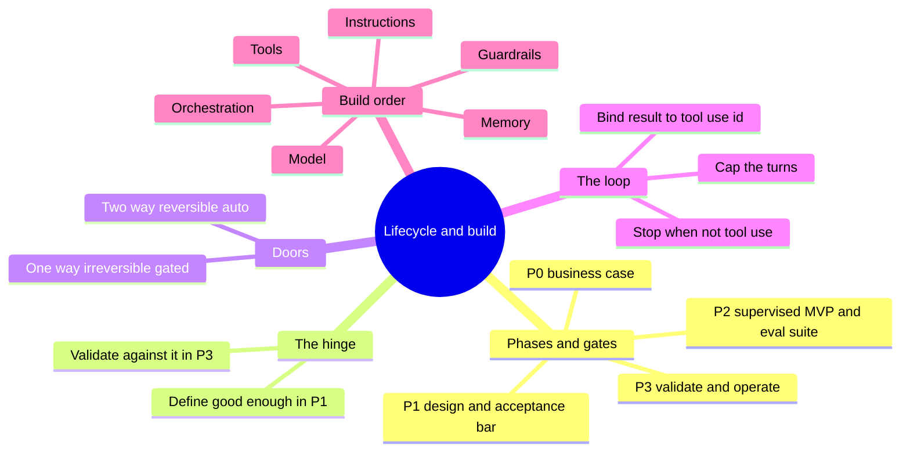
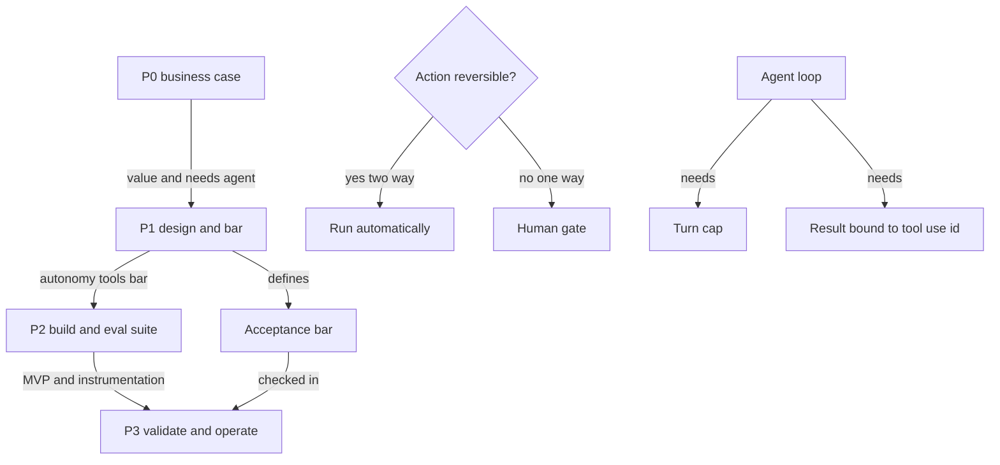
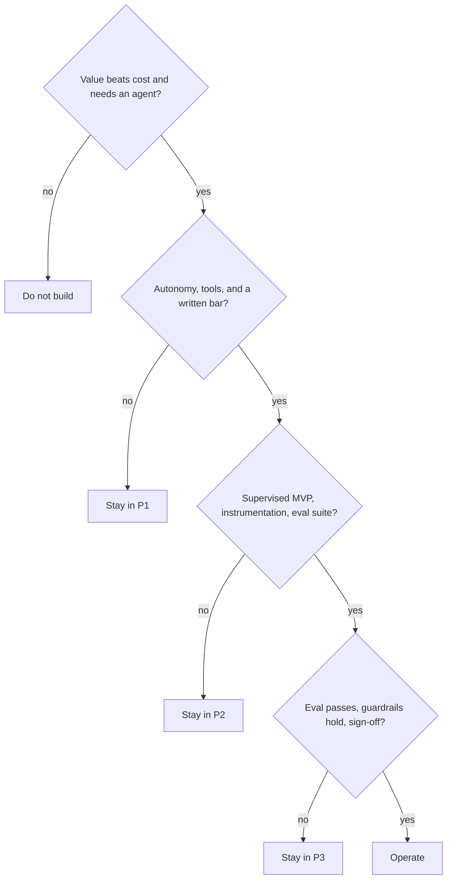

# Solution 4: The lifecycle and building the agent

Model solutions and study companion for Exercise 4. Answers are given by content and by the current option letter.

## What this set tests

| Cluster | Core idea |
|---|---|
| Lifecycle and gates | P0 to P3, each phase ends when a gate is passed |
| The hinge | The P1 to P2 acceptance bar defines good enough before you build |
| Doors | Reversible actions can run alone; irreversible ones get a human gate |
| The loop | Bind every result to its `toolUseId` and cap the turns |
| Build order | Model, rules, tools, memory, orchestration, guardrails |

## Concept recap

**The four phases and their gates**

| Phase | You produce | Gate to the next phase |
|---|---|---|
| P0 business case | value case, agent-or-not | value beats cost and the task needs an agent |
| P1 solution and architecture | design, autonomy, tools, acceptance bar | autonomy set, tools contracted, bar written |
| P2 build | supervised MVP, instrumentation, eval suite | MVP runs, instrumentation on, eval suite exists |
| P3 validate and operate | eval results, guardrails, sign-off | eval passes the bar, guardrails hold, sign-off signed |

The P1 to P2 bar is the hinge: you cannot validate in P3 what you did not define in P1. It turns QA from opinion into evidence.

**Doors**

| Door | Meaning | Autonomy |
|---|---|---|
| Two-way | reversible | can run automatically |
| One-way | hard to undo | needs a human gate |

Showing options is two-way. A charge or a refund is one-way.

**The ambition ladder** (recap)

$$\text{automation} \rightarrow \text{single call} + \text{RAG} \rightarrow \text{workflow} \rightarrow \text{agent loop}$$

Fixed steps with no judgement need no model at all.

**Loop anatomy and its two failure points**

1. A turn cap. `while True` with no bound is a runaway; use `for turn in range(max_turns)`.
2. Result binding. Every `toolResult` must carry the `toolUseId` the model sent. A hardcoded id works with one tool in flight, then binds results to the wrong call.

**Build order** (model access already in place)

$$\text{model} \rightarrow \text{instructions} \rightarrow \text{tools} \rightarrow \text{memory} \rightarrow \text{orchestration} \rightarrow \text{guardrails}$$

## Mind map

## Concept map

## Frameworks to apply

**Gate checklist** (is this phase actually done)

**Door test** (set the autonomy)

| Ask | Yes | No |
|---|---|---|
| Can I undo this action cheaply | run it automatically | put a human gate in front |

**Loop review** (what to check before QA)

| Check | Bad sign | Fix |
|---|---|---|
| turn cap present | `while True` | `for turn in range(max_turns)` |
| result binding | `toolUseId` hardcoded | use `block["toolUseId"]` |
| stop condition | never checks `stopReason` | return when `stopReason != "tool_use"` |

## Model solutions

**Q1. Correct: A) P2 to P3, they have nothing to test against.**
A supervised MVP with instrumentation and an eval suite is the P2 to P3 gate. Skip it and P3 cannot begin. The other gates carry different consequences.

**Q2. Correct: B) showing options is reversible and can run automatically; a charge is hard to undo and needs approval.**
The axis is reversibility, not test coverage. A charge is a one-way door; showing options is not, so making both automatic or both gated is wrong.

**Q3. Correct: C) `while True` has no turn cap, so a mis-stepping model loops without end.**
The id is present and the ordering is fine. The missing piece is a bound like `for turn in range(max_turns)`.

**Q4. Correct: D) `toolUseId` is hardcoded to `"tool"` instead of `block["toolUseId"]`.**
A fixed id happens to work with one call in flight, then binds results to the wrong call. The cap of 6 is enough, the role is correct, and the tool receives the right input.

**Q5. Correct matching:** blank 1 = needs data, blank 2 = has enough. The `T --> M` edge is the loop-back: read the result, decide again.

**Q6. Correct: A) model, instructions, tools, memory, orchestration, guardrails.**
Model, then the role and rules, then the tools, then session memory, then the loop that drives them, then the guardrails around it.

**Q7. Correct: B) automation, because the steps are fixed and need no model.**
Multiple steps or tools do not imply an agent. A fixed path with no judgement is plain automation.

**Q8. Correct: C) Option 1.**
The UI reaches the agent; the agent then calls tools and the knowledge base. The wrong option puts tools between the UI and the agent.

**Q9. Correct matching:** P0 to P1 = value beats cost and the task needs an agent; P1 to P2 = autonomy set, tools contracted, acceptance bar written; P2 to P3 = supervised MVP runs, instrumentation on, eval suite exists; P3 to operate = eval passes, guardrails hold, sign-off signed.

**Q10. Correct: B and D.**
A charge and a refund are hard to undo, so both are one-way doors that need a human gate. Showing options and reading a record are reversible.

**Q11. Correct: D) it defines good enough up front, so P3 validates against evidence, not opinion.**
The bar is not a budget, the last gate, or a model choice. It is the definition of good enough that makes validation objective.

**Q12. Correct: A) `lookup_pnr` then `get_cancellation_cause` then `get_alt_trains`.**
Look up the booking, find why the train died, then fetch alternatives for the PNR and tier. The shorter or scrambled sequences skip a needed input.

**Q13. Correct matching:** line 1 = records the model's turn in history; line 2 = binds the tool result to the call that asked for it; line 3 = ends the loop once the model stops asking for tools.

**Q14. Correct: B) without a stop condition, a mis-stepping loop can run without end.**
Id-matching and tool limits are separate concerns. The turn guard exists to stop a runaway loop and to make did it stop answerable in QA.

**Q15. Correct: A) True.**
Autonomy follows reversibility. A one-way door like a charge gets a human gate; a two-way door like showing options can run on its own.

## Facts, context, and gotchas

- The P1 to P2 bar is the single most load-bearing decision. Teams that skip it end up arguing about quality in P3 with no yardstick.
- The hardcoded `toolUseId` bug is dangerous precisely because it passes early tests. With one tool call in flight, a fixed id works; the failure only appears once two results must bind to two calls.
- A turn cap is not just safety, it is testability. Without a stop condition you cannot ask did it stop, which is a question QA needs.
- Doors are about cost of reversal, not about how confident the model is. A well-tested agent still gets a human gate on a charge.
- Build order matters because guardrails wrap the finished loop. Wiring them before the loop exists leaves nothing to wrap.

## Right and wrong

| Right | Wrong |
|---|---|
| Write the acceptance bar in P1 | Discover good enough during P3 |
| Cap the loop turns | Run `while True` with no bound |
| Bind each result to its `toolUseId` | Hardcode the tool use id |
| Gate one-way actions | Automate a charge because tests pass |
| Assemble guardrails last | Wire guardrails before the loop exists |
