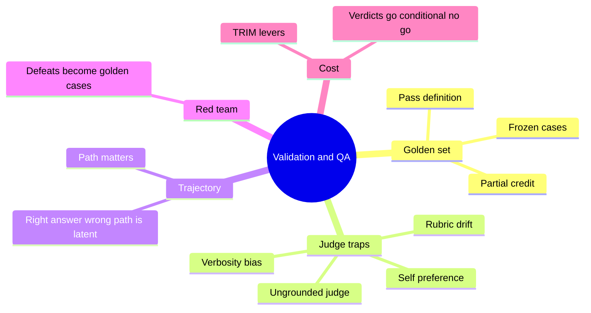
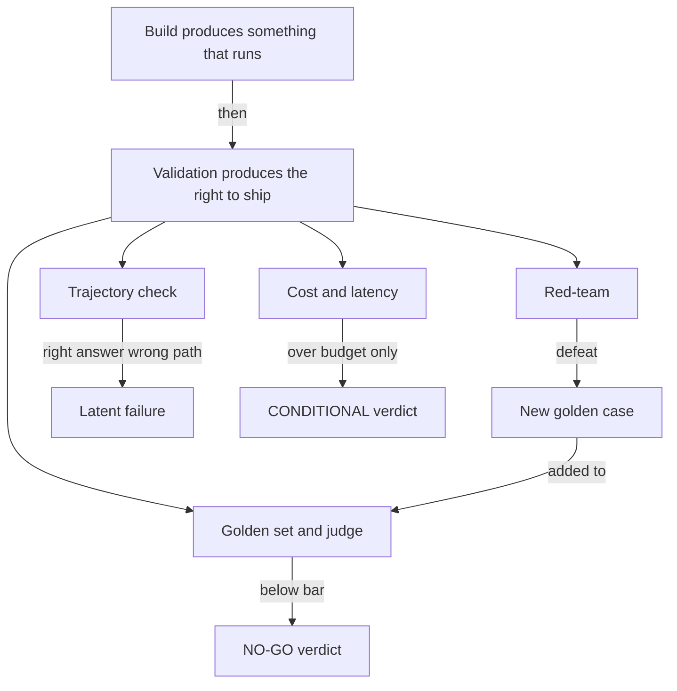
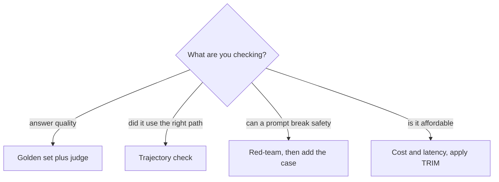
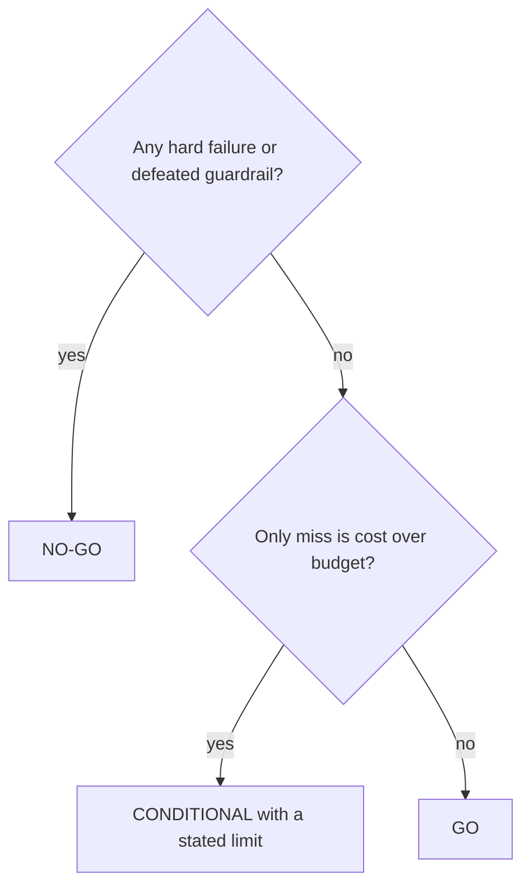

# Solution 5: Proving it, validation and QA

Model solutions and study companion for Exercise 5. Answers are given by content and by the current option letter.

## What this set tests

| Cluster | Core idea |
|---|---|
| Golden set | Frozen cases with a pass definition, scored with partial credit |
| Judge bias | Four traps in LLM-as-judge, each with a guard |
| Trajectory | The path matters; a right answer by the wrong path is a latent failure |
| Red-team | Every defeat becomes a permanent golden case |
| Cost | TRIM is the lever set; verdicts are GO, CONDITIONAL, NO-GO |

## Concept recap

**Why agentic QA differs**

The same input can yield different wording, and wrong answers often sound plausible. Exact-match tests break, so you validate ranges, traces, and grounding rather than one expected string.

**The four validations**

| Validation | Question it answers | Failure feeds |
|---|---|---|
| Golden set with a judge | is the answer good enough | the acceptance bar |
| Trajectory | did it take the right path | latent failures |
| Red-team | do the guardrails hold | new golden cases |
| Cost and latency | is it affordable and fast enough | the CONDITIONAL verdict |

**Partial-credit scoring**

A case score is the fraction of its checks that pass. A set score is the mean of case scores. This rewards near-misses over an all-or-nothing pass.

**LLM-as-judge, four traps and their guards**

| Trap | Symptom | Guard |
|---|---|---|
| Self-preference | favours its own family's style | judge from a different model family |
| Verbosity bias | longer answers score higher | reward grounding, not length |
| Rubric drift | scores wander over a run | anchor each score with a concrete example |
| Ungrounded judge | scores without the source | give it the source and score agreement |

**Trajectory logic**

A correct answer reached by skipping a needed tool is a latent failure. It got lucky by assuming a value; change the input and the same path returns the wrong answer.

**TRIM, the cost checklist**

| Lever | Meaning |
|---|---|
| Tier the model | Sonnet where the eval demands it, Haiku on cheap steps |
| Reuse context via cache | cache the policy that repeats |
| Idle to batch | move non-urgent work to batch |
| Minimize context | trim history sent per turn |

**Verdicts**

| Verdict | When |
|---|---|
| GO | every bar cleared |
| CONDITIONAL | a cost-only miss, ship with a stated limit |
| NO-GO | a hard failure or a defeated guardrail |

## Mind map

## Concept map

## Frameworks to apply

**Choose the validation** (what does this risk need)

**Verdict decision** (translate results to a call)

**Judge safeguards** (match the symptom to the guard)

| You observe | Guard |
|---|---|
| longer answers win | reward grounding, not length |
| own-family style wins | different-family judge |
| scores drift across the run | anchor with an example |
| scores with no source | supply the source |

## Model solutions

**Q1. Correct: A) `1.0` then `0.33`.**
The first answer passes all three checks. The second fails grounded (no `[source:`) and in_scope (contains `ceo`), passes has_options, so 1 of 3 is 0.33.

**Q2. Correct: B) `0.667`.**
Case scores are 1.0, 0.5, 0.5; the mean is 2 of 3, which prints `0.667`.

**Q3. Correct: C) verbosity bias, make the rubric reward grounding, not length.**
The symptom is length. The other three are real judge traps, but they are not what is happening here.

**Q4. Correct: D) it prints `True`, and the fix is `actual == expected` to respect order.**
`set()` throws away order, so a scrambled path passes. Comparing the ordered lists is the fix; sorting would also lose the order, so it is not the fix.

**Q5. Correct: A) ship Sonnet, the eval decided it, and LiteLLM makes the swap a one-string change.**
The eval, not preference, picks the model. Re-running until Haiku passes is gaming the test; routing by difficulty is a different technique, not this decision.

**Q6. Correct: B) it assumed the tier, so it will fail on a different passenger.**
The answer happened to be right; the path was not. Assuming a fact that should be fetched is the latent failure trajectory catches.

**Q7. Correct: A and B.**
Patch the guardrail, then add the failing case to the golden set so it is regression-tested forever. Removing the feature or blanket-lowering the threshold trades one problem for another.

**Q8. Correct matching:** blank 1 = all bars cleared, ship; blank 2 = a bar failed, hold and loop back. The hold path turns failures into new cases before the next run.

**Q9. Correct matching:** self-preference = different model family; verbosity bias = reward grounding not length; rubric drift = anchor with a concrete example; ungrounded judge = give it the source and score agreement.

**Q10. Correct: C) line 3, the 1 and 0 are inverted; an off-scope answer should score 0.**
As written, containing a banned phrase returns 1 (pass). Flip it: return 0 when a banned phrase appears.

**Q11. Correct: B) False.**
Trajectory asserts on the path. A right answer by the wrong path is a latent failure that fails the check.

**Q12. Correct matching:** line 1 = rewards a cited source; line 2 = fails an off-scope answer; line 3 = turns the checks into a partial-credit fraction.

**Q13. Correct: D) CONDITIONAL, ship with a stated limit.**
A cost-only miss with everything else green is CONDITIONAL: ship with a named limit, for example reduced scope or approval kept on. It is neither a hard failure nor a clean pass.

**Q14. Correct: A) Tier the model, Reuse context via cache, move Idle work to batch, Minimize context.**
That is TRIM. The other expansions are invented mnemonics.

**Q15. Correct: A) True.**
A judge is a force multiplier and a liability in one tool. Treat its scores as evidence and audit a sample against human labels.

## Facts, context, and gotchas

- The `set()` trajectory bug is a favourite because it looks correct and passes obvious cases. Only a deliberately scrambled path exposes it.
- A right answer with a wrong path is worse than a wrong answer, because it hides. Trajectory is what surfaces it.
- Nine cases is too few to trust; the fix is to grow the set, never to re-run until a weak model squeaks past.
- The judge is both the biggest time saver and the biggest source of quiet error in QA. Every judge run should be spot-checked.
- CONDITIONAL is not a soft NO-GO. It is a real ship decision with a written limit, reserved for cost-only misses.

## Right and wrong

| Right | Wrong |
|---|---|
| Freeze a golden set with pass definitions | Judge by vibe on ad hoc examples |
| Compare ordered trajectories | Compare with `set()` and lose order |
| Reward grounding in the judge rubric | Let longer answers win |
| Add every red-team defeat as a case | Patch and forget |
| Grow the set when it is small | Re-run until a weak model passes |
| Call a cost-only miss CONDITIONAL | Force a GO or a NO-GO on cost alone |
