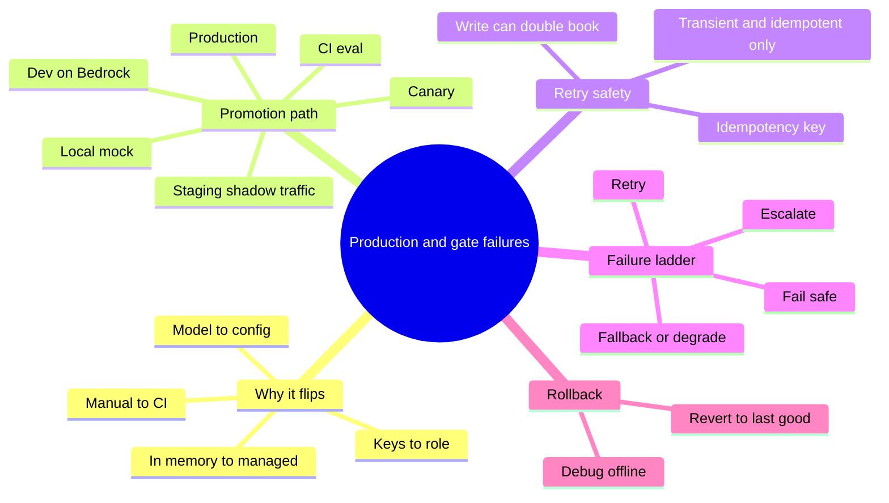
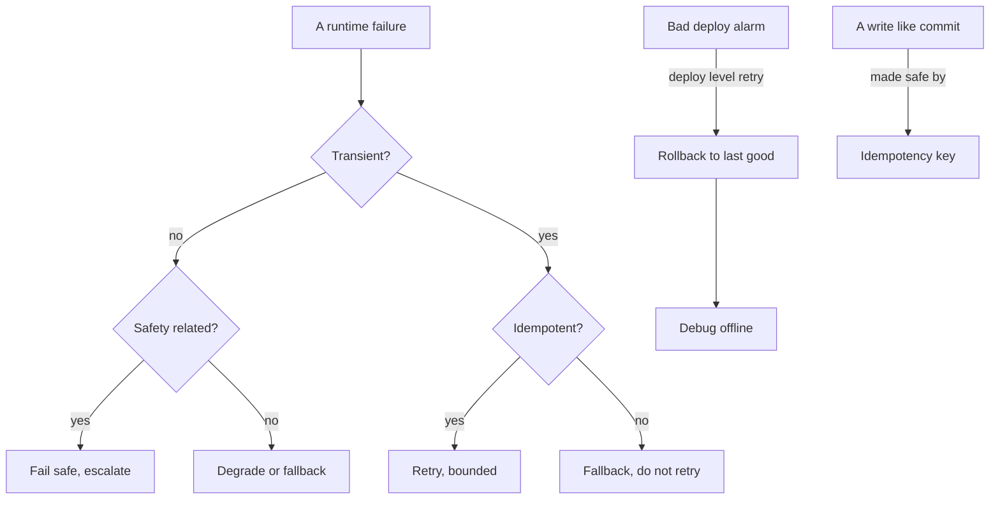
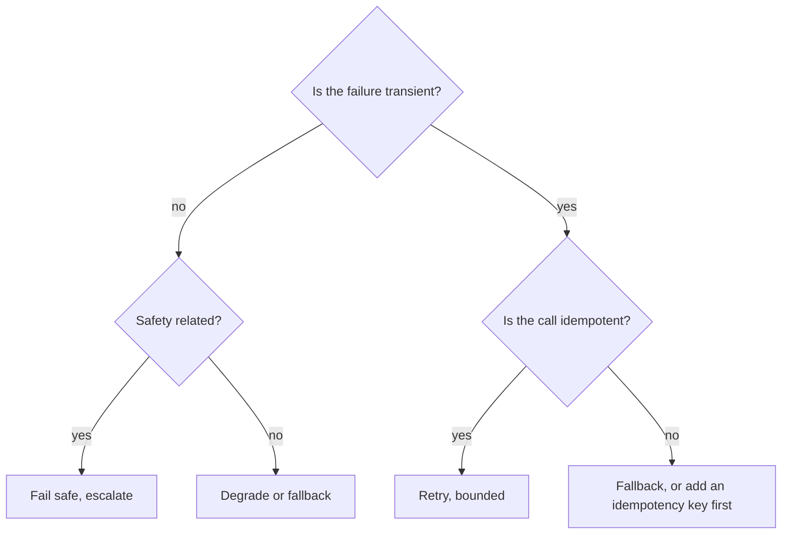

# Solution 6: From classroom to production, and gate failures

Model solutions and study companion for Exercise 6. Answers are given by content and by the current option letter.

## What this set tests

| Cluster | Core idea |
|---|---|
| Why production flips | Keys become roles, model becomes config, in-memory becomes managed, manual becomes CI |
| Promotion path | Local mock to production, a gate at every step up |
| Retry safety | Retry transient and idempotent calls only |
| Failure ladder | Retry, then fallback, then fail safe, then escalate |
| Rollback | The deploy-level retry: revert to last-good, debug offline |

## Concept recap

**What production changes, and why**

| Lab choice | Production choice | Why it flips |
|---|---|---|
| access keys | IAM role on the compute | static secrets leak and never rotate |
| hardcoded model string | config value | a change should not be a redeploy, and you need failover |
| in-memory index | managed store | it dies on restart and cannot serve concurrent load |
| manual eval | CI gate | manual eval gets skipped under deadline pressure |

**The promotion path**

$$\text{local mock} \rightarrow \text{dev on real Bedrock} \rightarrow \text{CI eval} \rightarrow \text{staging with shadow traffic} \rightarrow \text{canary} \rightarrow \text{production}$$

The staging gate is p95 latency and cost within budget on mirrored traffic, with no regressions.

**Retry safety**

Retry only what is both transient and idempotent. A read is safe to repeat. A write like committing a booking can double-book, no matter the cap or backoff. An idempotency key makes a write safe by turning a repeat into a no-op.

**The runtime-failure ladder**

| Step | When |
|---|---|
| retry, bounded | transient and idempotent |
| fallback or degrade | transient but not idempotent |
| fail safe | safety-related or uncertain |
| escalate | anything you cannot resolve safely |

**Fail safe, not fail open**

When safety is uncertain, refuse or escalate. Failing open ships the very risk the check exists to catch.

**Rollback**

A deploy that clears CI but trips a production alarm is reverted to the pinned last-good version first, then debugged offline. Rollback is the deploy analog of a bounded retry.

**Release gates vs runtime gates**

| Release or pre-ship | Runtime, per request |
|---|---|
| CI eval | tool-call timeout |
| red-team | guardrail trip |
| sign-off | model error |

## Mind map

## Concept map

## Frameworks to apply

**Retry safety test** (before you wrap anything in retry)

**Post-deploy alarm playbook** (fixed order)

1. Roll back to the pinned last-good version.
2. Confirm the alarm clears.
3. Reproduce and debug offline, away from the customer.
4. Fix, re-run the gates, then redeploy.

**Lab-to-production checklist** (what must flip before ship)

| Flip | Done when |
|---|---|
| keys to role | no access keys in code, role attached to compute |
| model to config | model id read from config, not literal |
| in-memory to managed | index survives restart and serves concurrency |
| manual to CI | every change runs the eval gate automatically |

## Model solutions

**Q1. Correct: A) roles issue short-lived, auto-rotating credentials the SDK reads on its own.**
Static keys leak and never rotate. A role gives temporary, rotating credentials with no secret in the code. Roles are not pasted, and broader permissions do not mean fewer failures.

**Q2. Correct: B) `{'ok': True, 'attempts': 2}` then `{'ok': False, 'attempts': 3}`.**
The bound works: attempt 2 succeeds, and the failing op stops after 3. The danger this sets up is retrying a non-idempotent write.

**Q3. Correct: C) `confirmed`, `duplicate ignored`, bookings: 1.**
The idempotency key makes the retry a no-op, so the booking is written once. That is what makes retrying a write safe.

**Q4. Correct: D) safe for an idempotent read, dangerous for a write like committing a booking.**
Capping attempts or adding backoff does not make a write safe to repeat. The axis is idempotency, not internal versus external.

**Q5. Correct: A) fail safe, refuse or escalate rather than guess.**
When safety is uncertain, stop. Failing open ships the risk the check exists to catch; retrying or degrading does not address the safety question.

**Q6. Correct matching:** blank 1 = Transient?, blank 2 = Safety-related?, blank 3 = Idempotent?. Non-transient routes to the safety question; transient routes to the idempotency question. Recovered and Over budget are decoys.

**Q7. Correct: B) Local mock, Dev on real Bedrock, CI eval, Staging with shadow traffic, Canary, Production.**
Prove logic offline, hit real Bedrock in dev, gate every change in CI, load-test on shadow traffic in staging, then a canary, then production.

**Q8. Correct: C) auto-rollback to the last-good version, then debug offline.**
Revert first, investigate after. Debugging on the customer or optimising load are the anti-patterns.

**Q9. Correct matching:** access keys to IAM role = static secrets leak and never rotate; hardcoded model to config = a change becomes a redeploy and blocks failover; in-memory index to managed store = it dies on restart and cannot serve concurrent load; manual eval to CI gate = it gets skipped under deadline pressure.

**Q10. Correct: D) `{'ok': True, 'attempts': 1}` then `{'ok': False, 'attempts': 2}`.**
Success on the first try reports one attempt; the failing op with a cap of 2 gives up after two.

**Q11. Correct: A) p95 latency and cost stay within budget on mirrored traffic, with no regressions.**
The eval and red-team gates cleared earlier, and on-call belongs to production. Staging proves load and cost on shadow traffic.

**Q12. Correct: B) Transient? yes to Fail safe is the wrong arrow.**
A transient failure should route toward a bounded retry, not straight to fail safe. Fail safe is for the safety branch.

**Q13. Correct: A, C, and D.**
The CI eval, red-team, and sign-off gates run before ship, where the team decides. A tool-call timeout is a runtime failure, not a release gate.

**Q14. Correct: A) True.**
Pin the last-good version, revert on alarm, then debug away from the customer, rather than fixing live in production first.

**Q15. Correct matching:** line 1 = bounds the number of attempts; line 2 = stops as soon as a try succeeds; line 3 = reports failure after the bound is spent.

## Facts, context, and gotchas

- The retry helper is safe on its own; the danger is what you wrap it around. Around a read it is fine, around a raw booking write it double-books.
- An idempotency key is the bridge that lets you retry a write safely. Without it, the only safe move on a write timeout is to check status, not to resend.
- Fail open versus fail safe is a one-word choice with large consequences. The safe default under uncertainty is always to stop.
- Rollback beats live debugging because it removes the customer from the blast radius first. Investigation happens on a copy, not on production traffic.
- Release gates and runtime gates get confused often. If it runs once per deploy, it is a release gate; if it runs per request, it is a runtime gate.

## Right and wrong

| Right | Wrong |
|---|---|
| Give the compute an IAM role | Ship static access keys in code |
| Retry only transient idempotent calls | Retry a raw write on timeout |
| Add an idempotency key to a write | Blind-retry a booking and double-charge |
| Fail safe under uncertainty | Fail open to avoid blocking the user |
| Roll back, then debug offline | Debug live on production traffic |
