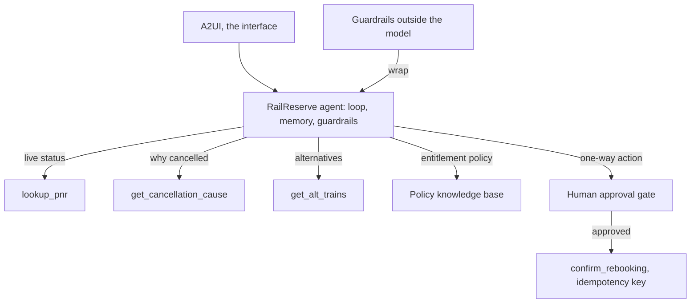
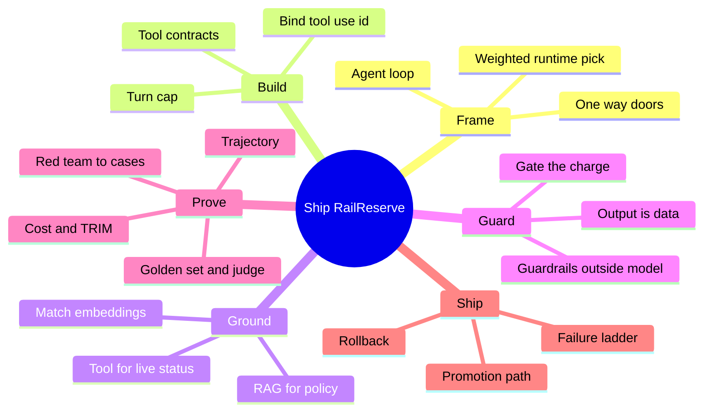

# Solution: Capstone, ship RailReserve

Model solutions and study companion for the capstone. Answers are given by content and by the current option letter. This ties every framework from the six sets into one build.

## The build in one picture

## The lifecycle spine

$$\text{P0 frame} \rightarrow \text{P1 design and bar} \rightarrow \text{P2 build, ground, guard} \rightarrow \text{P3 prove} \rightarrow \text{ship}$$

| Stage | Method in one line | Mindset |
|---|---|---|
| 0 Frame | ambition ladder, weighted runtime pick, mark the doors | climb only when forced, autonomy by reversibility |
| 1 Build | contract each tool, cap the loop, bind results | a tool is a contract, a loop needs a stop |
| 2 Ground | route facts, match embeddings, cite sources | ground what you assert |
| 3 Guard | guardrails outside, treat output as data, gate the charge | the rule sits outside the model |
| 4 Prove | golden set, judge, trajectory, red-team, cost | validation earns the right to ship |
| 5 Ship | promote through gates, failure ladder, rollback | production flips choices on purpose |

## Mind map

## Frameworks applied, stage by stage

| Framework | Used in stage | The move |
|---|---|---|
| Ambition ladder | 0 | is this really an agent |
| Door test | 0 and 3 | which actions need a human gate |
| Tool contract and loop review | 1 | typed schema, turn cap, `toolUseId` binding |
| Source router | 2 | live to tool, policy to RAG, prior chat to memory |
| Embedding rule | 2 | same model at index and query |
| Guardrail placement and injection procedure | 3 | rules outside the model, output as data |
| Four validations and verdict decision | 4 | golden set, trajectory, red-team, cost, then GO or not |
| Retry safety test and failure ladder | 5 | retry only transient idempotent, else fallback or fail safe |
| Rollback playbook | 5 | revert to last-good, debug offline |

## Model solutions

### Stage 0: Frame it

**CP0.1. Correct: A) an agent loop, it must pick tools and adapt per case.**
The path is not fixed and needs live data from three tools plus policy. That clears the bar for an agent, above automation, single-call RAG, or a fixed workflow.

**CP0.2. Correct: B) portability and cost, where the managed option is weakest.**
A ship-speed weighting favours the managed runtime, and the trade flags portability and cost as the levers that could flip the choice later. Latency, accuracy, and region are not what this weighting exposes.

**CP0.3. Correct: B and D.**
A charge and a refund are hard to undo, so both are one-way doors that need a human gate. Showing trains and reading a record are reversible.

### Stage 1: Build the loop and the tools

**CP1.1. Correct: C) the schema with `properties` as an object of typed fields and `required` as a list of names.**
Properties is an object mapping field to type, and required is a list of field names. The other shapes use a list for properties, drop the object wrapper, or invent a `fields` key.

**CP1.2. Correct: D) line 4, `toolUseId` is hardcoded and must be `block["toolUseId"]`.**
A fixed id works with one call in flight, then binds results to the wrong call. The tool receives the right input, the role is correct, and the payload key is fine.

**CP1.3. Correct: A) `lookup_pnr` then `get_cancellation_cause` then `get_alt_trains`.**
Look up the booking, find why the train died, then fetch alternatives for the PNR and tier. Shorter or scrambled orders skip a needed input.

### Stage 2: Ground the entitlement

**CP2.1. Correct matching:** live cancellation status = tool call, Platinum entitlement = RAG retrieval, the tier stated earlier = memory read.

**CP2.2. Correct: B) sources now come from `retrievedReferences`, and the old `citation` field is deprecated.**
The field changed. Re-indexing, guardrails, and the store choice do not explain empty citations when retrieval clearly works.

**CP2.3. Correct: C) retrieval quietly breaks, because the two models do not share a vector space.**
Mismatched embedding models make similarity meaningless. It fails silently, which is worse than a loud error; it does not speed up, double storage, or raise a clear error.

### Stage 3: Guard it

**CP3.1. Correct: D) treat it as data, strip or quarantine the injected text, and continue on the cleaned result.**
Tool output is data. Being internal does not make it a command, and leaning on the prompt to overrule it is the failure. Ending the session is an over-reaction to a routine step.

**CP3.2. Correct: A) Option 1, the gate before the action.**
The gate must sit before the one-way action. The wrong option charges first and asks after, which defeats the gate.

**CP3.3. Correct: B) the entitlement claim is not supported by any retrieved source.**
Grounding checks that the claim traces to a source. Length, multi-part questions, and tool use are not the trigger.

### Stage 4: Prove it

**CP4.1. Correct: C) ship the stronger model, since the eval cleared the bar and the swap is one string.**
The bar decided it. Re-running until the weak model passes is gaming the test; averaging or tightening guardrails does not change the bar it failed.

**CP4.2. Correct: D) line 3, the 1 and 0 are inverted; an off-scope answer should score 0.**
Containing a banned phrase currently returns 1 (pass). Flip it so a banned phrase scores 0.

**CP4.3. Correct: A) it assumed the tier, so it will fail for a Silver passenger.**
The answer was right for Platinum by luck; the path skipped a needed lookup. Change the tier and the same path returns the wrong answer.

**CP4.4. Correct: B) `0.667`.**
Case scores 1.0, 0.5, 0.5 average to `0.667`.

### Stage 5: Ship it

**CP5.1. Correct: C) p95 latency and cost stay within budget on mirrored traffic, with no regressions.**
The eval and red-team gates cleared earlier, and on-call belongs to production. Staging proves load and cost on shadow traffic.

**CP5.2. Correct: D) do not blind-retry; check status by the idempotency key, and only re-send with that key.**
A write is not safe to blind-retry. The key lets you check status and safely re-send without double-charging. Assuming success or failure both risk a wrong outcome.

**CP5.3. Correct: A) roll back to the last-good version, then investigate offline.**
Revert first, debug after. Debugging live or optimising load are the anti-patterns.

### Final checkpoint

**CP-final. Correct: B) GO, on the stronger model, with the human gate kept on the charge.**
Every bar cleared and the one-way action stays gated, which is the right to ship. A small set is a reason to keep growing it, not to block a passing launch, and a routing model is not required.

## The verdict, computed

| Signal | Result | Rule |
|---|---|---|
| Golden set | 91 percent, bar 80 | pass |
| Trajectory | passes | pass |
| Guardrails | hold after tuning | pass |
| Cost | within budget | pass |
| One-way action | human gate kept | pass |

No hard failure, no defeated guardrail, no cost miss. Verdict: **GO**.

## Definition of done, annotated

| Item | Why it is on the list |
|---|---|
| `us.` profile and `bedrock:InvokeModel`, not `Converse` | the two errors that block every call otherwise |
| turn cap and correct `toolUseId` | stops the runaway and the mis-bound result |
| tool for live status, RAG with a cited source | grounds every entitlement claim |
| output scanned as data, charge behind a gate | closes injection and the one-way door |
| golden set, trajectory, red-team cases, model chosen by eval | the right to ship, not a hope |
| idempotency key on the write | a retry cannot double-book |
| last-good pinned, rollback on alarm | recovery without live debugging |

## Facts, context, and gotchas

- The whole capstone is TravelMind's method applied to a new case. Nothing here is new theory; it is transfer, which is the point.
- The three tools map cleanly to the source router: live status is a tool, entitlement is RAG, the stated tier is memory. Getting that split right is most of the grounding work.
- The single most dangerous line in the build is the write, `confirm_rebooking`. It is a one-way door that needs both a human gate and an idempotency key.
- The verdict is GO because every bar cleared and the charge stayed gated. Change any one hard signal and it becomes NO-GO; a cost-only miss would make it CONDITIONAL.
- A passing launch on a small eval set is still a GO. The response to a small set is to grow it over time, not to withhold a launch that met its bar.

## Right and wrong

| Right | Wrong |
|---|---|
| Treat RailReserve as an agent because the path adapts | Force it into a fixed workflow |
| Contract each tool with a typed schema | Pass loose or untyped tool inputs |
| Bind each result to its `toolUseId` | Hardcode the tool use id |
| Gate and key the `confirm_rebooking` write | Let the charge run automatically or blind-retry it |
| Let the eval choose the model | Ship the model you prefer |
| Roll back on a post-deploy alarm | Debug live on production |
| GO on a passing bar, grow the set later | Block a passing launch over set size |
