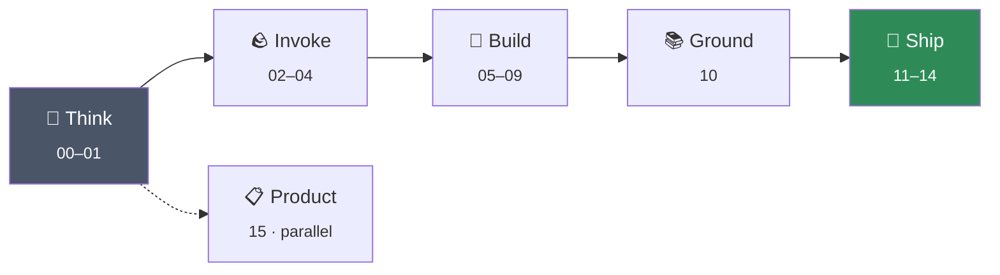

# The Curriculum — 16 Modules

Every module has the same shape and its `README.md` tells you the exact order to work through it.
**Always start with the module README**, not the notebooks.

If you do not know where to begin, use **[the learning paths](../docs/learning-paths/)** — five routes
by role and time budget — or **[START-HERE](../docs/START-HERE.md)**.

---

## The five tracks



**The ordering rule:** every abstraction is preceded by the thing it abstracts. You write the agent loop
by hand before meeting a framework (05 → 06). You build RAG by hand before touching a managed knowledge
base (10). You test before you deploy (13 → 14).

---

## All modules

| # | Track | Module | Time | 📓 | ✏️ | 📗 | 📊 | Design |
| --- | --- | --- | --- | --- | --- | --- | --- | --- |
| **00** | 1 · Think | 🧭 **[Agentic Foundations](00-agentic-foundations/)**<br/><sub>Decide what deserves to be an agent before you build one.</sub> | 4–5 h | 0 | 6 | 2 | 9 | [LLD](../docs/architecture/lld/00-agentic-foundations.md) |
| **01** | 1 · Think | 🌉 **[LLM Intuition and the AWS Bridge](01-llm-and-aws-bridge/)**<br/><sub>Build a working mental model of LLMs, then map it onto AWS.</sub> | 3–4 h | 0 | 2 | 0 | 1 | [LLD](../docs/architecture/lld/01-llm-and-aws-bridge.md) |
| **02** | 2 · Invoke | 🪨 **[Amazon Bedrock Essentials](02-bedrock-essentials/)**<br/><sub>Your first real calls: Converse API, tokens, tool use, knowledge bases, guardrails.</sub> | 6–8 h | 5 | 6 | 5 | 6 | [LLD](../docs/architecture/lld/02-bedrock-essentials.md) |
| **03** | 2 · Invoke | 🤖 **[Amazon Bedrock Agents](03-bedrock-agents/)**<br/><sub>Console to code: action groups, orchestration, and controlling behaviour.</sub> | 6–7 h | 8 | 7 | 3 | 3 | [LLD](../docs/architecture/lld/03-bedrock-agents.md) |
| **04** | 2 · Invoke | 🏗️ **[Agent Builder, Knowledge Bases and Guardrails](04-agent-builder-and-knowledge-bases/)**<br/><sub>The low-code surface, and how to wire knowledge and safety into it.</sub> | 4–5 h | 3 | 0 | 0 | 0 | [LLD](../docs/architecture/lld/04-agent-builder-and-knowledge-bases.md) |
| **05** | 3 · Build | 🔁 **[The Agent Loop: No Framework to Strands](05-agent-loop-no-framework-to-strands/)**<br/><sub>Write the loop by hand, feel the pain, then let Strands remove it.</sub> | 5–6 h | 13 | 4 | 4 | 1 | [LLD](../docs/architecture/lld/05-agent-loop-no-framework-to-strands.md) |
| **06** | 3 · Build | 🧵 **[Strands Foundations: Tools, Memory and MCP](06-strands-foundations/)**<br/><sub>Agents with hands, memory, and a standard way to reach the outside world.</sub> | 5–6 h | 5 | 4 | 0 | 5 | [LLD](../docs/architecture/lld/06-strands-foundations.md) |
| **07** | 3 · Build | 🕸️ **[Multi-Agent Patterns with Strands](07-strands-multi-agent-patterns/)**<br/><sub>Swarm, graph, delegation, critique — and when each one is wrong.</sub> | 6–7 h | 8 | 9 | 9 | 0 | [LLD](../docs/architecture/lld/07-strands-multi-agent-patterns.md) |
| **08** | 3 · Build | 🦜 **[LangChain and LangGraph](08-langchain-and-langgraph/)**<br/><sub>The other ecosystem — and an honest side-by-side with Strands.</sub> | 7–8 h | 16 | 12 | 12 | 0 | [LLD](../docs/architecture/lld/08-langchain-and-langgraph.md) |
| **09** | 3 · Build | 🧠 **[LLM Memory Mechanics](09-llm-memory/)**<br/><sub>What models forget, why, and what you can do about it.</sub> | 3–4 h | 2 | 1 | 0 | 0 | [LLD](../docs/architecture/lld/09-llm-memory.md) |
| **10** | 4 · Ground | 📚 **[RAG, OpenSearch and LiteLLM](10-rag-opensearch-litellm/)**<br/><sub>Retrieval done properly — chunking, hybrid search, reranking, and an evaluation gate.</sub> | 8–10 h | 14 | 6 | 6 | 0 | [LLD](../docs/architecture/lld/10-rag-opensearch-litellm.md) |
| **11** | 5 · Ship | ⚙️ **[Amazon Bedrock AgentCore](11-bedrock-agentcore/)**<br/><sub>Runtime, memory, identity, gateway, observability — agents as deployed services.</sub> | 8–10 h | 17 | 4 | 0 | 3 | [LLD](../docs/architecture/lld/11-bedrock-agentcore.md) |
| **12** | 5 · Ship | 🔌 **[A2A and A2UI: Agent Interoperability](12-a2a-and-a2ui-interop/)**<br/><sub>Agents talking to agents, and agents talking to users.</sub> | 4–5 h | 5 | 5 | 2 | 0 | [LLD](../docs/architecture/lld/12-a2a-and-a2ui-interop.md) |
| **13** | 5 · Ship | 🔬 **[Agentic QA and Evaluation](13-agentic-qa-and-evaluation/)**<br/><sub>How you prove an agent works — and block the ones that do not.</sub> | 5–6 h | 2 | 1 | 0 | 0 | [LLD](../docs/architecture/lld/13-agentic-qa-and-evaluation.md) |
| **14** | 5 · Ship | 🚀 **[End-to-End Production Pipeline](14-end-to-end-production/)**<br/><sub>The capstone: build, validate, deploy, fail over, and gate a release.</sub> | 8–10 h | 4 | 9 | 8 | 0 | [LLD](../docs/architecture/lld/14-end-to-end-production.md) |
| **15** | Parallel · Product | 📋 **[Agentic Product Lifecycle](15-agentic-product-lifecycle/)**<br/><sub>For the people who decide what gets built, and have to defend it.</sub> | 4–5 h | 0 | 16 | 12 | 2 | [LLD](../docs/architecture/lld/15-agentic-product-lifecycle.md) |

<sub>📓 notebooks · ✏️ exercises · 📗 solutions · 📊 workbooks</sub>

---

## Inside a module

```
modules/NN-topic/
├── README.md      ← objectives, the ordered sequence, common mistakes. Start here.
├── slides/        ← decks and reading material
├── notebooks/     ← runnable code
├── exercises/     ← practice. Attempt closed-book.
├── solutions/     ← worked answers. Read after you have a wrong answer.
├── activities/    ← workbooks where a decision gets written down and costed
├── src/           ← supporting source code
├── labs/          ← extended hands-on (Module 10)
├── walkthroughs/  ← paired explainer + notebook (Module 11)
└── guides/        ← runbooks and reference
```

## The four rules

1. **Attempt exercises closed-book.** Solutions are written to be read *after* you have a wrong answer
   to compare against. Read first and an hour of learning becomes five minutes of nodding.
2. **Fill in the workbooks.** That is where a design decision gets written down and costed — which is
   what makes it defensible later.
3. **Do not skip [Module 05](05-agent-loop-no-framework-to-strands/).** Writing the agent loop by hand
   is what stops every later framework from being magic.
4. **Tear down what you create.** Modules 10, 11 and 14 create infrastructure that bills for *existing*.
   [Checklist](../docs/setup/cost-controls.md#teardown-checklist).

## Needs no AWS account

Start here while model access is pending: [Module 00](00-agentic-foundations/),
[Module 01](01-llm-and-aws-bridge/), [Module 15](15-agentic-product-lifecycle/), plus
[`rag_by_hand.py`](10-rag-opensearch-litellm/src/rag_by_hand.py) and
[`quality_gate.py`](13-agentic-qa-and-evaluation/src/quality_gate.py).

---

[🏠 Repository](../) · [▶️ START-HERE](../docs/START-HERE.md) · [🗺️ Learning paths](../docs/learning-paths/) ·
[🏛️ Architecture](../docs/architecture/) · [🧭 Field guide](../cheatsheets/)
